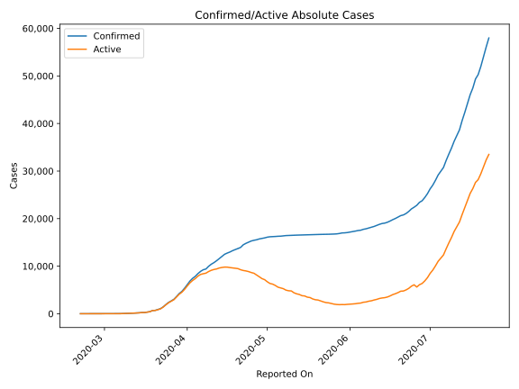
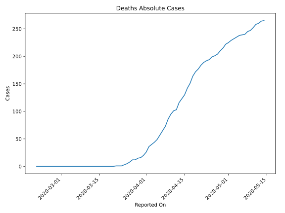
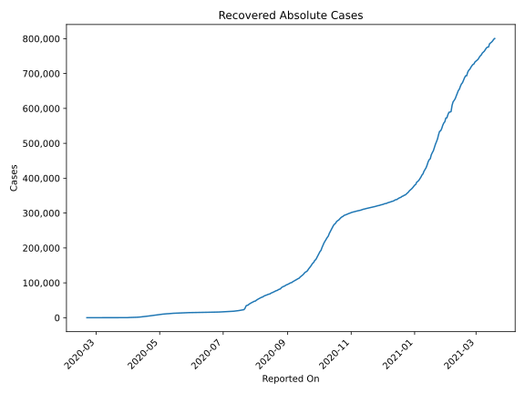
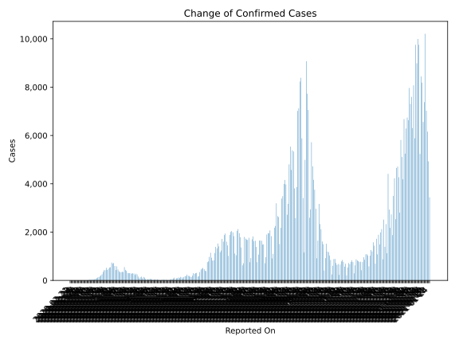
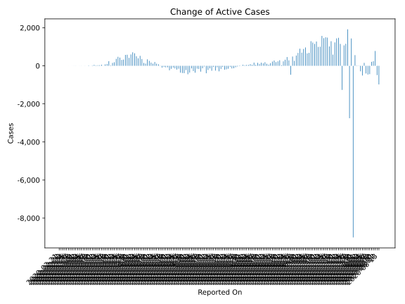
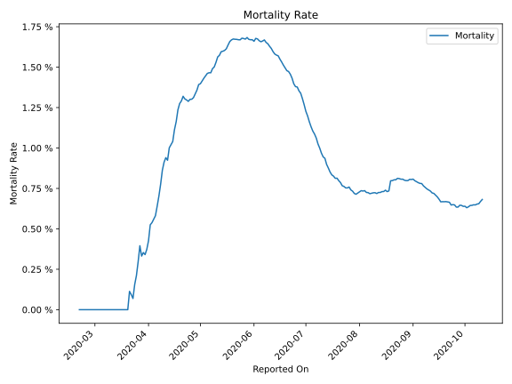

# Country Figures: Time Series for Israel 

| Reported On | Confirmed | Deaths | Recovered | Active | Mortality | &Delta; Confirmed | &Delta; Deaths | &Delta; Recovered | &Delta; Active | % Active of Population |
|-------------|-----------|--------|-----------|--------|-----------|-------------------|----------------|-------------------|----------------|------------------------|
| 2020-05-04 | 16246 | 235 | 10064 | 5947 |  1.45 %  | 38 | 3 | 315 | -280 |  0.067 %  | 
| 2020-05-03 | 16208 | 232 | 9749 | 6227 |  1.43 %  | 23 | 3 | 156 | -136 |  0.070 %  | 
| 2020-05-02 | 16185 | 229 | 9593 | 6363 |  1.41 %  | 84 | 4 | 437 | -357 |  0.072 %  | 
| 2020-05-01 | 16101 | 225 | 9156 | 6720 |  1.40 %  | 155 | 3 | 595 | -443 |  0.076 %  | 
| 2020-04-30 | 15946 | 222 | 8561 | 7163 |  1.39 %  | 112 | 7 | 328 | -223 |  0.081 %  | 
| 2020-04-29 | 15834 | 215 | 8233 | 7386 |  1.36 %  | 106 | 5 | 487 | -386 |  0.083 %  | 
| 2020-04-28 | 15728 | 210 | 7746 | 7772 |  1.34 %  | 173 | 6 | 546 | -379 |  0.087 %  | 
| 2020-04-27 | 15555 | 204 | 7200 | 8151 |  1.31 %  | 112 | 3 | 469 | -360 |  0.092 %  | 
| 2020-04-26 | 15443 | 201 | 6731 | 8511 |  1.30 %  | 145 | 2 | 296 | -153 |  0.096 %  | 
| 2020-04-25 | 15298 | 199 | 6435 | 8664 |  1.30 %  | 240 | 5 | 432 | -197 |  0.098 %  | 
| 2020-04-24 | 15058 | 194 | 6003 | 8861 |  1.29 %  | 255 | 2 | 392 | -139 |  0.100 %  | 
| 2020-04-23 | 14803 | 192 | 5611 | 9000 |  1.30 %  | 305 | 3 | 396 | -94 |  0.101 %  | 
| 2020-04-22 | 14498 | 189 | 5215 | 9094 |  1.30 %  | 556 | 5 | 708 | -157 |  0.102 %  | 
| 2020-04-21 | 13942 | 184 | 4507 | 9251 |  1.32 %  | 229 | 7 | 458 | -236 |  0.104 %  | 
| 2020-04-20 | 13713 | 177 | 4049 | 9487 |  1.29 %  | 222 | 5 | 295 | -78 |  0.107 %  | 
| 2020-04-19 | 13491 | 172 | 3754 | 9565 |  1.27 %  | 226 | 8 | 298 | -80 |  0.108 %  | 
| 2020-04-18 | 13265 | 164 | 3456 | 9645 |  1.24 %  | 283 | 13 | 330 | -60 |  0.109 %  | 
| 2020-04-17 | 12982 | 151 | 3126 | 9705 |  1.16 %  | 224 | 9 | 308 | -93 |  0.109 %  | 
| 2020-04-16 | 12758 | 142 | 2818 | 9798 |  1.11 %  | 257 | 12 | 255 | -10 |  0.110 %  | 
| 2020-04-15 | 12501 | 130 | 2563 | 9808 |  1.04 %  | 455 | 7 | 368 | 80 |  0.110 %  | 
| 2020-04-14 | 12046 | 123 | 2195 | 9728 |  1.02 %  | 460 | 7 | 340 | 113 |  0.110 %  | 
| 2020-04-13 | 11586 | 116 | 1855 | 9615 |  1.00 %  | 441 | 13 | 228 | 200 |  0.108 %  | 
| 2020-04-12 | 11145 | 103 | 1627 | 9415 |  0.92 %  | 402 | 2 | 286 | 114 |  0.106 %  | 
| 2020-04-11 | 10743 | 101 | 1341 | 9301 |  0.94 %  | 335 | 6 | 158 | 171 |  0.105 %  | 
| 2020-04-10 | 10408 | 95 | 1183 | 9130 |  0.91 %  | 440 | 9 | 172 | 259 |  0.103 %  | 
| 2020-04-09 | 9968 | 86 | 1011 | 8871 |  0.86 %  | 564 | 13 | 210 | 341 |  0.100 %  | 
| 2020-04-08 | 9404 | 73 | 801 | 8530 |  0.78 %  | 156 | 8 | 31 | 117 |  0.096 %  | 
| 2020-04-07 | 9248 | 65 | 770 | 8413 |  0.70 %  | 344 | 8 | 185 | 151 |  0.095 %  | 
| 2020-04-06 | 8904 | 57 | 585 | 8262 |  0.64 %  | 474 | 8 | 108 | 358 |  0.093 %  | 
| 2020-04-05 | 8430 | 49 | 477 | 7904 |  0.58 %  | 579 | 5 | 50 | 524 |  0.089 %  | 
| 2020-04-04 | 7851 | 44 | 427 | 7380 |  0.56 %  | 423 | 4 | 24 | 395 |  0.083 %  | 
| 2020-04-03 | 7428 | 40 | 403 | 6985 |  0.54 %  | 571 | 4 | 65 | 502 |  0.079 %  | 
| 2020-04-02 | 6857 | 36 | 338 | 6483 |  0.53 %  | 765 | 10 | 97 | 658 |  0.073 %  | 
| 2020-04-01 | 6092 | 26 | 241 | 5825 |  0.43 %  | 734 | 6 | 17 | 711 |  0.066 %  | 
| 2020-03-31 | 5358 | 20 | 224 | 5114 |  0.37 %  | 663 | 4 | 63 | 596 |  0.058 %  | 
| 2020-03-30 | 4695 | 16 | 161 | 4518 |  0.34 %  | 448 | 1 | 29 | 418 |  0.051 %  | 
| 2020-03-29 | 4247 | 15 | 132 | 4100 |  0.35 %  | 628 | 3 | 43 | 582 |  0.046 %  | 
| 2020-03-28 | 3619 | 12 | 89 | 3518 |  0.33 %  | 584 | 0 | 10 | 574 |  0.040 %  | 
| 2020-03-27 | 3035 | 12 | 79 | 2944 |  0.40 %  | 342 | 4 | 11 | 327 |  0.033 %  | 
| 2020-03-26 | 2693 | 8 | 68 | 2617 |  0.30 %  | 324 | 3 | 10 | 311 |  0.029 %  | 
| 2020-03-25 | 2369 | 5 | 58 | 2306 |  0.21 %  | 439 | 2 | 5 | 432 |  0.026 %  | 
| 2020-03-24 | 1930 | 3 | 53 | 1874 |  0.16 %  | 488 | 2 | 12 | 474 |  0.021 %  | 
| 2020-03-23 | 1442 | 1 | 41 | 1400 |  0.07 %  | 371 | 0 | 4 | 367 |  0.016 %  | 
| 2020-03-22 | 1071 | 1 | 37 | 1033 |  0.09 %  | 188 | 0 | 1 | 187 |  0.012 %  | 
| 2020-03-21 | 883 | 1 | 36 | 846 |  0.11 %  | 178 | 1 | 22 | 155 |  0.010 %  | 
| 2020-03-20 | 705 | 0 | 14 | 691 |  None  | 28 | 0 | 3 | 25 |  0.008 %  | 
| 2020-03-19 | 677 | 0 | 11 | 666 |  None  | 244 | 0 | 0 | 244 |  0.007 %  | 
| 2020-03-18 | 433 | 0 | 11 | 422 |  None  | 96 | 0 | 0 | 96 |  0.005 %  | 
| 2020-03-17 | 337 | 0 | 11 | 326 |  None  | 82 | 0 | 7 | 75 |  0.004 %  | 
| 2020-03-16 | 255 | 0 | 4 | 251 |  None  | 4 | 0 | 0 | 4 |  0.003 %  | 
| 2020-03-15 | 251 | 0 | 4 | 247 |  None  | 58 | 0 | 0 | 58 |  0.003 %  | 
| 2020-03-14 | 193 | 0 | 4 | 189 |  None  | 32 | 0 | 0 | 32 |  0.002 %  | 
| 2020-03-13 | 161 | 0 | 4 | 157 |  None  | 30 | 0 | 0 | 30 |  0.002 %  | 
| 2020-03-12 | 131 | 0 | 4 | 127 |  None  | 22 | 0 | 0 | 22 |  0.001 %  | 
| 2020-03-11 | 109 | 0 | 4 | 105 |  None  | 51 | 0 | 0 | 51 |  0.001 %  | 
| 2020-03-10 | 58 | 0 | 4 | 54 |  None  | 19 | 0 | 2 | 17 |  0.001 %  | 
| 2020-03-09 | 39 | 0 | 2 | 37 |  None  | 0 | 0 | 0 | 0 |  0.000 %  | 
| 2020-03-08 | 39 | 0 | 2 | 37 |  None  | 18 | 0 | 0 | 18 |  0.000 %  | 
| 2020-03-07 | 21 | 0 | 2 | 19 |  None  | 0 | 0 | 0 | 0 |  0.000 %  | 
| 2020-03-06 | 21 | 0 | 2 | 19 |  None  | 5 | 0 | 1 | 4 |  0.000 %  | 
| 2020-03-05 | 16 | 0 | 1 | 15 |  None  | 1 | 0 | 0 | 1 |  0.000 %  | 
| 2020-03-04 | 15 | 0 | 1 | 14 |  None  | 3 | 0 | 0 | 3 |  0.000 %  | 
| 2020-03-03 | 12 | 0 | 1 | 11 |  None  | 2 | 0 | 0 | 2 |  0.000 %  | 
| 2020-03-02 | 10 | 0 | 1 | 9 |  None  | 0 | 0 | 0 | 0 |  0.000 %  | 
| 2020-03-01 | 10 | 0 | 1 | 9 |  None  | 3 | 0 | 0 | 3 |  0.000 %  | 
| 2020-02-29 | 7 | 0 | 1 | 6 |  None  | 3 | 0 | 0 | 3 |  0.000 %  | 
| 2020-02-28 | 4 | 0 | 1 | 3 |  None  | 1 | 0 | 0 | 1 |  0.000 %  | 
| 2020-02-27 | 3 | 0 | 1 | 2 |  None  | 1 | 0 | 1 | 0 |  0.000 %  | 
| 2020-02-26 | 2 | 0 | 0 | 2 |  None  | 1 | 0 | 0 | 1 |  0.000 %  | 
| 2020-02-25 | 1 | 0 | 0 | 1 |  None  | 0 | 0 | 0 | 0 |  0.000 %  | 
| 2020-02-24 | 1 | 0 | 0 | 1 |  None  | 0 | 0 | 0 | 0 |  0.000 %  | 
| 2020-02-23 | 1 | 0 | 0 | 1 |  None  | 0 | 0 | 0 | 0 |  0.000 %  | 
| 2020-02-22 | 1 | 0 | 0 | 1 |  None  | 0 | 0 | 0 | 0 |  0.000 %  | 
| 2020-02-21 | 1 | 0 | 0 | 1 |  None  | None | None | None | None |  0.000 %  | 

