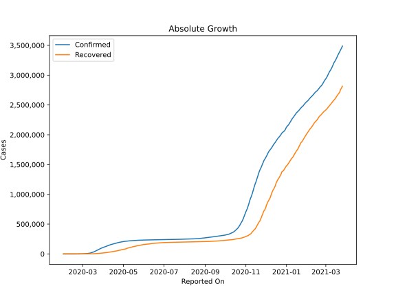
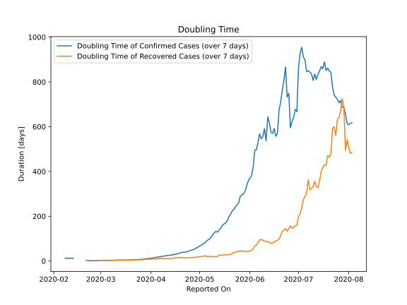

# Country Figures: Doubling Time of Infections for Italy 

The doubling time below are calculated based on
* an exponential growth assumption
* for time difference of past seven (7) days.
The doubling time's unit is "days".

The first doubling time indicates the increase of confirmed (infected)
cases. There, the *higher* the number is, the better is to take control
of the disease.

The second doubling time indicates the increase of recovered (healed)
cases. There, the *lower* the number is, the better it is to take
control of the disease.

| Reported On | Confirmed | Doubling Time (Confirmed) | Recovered | Doubling Time (Recovered) |
|-------------|-----------|---------------------------|-----------|---------------------------|
| 2020-04-20 | 181228 |  38.4 days  | 48877 |  15.4 days  | 
| 2020-04-19 | 178972 |  36.3 days  | 47055 |  15.6 days  | 
| 2020-04-18 | 175925 |  33.9 days  | 44927 |  15.4 days  | 
| 2020-04-17 | 172434 |  31.5 days  | 42727 |  14.7 days  | 
| 2020-04-16 | 168941 |  30.2 days  | 40164 |  14.4 days  | 
| 2020-04-15 | 165155 |  29.0 days  | 38092 |  13.7 days  | 
| 2020-04-14 | 162488 |  27.2 days  | 37130 |  11.9 days  | 
| 2020-04-13 | 159516 |  26.5 days  | 35435 |  11.4 days  | 
| 2020-04-12 | 156363 |  25.5 days  | 34211 |  11.1 days  | 
| 2020-04-11 | 152271 |  24.6 days  | 32534 |  11.4 days  | 
| 2020-04-10 | 147577 |  23.6 days  | 30455 |  11.6 days  | 
| 2020-04-09 | 143626 |  22.4 days  | 28470 |  11.3 days  | 
| 2020-04-08 | 139422 |  21.3 days  | 26491 |  11.1 days  | 
| 2020-04-07 | 135586 |  19.9 days  | 24392 |  11.4 days  | 
| 2020-04-06 | 132547 |  18.7 days  | 22837 |  11.2 days  | 
| 2020-04-05 | 128948 |  17.8 days  | 21815 |  9.8 days  | 
| 2020-04-04 | 124632 |  16.6 days  | 20996 |  9.5 days  | 
| 2020-04-03 | 119827 |  15.2 days  | 19758 |  8.6 days  | 
| 2020-04-02 | 115242 |  13.9 days  | 18278 |  8.9 days  | 
| 2020-04-01 | 110574 |  12.6 days  | 16847 |  8.6 days  | 
| 2020-03-31 | 105792 |  11.8 days  | 15729 |  8.0 days  | 
| 2020-03-30 | 101739 |  10.8 days  | 14620 |  7.5 days  | 
| 2020-03-29 | 97689 |  10.0 days  | 13030 |  8.2 days  | 
| 2020-03-28 | 92472 |  9.2 days  | 12384 |  7.1 days  | 
| 2020-03-27 | 86498 |  8.3 days  | 10950 |  5.7 days  | 
| 2020-03-26 | 80589 |  7.5 days  | 10361 |  6.1 days  | 
| 2020-03-25 | 74386 |  7.0 days  | 9362 |  6.1 days  | 
| 2020-03-24 | 69176 |  6.5 days  | 8326 |  5.0 days  | 
| 2020-03-23 | 63927 |  6.2 days  | 7432 |  5.2 days  | 
| 2020-03-22 | 59138 |  5.9 days  | 7024 |  4.7 days  | 
| 2020-03-21 | 53578 |  5.6 days  | 6072 |  4.6 days  | 
| 2020-03-20 | 47021 |  5.3 days  | 4440 |  4.6 days  | 
| 2020-03-19 | 41035 |  4.4 days  | 4440 |  3.7 days  | 
| 2020-03-18 | 35713 |  4.9 days  | 4025 |  3.9 days  | 
| 2020-03-17 | 31506 |  4.6 days  | 2941 |  3.8 days  | 
| 2020-03-16 | 27980 |  4.7 days  | 2749 |  4.0 days  | 
| 2020-03-15 | 24747 |  4.3 days  | 2335 |  4.0 days  | 
| 2020-03-14 | 21157 |  4.1 days  | 1966 |  4.4 days  | 
| 2020-03-13 | 17660 |  4.0 days  | 1439 |  5.1 days  | 
| 2020-03-12 | 12462 |  4.5 days  | 1045 |  5.6 days  | 
| 2020-03-11 | 12462 |  3.8 days  | 1045 |  4.0 days  | 
| 2020-03-10 | 10149 |  3.8 days  | 724 |  3.5 days  | 
| 2020-03-09 | 9172 |  3.6 days  | 724 |  3.4 days  | 
| 2020-03-08 | 7375 |  3.6 days  | 622 |  2.7 days  | 
| 2020-03-07 | 5883 |  3.3 days  | 589 |  2.2 days  | 
| 2020-03-06 | 4636 |  3.3 days  | 523 |  2.3 days  | 
| 2020-03-05 | 3858 |  3.1 days  | 414 |  2.5 days  | 
| 2020-03-04 | 3089 |  2.9 days  | 276 |  1.4 days  | 
| 2020-03-03 | 2502 |  2.7 days  | 160 |  1.3 days  | 
| 2020-03-02 | 2036 |  2.6 days  | 149 |  1.3 days  | 
| 2020-03-01 | 1694 |  2.4 days  | 83 |  1.6 days  | 
| 2020-02-29 | 1128 |  2.0 days  | 46 |  1.6 days  | 
| 2020-02-28 | 888 |  1.6 days  | 46 |  None  | 
| 2020-02-27 | 655 |  1.2 days  | 45 |  None  | 
| 2020-02-26 | 453 |  1.3 days  | 3 |  None  | 
| 2020-02-25 | 322 |  1.4 days  | 1 |  None  | 
| 2020-02-24 | 229 |  1.4 days  | 1 |  None  | 
| 2020-02-23 | 155 |  1.6 days  | 2 |  None  | 
| 2020-02-22 | 62 |  1.9 days  | 1 |  None  | 
| 2020-02-21 | 20 |  2.9 days  | 0 |  None  | 
| 2020-02-20 | 3 |  None  | 0 |  None  | 
| 2020-02-19 | 3 |  None  | 0 |  None  | 
| 2020-02-18 | 3 |  None  | 0 |  None  | 
| 2020-02-17 | 3 |  None  | 0 |  None  | 
| 2020-02-16 | 3 |  None  | 0 |  None  | 
| 2020-02-15 | 3 |  None  | 0 |  None  | 
| 2020-02-14 | 3 |  None  | 0 |  None  | 
| 2020-02-13 | 3 |  12.3 days  | 0 |  None  | 
| 2020-02-12 | 3 |  12.3 days  | 0 |  None  | 
| 2020-02-11 | 3 |  12.3 days  | 0 |  None  | 
| 2020-02-10 | 3 |  12.3 days  | 0 |  None  | 
| 2020-02-09 | 3 |  12.3 days  | 0 |  None  | 
| 2020-02-08 | 3 |  12.3 days  | 0 |  None  | 
| 2020-02-07 | 3 |  None  | 0 |  None  | 
| 2020-02-06 | 2 |  None  | 0 |  None  | 
| 2020-02-05 | 2 |  None  | 0 |  None  | 
| 2020-02-04 | 2 |  None  | 0 |  None  | 
| 2020-02-03 | 2 |  None  | 0 |  None  | 
| 2020-02-02 | 2 |  None  | 0 |  None  | 
| 2020-02-01 | 2 |  None  | 0 |  None  | 

