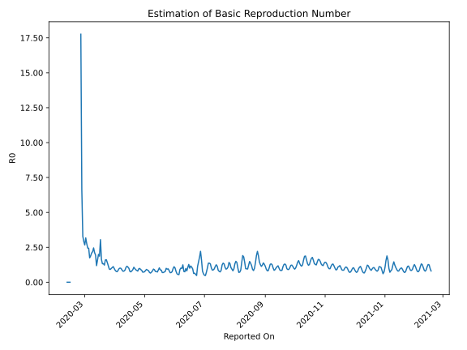

# Country Figures: Time Series for Basic Reproduction Number of Italy 

| Reported On | &Delta; Confirmed | Total &Delta; Confirmed First Interval | Total &Delta; Confirmed Second Interval | Estimated Basic Reproduction Number R0 | 
|-------------|-------------------|----------------------------------------|-----------------------------------------|---------------------------------------------------|
| 2020-05-03 | 1389 |  7823  |  8511  |  0.92  | 
| 2020-05-02 | 1900 |  8014  |  9441  |  0.85  | 
| 2020-05-01 | 1965 |  7788  |  10348  |  0.75  | 
| 2020-04-30 | 1872 |  8240  |  11394  |  0.72  | 
| 2020-04-29 | 2086 |  8511  |  11766  |  0.72  | 
| 2020-04-28 | 2091 |  9441  |  11001  |  0.86  | 
| 2020-04-27 | 1739 |  10348  |  11402  |  0.91  | 
| 2020-04-26 | 2324 |  11394  |  11523  |  0.99  | 
| 2020-04-25 | 2357 |  11766  |  12287  |  0.96  | 
| 2020-04-24 | 3021 |  11001  |  13817  |  0.80  | 
| 2020-04-23 | 2646 |  11402  |  13437  |  0.85  | 
| 2020-04-22 | 3370 |  11523  |  12918  |  0.89  | 
| 2020-04-21 | 2729 |  12287  |  12578  |  0.98  | 
| 2020-04-20 | 2256 |  13817  |  12884  |  1.07  | 
| 2020-04-19 | 3047 |  13437  |  14911  |  0.90  | 
| 2020-04-18 | 3491 |  12918  |  15890  |  0.81  | 
| 2020-04-17 | 3493 |  12578  |  16941  |  0.74  | 
| 2020-04-16 | 3786 |  12884  |  16685  |  0.77  | 
| 2020-04-15 | 2667 |  14911  |  15030  |  0.99  | 
| 2020-04-14 | 2972 |  15890  |  14678  |  1.08  | 
| 2020-04-13 | 3153 |  16941  |  14790  |  1.15  | 
| 2020-04-12 | 4092 |  16685  |  15759  |  1.06  | 
| 2020-04-11 | 4694 |  15030  |  17305  |  0.87  | 
| 2020-04-10 | 3951 |  14678  |  18374  |  0.80  | 
| 2020-04-09 | 4204 |  14790  |  18840  |  0.79  | 
| 2020-04-08 | 3836 |  15759  |  18088  |  0.87  | 
| 2020-04-07 | 3039 |  17305  |  17553  |  0.99  | 
| 2020-04-06 | 3599 |  18374  |  18102  |  1.02  | 
| 2020-04-05 | 4316 |  18840  |  19294  |  0.98  | 
| 2020-04-04 | 4805 |  18088  |  21150  |  0.86  | 
| 2020-04-03 | 4585 |  17553  |  23303  |  0.75  | 
| 2020-04-02 | 4668 |  18102  |  23296  |  0.78  | 
| 2020-04-01 | 4782 |  19294  |  22571  |  0.85  | 
| 2020-03-31 | 4053 |  21150  |  21451  |  0.99  | 
| 2020-03-30 | 4050 |  23303  |  20808  |  1.12  | 
| 2020-03-29 | 5217 |  23296  |  22155  |  1.05  | 
| 2020-03-28 | 5974 |  22571  |  22892  |  0.99  | 
| 2020-03-27 | 5909 |  21451  |  23425  |  0.92  | 
| 2020-03-26 | 6203 |  20808  |  22072  |  0.94  | 
| 2020-03-25 | 5210 |  22155  |  19041  |  1.16  | 
| 2020-03-24 | 5249 |  22892  |  16288  |  1.41  | 
| 2020-03-23 | 4789 |  23425  |  14556  |  1.61  | 
| 2020-03-22 | 5560 |  22072  |  13846  |  1.59  | 
| 2020-03-21 | 6557 |  19041  |  15518  |  1.23  | 
| 2020-03-20 | 5986 |  16288  |  12285  |  1.33  | 
| 2020-03-19 | 5322 |  14556  |  11008  |  1.32  | 
| 2020-03-18 | 4207 |  13846  |  8488  |  1.63  | 
| 2020-03-17 | 3526 |  15518  |  5087  |  3.05  | 
| 2020-03-16 | 3233 |  12285  |  6579  |  1.87  | 
| 2020-03-15 | 3590 |  11008  |  5513  |  2.00  | 
| 2020-03-14 | 3497 |  8488  |  5314  |  1.60  | 
| 2020-03-13 | 5198 |  5087  |  4286  |  1.19  | 
| 2020-03-12 | 0 |  6579  |  3381  |  1.95  | 
| 2020-03-11 | 2313 |  5513  |  2600  |  2.12  | 
| 2020-03-10 | 977 |  5314  |  2164  |  2.46  | 
| 2020-03-09 | 1797 |  4286  |  1961  |  2.19  | 
| 2020-03-08 | 1492 |  3381  |  1614  |  2.09  | 
| 2020-03-07 | 1247 |  2600  |  1381  |  1.88  | 
| 2020-03-06 | 778 |  2164  |  1241  |  1.74  | 
| 2020-03-05 | 769 |  1961  |  806  |  2.43  | 
| 2020-03-04 | 587 |  1614  |  659  |  2.45  | 
| 2020-03-03 | 466 |  1381  |  500  |  2.76  | 
| 2020-03-02 | 342 |  1241  |  391  |  3.17  | 
| 2020-03-01 | 566 |  806  |  302  |  2.67  | 
| 2020-02-29 | 240 |  659  |  226  |  2.92  | 
| 2020-02-28 | 233 |  500  |  152  |  3.29  | 
| 2020-02-27 | 202 |  391  |  59  |  6.63  | 
| 2020-02-26 | 131 |  302  |  17  |  17.76  | 
| 2020-02-25 | 93 |  226  |  None  |  None  | 
| 2020-02-24 | 74 |  152  |  None  |  None  | 
| 2020-02-23 | 93 |  59  |  None  |  None  | 
| 2020-02-22 | 42 |  17  |  None  |  None  | 
| 2020-02-21 | 17 |  None  |  None  |  None  | 
| 2020-02-20 | 0 |  None  |  None  |  None  | 
| 2020-02-19 | 0 |  None  |  None  |  None  | 
| 2020-02-18 | 0 |  None  |  None  |  None  | 
| 2020-02-17 | 0 |  None  |  None  |  None  | 
| 2020-02-16 | 0 |  None  |  None  |  None  | 
| 2020-02-15 | 0 |  None  |  1  |  None  | 
| 2020-02-14 | 0 |  None  |  1  |  None  | 
| 2020-02-13 | 0 |  None  |  1  |  None  | 
| 2020-02-12 | 0 |  None  |  1  |  None  | 
| 2020-02-11 | 0 |  1  |  None  |  None  | 
| 2020-02-10 | 0 |  1  |  None  |  None  | 
| 2020-02-09 | 0 |  1  |  None  |  None  | 
| 2020-02-08 | 0 |  1  |  None  |  None  | 
| 2020-02-07 | 1 |  None  |  None  |  None  | 
| 2020-02-06 | 0 |  None  |  None  |  None  | 
| 2020-02-05 | 0 |  None  |  None  |  None  | 
| 2020-02-04 | 0 |  None  |  None  |  None  | 
| 2020-02-03 | 0 |  None  |  None  |  None  | 
| 2020-02-02 | 0 |  None  |  None  |  None  | 
| 2020-02-01 | 0 |  None  |  None  |  None  | 
| 2020-01-31 | None |  None  |  None  |  None  | 

