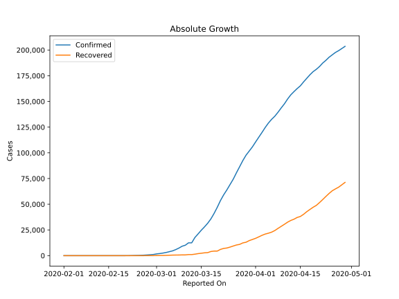
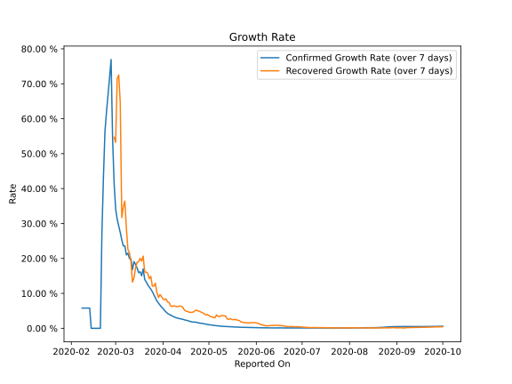

# Country Figures: Growth Rate for Italy 

The growth rates below are calculated based on
* an exponential growth assumption
* for time difference of past seven (7) days.
The growth rate is to be understood as on "growth per day".

The first growth rate indicates the increase of confirmed (infected) cases.

The second growth rate indicates the increase of recovered (healed) cases.

| Reported On | Confirmed | Growth Rate (Confirmed) | Recovered | Growth Rate (Recovered) |
|-------------|-----------|-------------------------|-----------|-------------------------|
| 2020-04-10 | 147577 |  2.98 %  | 30455 |  6.181 %  | 
| 2020-04-09 | 143626 |  3.15 %  | 28470 |  6.331 %  | 
| 2020-04-08 | 139422 |  3.31 %  | 26491 |  6.466 %  | 
| 2020-04-07 | 135586 |  3.54 %  | 24392 |  6.268 %  | 
| 2020-04-06 | 132547 |  3.78 %  | 22837 |  6.371 %  | 
| 2020-04-05 | 128948 |  3.97 %  | 21815 |  7.362 %  | 
| 2020-04-04 | 124632 |  4.26 %  | 20996 |  7.542 %  | 
| 2020-04-03 | 119827 |  4.66 %  | 19758 |  8.432 %  | 
| 2020-04-02 | 115242 |  5.11 %  | 18278 |  8.109 %  | 
| 2020-04-01 | 110574 |  5.66 %  | 16847 |  8.393 %  | 
| 2020-03-31 | 105792 |  6.07 %  | 15729 |  9.087 %  | 
| 2020-03-30 | 101739 |  6.64 %  | 14620 |  9.666 %  | 
| 2020-03-29 | 97689 |  7.17 %  | 13030 |  8.827 %  | 
| 2020-03-28 | 92472 |  7.80 %  | 12384 |  10.182 %  | 
| 2020-03-27 | 86498 |  8.71 %  | 10950 |  12.896 %  | 
| 2020-03-26 | 80589 |  9.64 %  | 10361 |  12.106 %  | 
| 2020-03-25 | 74386 |  10.48 %  | 9362 |  12.059 %  | 
| 2020-03-24 | 69176 |  11.24 %  | 8326 |  14.866 %  | 
| 2020-03-23 | 63927 |  11.80 %  | 7432 |  14.208 %  | 
| 2020-03-22 | 59138 |  12.45 %  | 7024 |  15.733 %  | 
| 2020-03-21 | 53578 |  13.27 %  | 6072 |  16.110 %  | 
| 2020-03-20 | 47021 |  13.99 %  | 4440 |  16.096 %  | 
| 2020-03-19 | 41035 |  17.02 %  | 4440 |  20.666 %  | 
| 2020-03-18 | 35713 |  15.04 %  | 4025 |  19.264 %  | 
| 2020-03-17 | 31506 |  16.18 %  | 2941 |  20.024 %  | 
| 2020-03-16 | 27980 |  15.93 %  | 2749 |  19.060 %  | 
| 2020-03-15 | 24747 |  17.29 %  | 2335 |  18.898 %  | 
| 2020-03-14 | 21157 |  18.28 %  | 1966 |  17.219 %  | 
| 2020-03-13 | 17660 |  19.11 %  | 1439 |  14.459 %  | 
| 2020-03-12 | 12462 |  16.75 %  | 1045 |  13.227 %  | 
| 2020-03-11 | 12462 |  19.93 %  | 1045 |  19.020 %  | 
| 2020-03-10 | 10149 |  20.00 %  | 724 |  21.566 %  | 
| 2020-03-09 | 9172 |  21.50 %  | 724 |  22.584 %  | 
| 2020-03-08 | 7375 |  21.01 %  | 622 |  28.773 %  | 
| 2020-03-07 | 5883 |  23.59 %  | 589 |  36.425 %  | 
| 2020-03-06 | 4636 |  23.61 %  | 523 |  34.728 %  | 
| 2020-03-05 | 3858 |  25.33 %  | 414 |  31.703 %  | 
| 2020-03-04 | 3089 |  27.42 %  | 276 |  64.597 %  | 
| 2020-03-03 | 2502 |  29.29 %  | 160 |  72.502 %  | 
| 2020-03-02 | 2036 |  31.21 %  | 149 |  71.485 %  | 
| 2020-03-01 | 1694 |  34.16 %  | 83 |  53.224 %  | 
| 2020-02-29 | 1128 |  41.44 %  | 46 |  54.695 %  | 
| 2020-02-28 | 888 |  54.19 %  | 46 |  None  | 
| 2020-02-27 | 655 |  76.94 %  | 45 |  None  | 
| 2020-02-26 | 453 |  71.68 %  | 3 |  None  | 
| 2020-02-25 | 322 |  66.80 %  | 1 |  None  | 
| 2020-02-24 | 229 |  61.93 %  | 1 |  None  | 
| 2020-02-23 | 155 |  56.35 %  | 2 |  None  | 
| 2020-02-22 | 62 |  43.26 %  | 1 |  None  | 
| 2020-02-21 | 20 |  27.10 %  | 0 |  None  | 
| 2020-02-20 | 3 |  None  | 0 |  None  | 
| 2020-02-19 | 3 |  None  | 0 |  None  | 
| 2020-02-18 | 3 |  None  | 0 |  None  | 
| 2020-02-17 | 3 |  None  | 0 |  None  | 
| 2020-02-16 | 3 |  None  | 0 |  None  | 
| 2020-02-15 | 3 |  None  | 0 |  None  | 
| 2020-02-14 | 3 |  None  | 0 |  None  | 
| 2020-02-13 | 3 |  5.79 %  | 0 |  None  | 
| 2020-02-12 | 3 |  5.79 %  | 0 |  None  | 
| 2020-02-11 | 3 |  5.79 %  | 0 |  None  | 
| 2020-02-10 | 3 |  5.79 %  | 0 |  None  | 
| 2020-02-09 | 3 |  5.79 %  | 0 |  None  | 
| 2020-02-08 | 3 |  5.79 %  | 0 |  None  | 
| 2020-02-07 | 3 |  None  | 0 |  None  | 
| 2020-02-06 | 2 |  None  | 0 |  None  | 
| 2020-02-05 | 2 |  None  | 0 |  None  | 
| 2020-02-04 | 2 |  None  | 0 |  None  | 
| 2020-02-03 | 2 |  None  | 0 |  None  | 
| 2020-02-02 | 2 |  None  | 0 |  None  | 
| 2020-02-01 | 2 |  None  | 0 |  None  | 

