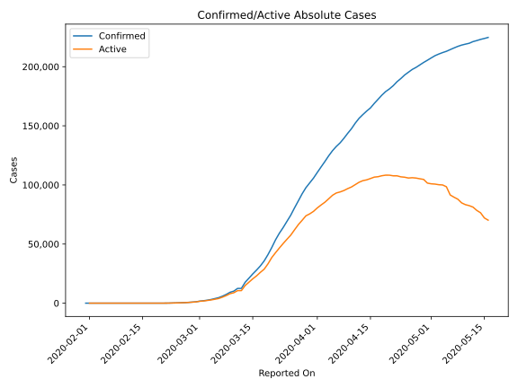
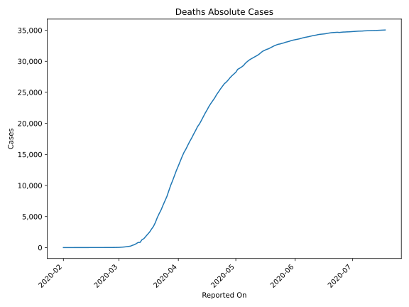
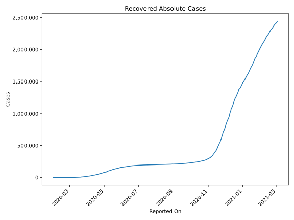
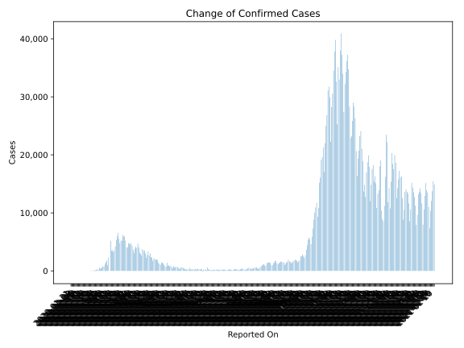
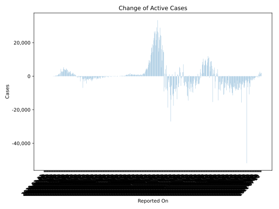
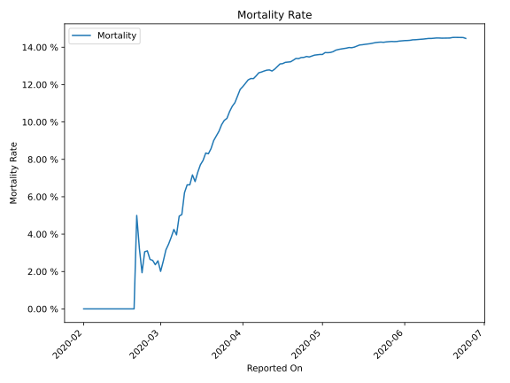

# Country Figures: Time Series for Italy 

| Reported On | Confirmed | Deaths | Recovered | Active | Mortality | &Delta; Confirmed | &Delta; Deaths | &Delta; Recovered | &Delta; Active | % Active of Population |
|-------------|-----------|--------|-----------|--------|-----------|-------------------|----------------|-------------------|----------------|------------------------|
| 2020-04-25 | 195351 | 26384 | 63120 | 105847 |  13.51 %  | 2357 | 415 | 2622 | -680 |  0.175 %  | 
| 2020-04-24 | 192994 | 25969 | 60498 | 106527 |  13.46 %  | 3021 | 420 | 2922 | -321 |  0.176 %  | 
| 2020-04-23 | 189973 | 25549 | 57576 | 106848 |  13.45 %  | 2646 | 464 | 3033 | -851 |  0.177 %  | 
| 2020-04-22 | 187327 | 25085 | 54543 | 107699 |  13.39 %  | 3370 | 437 | 2943 | -10 |  0.178 %  | 
| 2020-04-21 | 183957 | 24648 | 51600 | 107709 |  13.40 %  | 2729 | 534 | 2723 | -528 |  0.178 %  | 
| 2020-04-20 | 181228 | 24114 | 48877 | 108237 |  13.31 %  | 2256 | 454 | 1822 | -20 |  0.179 %  | 
| 2020-04-19 | 178972 | 23660 | 47055 | 108257 |  13.22 %  | 3047 | 433 | 2128 | 486 |  0.179 %  | 
| 2020-04-18 | 175925 | 23227 | 44927 | 107771 |  13.20 %  | 3491 | 482 | 2200 | 809 |  0.178 %  | 
| 2020-04-17 | 172434 | 22745 | 42727 | 106962 |  13.19 %  | 3493 | 575 | 2563 | 355 |  0.177 %  | 
| 2020-04-16 | 168941 | 22170 | 40164 | 106607 |  13.12 %  | 3786 | 525 | 2072 | 1189 |  0.176 %  | 
| 2020-04-15 | 165155 | 21645 | 38092 | 105418 |  13.11 %  | 2667 | 578 | 962 | 1127 |  0.174 %  | 
| 2020-04-14 | 162488 | 21067 | 37130 | 104291 |  12.97 %  | 2972 | 602 | 1695 | 675 |  0.173 %  | 
| 2020-04-13 | 159516 | 20465 | 35435 | 103616 |  12.83 %  | 3153 | 566 | 1224 | 1363 |  0.171 %  | 
| 2020-04-12 | 156363 | 19899 | 34211 | 102253 |  12.73 %  | 4092 | 431 | 1677 | 1984 |  0.169 %  | 
| 2020-04-11 | 152271 | 19468 | 32534 | 100269 |  12.79 %  | 4694 | 619 | 2079 | 1996 |  0.166 %  | 
| 2020-04-10 | 147577 | 18849 | 30455 | 98273 |  12.77 %  | 3951 | 570 | 1985 | 1396 |  0.163 %  | 
| 2020-04-09 | 143626 | 18279 | 28470 | 96877 |  12.73 %  | 4204 | 610 | 1979 | 1615 |  0.160 %  | 
| 2020-04-08 | 139422 | 17669 | 26491 | 95262 |  12.67 %  | 3836 | 542 | 2099 | 1195 |  0.158 %  | 
| 2020-04-07 | 135586 | 17127 | 24392 | 94067 |  12.63 %  | 3039 | 604 | 1555 | 880 |  0.156 %  | 
| 2020-04-06 | 132547 | 16523 | 22837 | 93187 |  12.47 %  | 3599 | 636 | 1022 | 1941 |  0.154 %  | 
| 2020-04-05 | 128948 | 15887 | 21815 | 91246 |  12.32 %  | 4316 | 525 | 819 | 2972 |  0.151 %  | 
| 2020-04-04 | 124632 | 15362 | 20996 | 88274 |  12.33 %  | 4805 | 681 | 1238 | 2886 |  0.146 %  | 
| 2020-04-03 | 119827 | 14681 | 19758 | 85388 |  12.25 %  | 4585 | 766 | 1480 | 2339 |  0.141 %  | 
| 2020-04-02 | 115242 | 13915 | 18278 | 83049 |  12.07 %  | 4668 | 760 | 1431 | 2477 |  0.137 %  | 
| 2020-04-01 | 110574 | 13155 | 16847 | 80572 |  11.90 %  | 4782 | 727 | 1118 | 2937 |  0.133 %  | 
| 2020-03-31 | 105792 | 12428 | 15729 | 77635 |  11.75 %  | 4053 | 837 | 1109 | 2107 |  0.128 %  | 
| 2020-03-30 | 101739 | 11591 | 14620 | 75528 |  11.39 %  | 4050 | 812 | 1590 | 1648 |  0.125 %  | 
| 2020-03-29 | 97689 | 10779 | 13030 | 73880 |  11.03 %  | 5217 | 756 | 646 | 3815 |  0.122 %  | 
| 2020-03-28 | 92472 | 10023 | 12384 | 70065 |  10.84 %  | 5974 | 889 | 1434 | 3651 |  0.116 %  | 
| 2020-03-27 | 86498 | 9134 | 10950 | 66414 |  10.56 %  | 5909 | 919 | 589 | 4401 |  0.110 %  | 
| 2020-03-26 | 80589 | 8215 | 10361 | 62013 |  10.19 %  | 6203 | 712 | 999 | 4492 |  0.103 %  | 
| 2020-03-25 | 74386 | 7503 | 9362 | 57521 |  10.09 %  | 5210 | 683 | 1036 | 3491 |  0.095 %  | 
| 2020-03-24 | 69176 | 6820 | 8326 | 54030 |  9.86 %  | 5249 | 743 | 894 | 3612 |  0.089 %  | 
| 2020-03-23 | 63927 | 6077 | 7432 | 50418 |  9.51 %  | 4789 | 601 | 408 | 3780 |  0.083 %  | 
| 2020-03-22 | 59138 | 5476 | 7024 | 46638 |  9.26 %  | 5560 | 651 | 952 | 3957 |  0.077 %  | 
| 2020-03-21 | 53578 | 4825 | 6072 | 42681 |  9.01 %  | 6557 | 793 | 1632 | 4132 |  0.071 %  | 
| 2020-03-20 | 47021 | 4032 | 4440 | 38549 |  8.57 %  | 5986 | 627 | 0 | 5359 |  0.064 %  | 
| 2020-03-19 | 41035 | 3405 | 4440 | 33190 |  8.30 %  | 5322 | 427 | 415 | 4480 |  0.055 %  | 
| 2020-03-18 | 35713 | 2978 | 4025 | 28710 |  8.34 %  | 4207 | 475 | 1084 | 2648 |  0.048 %  | 
| 2020-03-17 | 31506 | 2503 | 2941 | 26062 |  7.94 %  | 3526 | 345 | 192 | 2989 |  0.043 %  | 
| 2020-03-16 | 27980 | 2158 | 2749 | 23073 |  7.71 %  | 3233 | 349 | 414 | 2470 |  0.038 %  | 
| 2020-03-15 | 24747 | 1809 | 2335 | 20603 |  7.31 %  | 3590 | 368 | 369 | 2853 |  0.034 %  | 
| 2020-03-14 | 21157 | 1441 | 1966 | 17750 |  6.81 %  | 3497 | 175 | 527 | 2795 |  0.029 %  | 
| 2020-03-13 | 17660 | 1266 | 1439 | 14955 |  7.17 %  | 5198 | 439 | 394 | 4365 |  0.025 %  | 
| 2020-03-12 | 12462 | 827 | 1045 | 10590 |  6.64 %  | 0 | 0 | 0 | 0 |  0.018 %  | 
| 2020-03-11 | 12462 | 827 | 1045 | 10590 |  6.64 %  | 2313 | 196 | 321 | 1796 |  0.018 %  | 
| 2020-03-10 | 10149 | 631 | 724 | 8794 |  6.22 %  | 977 | 168 | 0 | 809 |  0.015 %  | 
| 2020-03-09 | 9172 | 463 | 724 | 7985 |  5.05 %  | 1797 | 97 | 102 | 1598 |  0.013 %  | 
| 2020-03-08 | 7375 | 366 | 622 | 6387 |  4.96 %  | 1492 | 133 | 33 | 1326 |  0.011 %  | 
| 2020-03-07 | 5883 | 233 | 589 | 5061 |  3.96 %  | 1247 | 36 | 66 | 1145 |  0.008 %  | 
| 2020-03-06 | 4636 | 197 | 523 | 3916 |  4.25 %  | 778 | 49 | 109 | 620 |  0.006 %  | 
| 2020-03-05 | 3858 | 148 | 414 | 3296 |  3.84 %  | 769 | 41 | 138 | 590 |  0.005 %  | 
| 2020-03-04 | 3089 | 107 | 276 | 2706 |  3.46 %  | 587 | 28 | 116 | 443 |  0.004 %  | 
| 2020-03-03 | 2502 | 79 | 160 | 2263 |  3.16 %  | 466 | 27 | 11 | 428 |  0.004 %  | 
| 2020-03-02 | 2036 | 52 | 149 | 1835 |  2.55 %  | 342 | 18 | 66 | 258 |  0.003 %  | 
| 2020-03-01 | 1694 | 34 | 83 | 1577 |  2.01 %  | 566 | 5 | 37 | 524 |  0.003 %  | 
| 2020-02-29 | 1128 | 29 | 46 | 1053 |  2.57 %  | 240 | 8 | 0 | 232 |  0.002 %  | 
| 2020-02-28 | 888 | 21 | 46 | 821 |  2.36 %  | 233 | 4 | 1 | 228 |  0.001 %  | 
| 2020-02-27 | 655 | 17 | 45 | 593 |  2.60 %  | 202 | 5 | 42 | 155 |  0.001 %  | 
| 2020-02-26 | 453 | 12 | 3 | 438 |  2.65 %  | 131 | 2 | 2 | 127 |  0.001 %  | 
| 2020-02-25 | 322 | 10 | 1 | 311 |  3.11 %  | 93 | 3 | 0 | 90 |  0.001 %  | 
| 2020-02-24 | 229 | 7 | 1 | 221 |  3.06 %  | 74 | 4 | -1 | 71 |  0.000 %  | 
| 2020-02-23 | 155 | 3 | 2 | 150 |  1.94 %  | 93 | 1 | 1 | 91 |  0.000 %  | 
| 2020-02-22 | 62 | 2 | 1 | 59 |  3.23 %  | 42 | 1 | 1 | 40 |  0.000 %  | 
| 2020-02-21 | 20 | 1 | 0 | 19 |  5.00 %  | 17 | 1 | 0 | 16 |  0.000 %  | 
| 2020-02-20 | 3 | 0 | 0 | 3 |  None  | 0 | 0 | 0 | 0 |  0.000 %  | 
| 2020-02-19 | 3 | 0 | 0 | 3 |  None  | 0 | 0 | 0 | 0 |  0.000 %  | 
| 2020-02-18 | 3 | 0 | 0 | 3 |  None  | 0 | 0 | 0 | 0 |  0.000 %  | 
| 2020-02-17 | 3 | 0 | 0 | 3 |  None  | 0 | 0 | 0 | 0 |  0.000 %  | 
| 2020-02-16 | 3 | 0 | 0 | 3 |  None  | 0 | 0 | 0 | 0 |  0.000 %  | 
| 2020-02-15 | 3 | 0 | 0 | 3 |  None  | 0 | 0 | 0 | 0 |  0.000 %  | 
| 2020-02-14 | 3 | 0 | 0 | 3 |  None  | 0 | 0 | 0 | 0 |  0.000 %  | 
| 2020-02-13 | 3 | 0 | 0 | 3 |  None  | 0 | 0 | 0 | 0 |  0.000 %  | 
| 2020-02-12 | 3 | 0 | 0 | 3 |  None  | 0 | 0 | 0 | 0 |  0.000 %  | 
| 2020-02-11 | 3 | 0 | 0 | 3 |  None  | 0 | 0 | 0 | 0 |  0.000 %  | 
| 2020-02-10 | 3 | 0 | 0 | 3 |  None  | 0 | 0 | 0 | 0 |  0.000 %  | 
| 2020-02-09 | 3 | 0 | 0 | 3 |  None  | 0 | 0 | 0 | 0 |  0.000 %  | 
| 2020-02-08 | 3 | 0 | 0 | 3 |  None  | 0 | 0 | 0 | 0 |  0.000 %  | 
| 2020-02-07 | 3 | 0 | 0 | 3 |  None  | 1 | 0 | 0 | 1 |  0.000 %  | 
| 2020-02-06 | 2 | 0 | 0 | 2 |  None  | 0 | 0 | 0 | 0 |  0.000 %  | 
| 2020-02-05 | 2 | 0 | 0 | 2 |  None  | 0 | 0 | 0 | 0 |  0.000 %  | 
| 2020-02-04 | 2 | 0 | 0 | 2 |  None  | 0 | 0 | 0 | 0 |  0.000 %  | 
| 2020-02-03 | 2 | 0 | 0 | 2 |  None  | 0 | 0 | 0 | 0 |  0.000 %  | 
| 2020-02-02 | 2 | 0 | 0 | 2 |  None  | 0 | 0 | 0 | 0 |  0.000 %  | 
| 2020-02-01 | 2 | 0 | 0 | 2 |  None  | 0 | None | None | None |  0.000 %  | 
| 2020-01-31 | 2 | None | None | None |  None  | None | None | None | None |  n/a  | 

