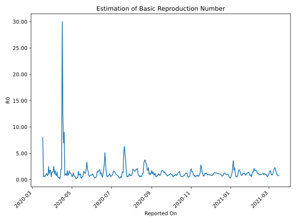

# Country Figures: Time Series for Basic Reproduction Number of Jamaica 

| Reported On | &Delta; Confirmed | Total &Delta; Confirmed First Interval | Total &Delta; Confirmed Second Interval | Estimated Basic Reproduction Number R0 | 
|-------------|-------------------|----------------------------------------|-----------------------------------------|---------------------------------------------------|
| 2020-05-03 | 6 |  99  |  76  |  1.30  | 
| 2020-05-02 | 31 |  68  |  107  |  0.64  | 
| 2020-05-01 | 10 |  72  |  117  |  0.62  | 
| 2020-04-30 | 26 |  91  |  82  |  1.11  | 
| 2020-04-29 | 32 |  76  |  65  |  1.17  | 
| 2020-04-28 | 0 |  107  |  84  |  1.27  | 
| 2020-04-27 | 14 |  117  |  70  |  1.67  | 
| 2020-04-26 | 45 |  82  |  80  |  1.02  | 
| 2020-04-25 | 17 |  65  |  80  |  0.81  | 
| 2020-04-24 | 31 |  84  |  48  |  1.75  | 
| 2020-04-23 | 24 |  70  |  90  |  0.78  | 
| 2020-04-22 | 10 |  80  |  70  |  1.14  | 
| 2020-04-21 | 0 |  80  |  74  |  1.08  | 
| 2020-04-20 | 50 |  48  |  60  |  0.80  | 
| 2020-04-19 | 10 |  90  |  10  |  9.00  | 
| 2020-04-18 | 20 |  70  |  10  |  7.00  | 
| 2020-04-17 | 0 |  74  |  6  |  12.33  | 
| 2020-04-16 | 18 |  60  |  2  |  30.00  | 
| 2020-04-15 | 52 |  10  |  5  |  2.00  | 
| 2020-04-14 | 0 |  10  |  5  |  2.00  | 
| 2020-04-13 | 4 |  6  |  10  |  0.60  | 
| 2020-04-12 | 4 |  2  |  16  |  0.12  | 
| 2020-04-11 | 2 |  5  |  11  |  0.45  | 
| 2020-04-10 | 0 |  5  |  14  |  0.36  | 
| 2020-04-09 | 0 |  10  |  17  |  0.59  | 
| 2020-04-08 | 0 |  16  |  11  |  1.45  | 
| 2020-04-07 | 5 |  11  |  15  |  0.73  | 
| 2020-04-06 | 0 |  14  |  14  |  1.00  | 
| 2020-04-05 | 5 |  17  |  10  |  1.70  | 
| 2020-04-04 | 6 |  11  |  10  |  1.10  | 
| 2020-04-03 | 0 |  15  |  6  |  2.50  | 
| 2020-04-02 | 3 |  14  |  9  |  1.56  | 
| 2020-04-01 | 8 |  10  |  7  |  1.43  | 
| 2020-03-31 | 0 |  10  |  7  |  1.43  | 
| 2020-03-30 | 4 |  6  |  10  |  0.60  | 
| 2020-03-29 | 2 |  9  |  5  |  1.80  | 
| 2020-03-28 | 4 |  7  |  4  |  1.75  | 
| 2020-03-27 | 0 |  7  |  6  |  1.17  | 
| 2020-03-26 | 0 |  10  |  4  |  2.50  | 
| 2020-03-25 | 5 |  5  |  6  |  0.83  | 
| 2020-03-24 | 2 |  4  |  5  |  0.80  | 
| 2020-03-23 | 0 |  6  |  5  |  1.20  | 
| 2020-03-22 | 3 |  4  |  4  |  1.00  | 
| 2020-03-21 | 0 |  6  |  8  |  0.75  | 
| 2020-03-20 | 1 |  5  |  9  |  0.56  | 
| 2020-03-19 | 2 |  5  |  7  |  0.71  | 
| 2020-03-18 | 1 |  4  |  7  |  0.57  | 
| 2020-03-17 | 2 |  8  |  1  |  8.00  | 
| 2020-03-16 | 0 |  9  |  None  |  None  | 
| 2020-03-15 | 2 |  7  |  None  |  None  | 
| 2020-03-14 | 0 |  7  |  None  |  None  | 
| 2020-03-13 | 6 |  1  |  None  |  None  | 
| 2020-03-12 | 1 |  None  |  None  |  None  | 
| 2020-03-11 | None |  None  |  None  |  None  | 

