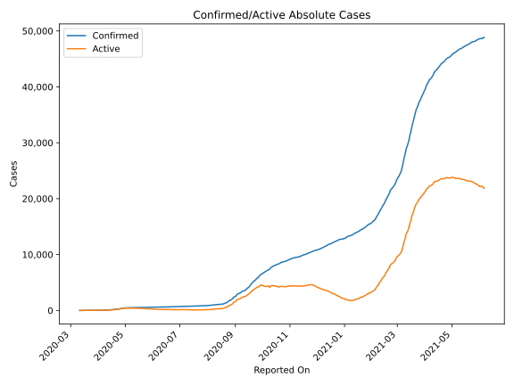
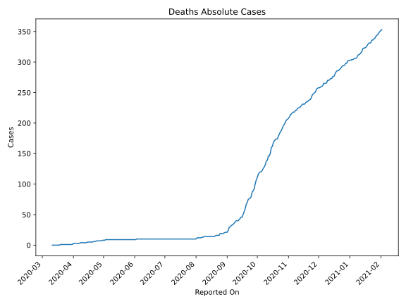
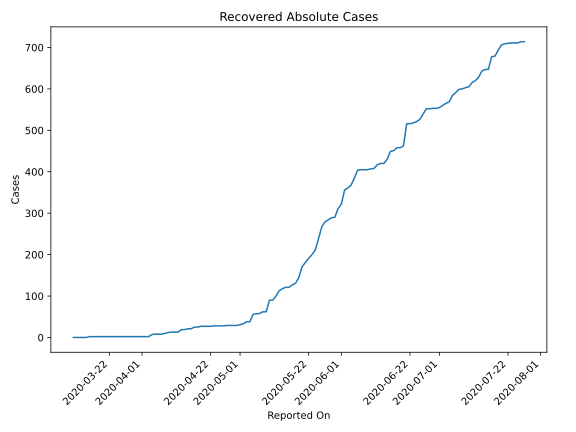
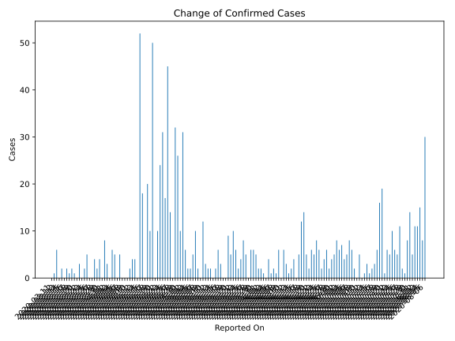
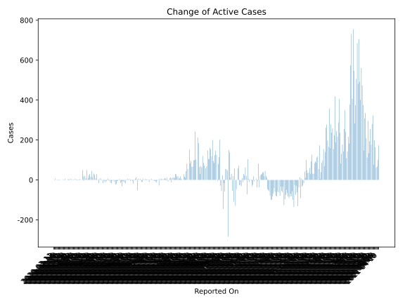
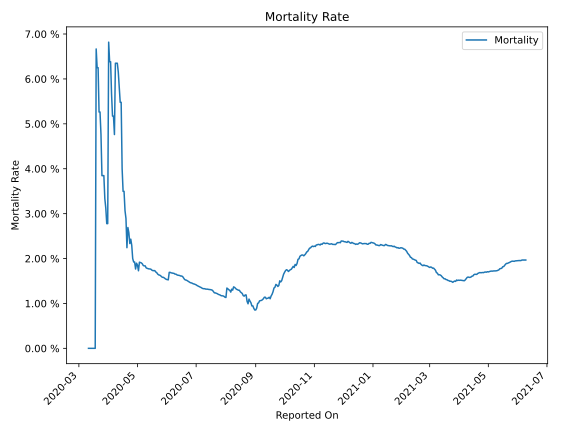

# Country Figures: Time Series for Jamaica 

| Reported On | Confirmed | Deaths | Recovered | Active | Mortality | &Delta; Confirmed | &Delta; Deaths | &Delta; Recovered | &Delta; Active | % Active of Population |
|-------------|-----------|--------|-----------|--------|-----------|-------------------|----------------|-------------------|----------------|------------------------|
| 2020-04-19 | 173 | 5 | 27 | 141 |  2.89 %  | 10 | 0 | 2 | 8 |  0.005 %  | 
| 2020-04-18 | 163 | 5 | 25 | 133 |  3.07 %  | 20 | 0 | 0 | 20 |  0.005 %  | 
| 2020-04-17 | 143 | 5 | 25 | 113 |  3.50 %  | 0 | 0 | 4 | -4 |  0.004 %  | 
| 2020-04-16 | 143 | 5 | 21 | 117 |  3.50 %  | 18 | 0 | 0 | 18 |  0.004 %  | 
| 2020-04-15 | 125 | 5 | 21 | 99 |  4.00 %  | 52 | 1 | 2 | 49 |  0.003 %  | 
| 2020-04-14 | 73 | 4 | 19 | 50 |  5.48 %  | 0 | 0 | 0 | 0 |  0.002 %  | 
| 2020-04-13 | 73 | 4 | 19 | 50 |  5.48 %  | 4 | 0 | 6 | -2 |  0.002 %  | 
| 2020-04-12 | 69 | 4 | 13 | 52 |  5.80 %  | 4 | 0 | 0 | 4 |  0.002 %  | 
| 2020-04-11 | 65 | 4 | 13 | 48 |  6.15 %  | 2 | 0 | 0 | 2 |  0.002 %  | 
| 2020-04-10 | 63 | 4 | 13 | 46 |  6.35 %  | 0 | 0 | 1 | -1 |  0.002 %  | 
| 2020-04-09 | 63 | 4 | 12 | 47 |  6.35 %  | 0 | 0 | 2 | -2 |  0.002 %  | 
| 2020-04-08 | 63 | 4 | 10 | 49 |  6.35 %  | 0 | 1 | 2 | -3 |  0.002 %  | 
| 2020-04-07 | 63 | 3 | 8 | 52 |  4.76 %  | 5 | 0 | 0 | 5 |  0.002 %  | 
| 2020-04-06 | 58 | 3 | 8 | 47 |  5.17 %  | 0 | 0 | 0 | 0 |  0.002 %  | 
| 2020-04-05 | 58 | 3 | 8 | 47 |  5.17 %  | 5 | 0 | 1 | 4 |  0.002 %  | 
| 2020-04-04 | 53 | 3 | 7 | 43 |  5.66 %  | 6 | 0 | 5 | 1 |  0.001 %  | 
| 2020-04-03 | 47 | 3 | 2 | 42 |  6.38 %  | 0 | 0 | 0 | 0 |  0.001 %  | 
| 2020-04-02 | 47 | 3 | 2 | 42 |  6.38 %  | 3 | 0 | 0 | 3 |  0.001 %  | 
| 2020-04-01 | 44 | 3 | 2 | 39 |  6.82 %  | 8 | 2 | 0 | 6 |  0.001 %  | 
| 2020-03-31 | 36 | 1 | 2 | 33 |  2.78 %  | 0 | 0 | 0 | 0 |  0.001 %  | 
| 2020-03-30 | 36 | 1 | 2 | 33 |  2.78 %  | 4 | 0 | 0 | 4 |  0.001 %  | 
| 2020-03-29 | 32 | 1 | 2 | 29 |  3.12 %  | 2 | 0 | 0 | 2 |  0.001 %  | 
| 2020-03-28 | 30 | 1 | 2 | 27 |  3.33 %  | 4 | 0 | 0 | 4 |  0.001 %  | 
| 2020-03-27 | 26 | 1 | 2 | 23 |  3.85 %  | 0 | 0 | 0 | 0 |  0.001 %  | 
| 2020-03-26 | 26 | 1 | 2 | 23 |  3.85 %  | 0 | 0 | 0 | 0 |  0.001 %  | 
| 2020-03-25 | 26 | 1 | 2 | 23 |  3.85 %  | 5 | 0 | 0 | 5 |  0.001 %  | 
| 2020-03-24 | 21 | 1 | 2 | 18 |  4.76 %  | 2 | 0 | 0 | 2 |  0.001 %  | 
| 2020-03-23 | 19 | 1 | 2 | 16 |  5.26 %  | 0 | 0 | 0 | 0 |  0.001 %  | 
| 2020-03-22 | 19 | 1 | 2 | 16 |  5.26 %  | 3 | 0 | 0 | 3 |  0.001 %  | 
| 2020-03-21 | 16 | 1 | 2 | 13 |  6.25 %  | 0 | 0 | 0 | 0 |  0.000 %  | 
| 2020-03-20 | 16 | 1 | 2 | 13 |  6.25 %  | 1 | 0 | 0 | 1 |  0.000 %  | 
| 2020-03-19 | 15 | 1 | 2 | 12 |  6.67 %  | 2 | 1 | 0 | 1 |  0.000 %  | 
| 2020-03-18 | 13 | 0 | 2 | 11 |  None  | 1 | 0 | 0 | 1 |  0.000 %  | 
| 2020-03-17 | 12 | 0 | 2 | 10 |  None  | 2 | 0 | 0 | 2 |  0.000 %  | 
| 2020-03-16 | 10 | 0 | 2 | 8 |  None  | 0 | 0 | 2 | -2 |  0.000 %  | 
| 2020-03-15 | 10 | 0 | 0 | 10 |  None  | 2 | 0 | 0 | 2 |  0.000 %  | 
| 2020-03-14 | 8 | 0 | 0 | 8 |  None  | 0 | 0 | 0 | 0 |  0.000 %  | 
| 2020-03-13 | 8 | 0 | 0 | 8 |  None  | 6 | 0 | 0 | 6 |  0.000 %  | 
| 2020-03-12 | 2 | 0 | 0 | 2 |  None  | 1 | 0 | 0 | 1 |  0.000 %  | 
| 2020-03-11 | 1 | 0 | 0 | 1 |  None  | None | None | None | None |  0.000 %  | 

