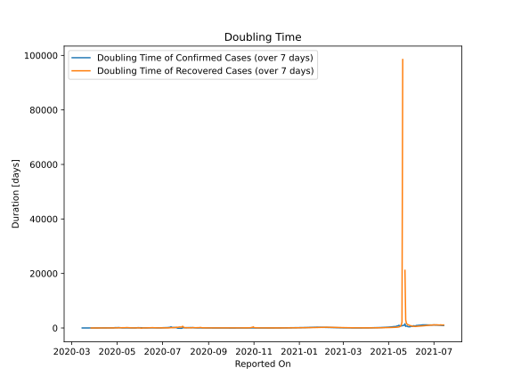

# Country Figures: New Infections in Previous 7 Days per 100,000 Population for Jordan 

<!--  --> 

| Reported On | &Delta; Confirmed (on the day) | &Delta; Confirmed (last 7 days) | New Cases in Previous 7 Days per 100,000 Population |
|-------------|--------------------------------|---------------------------------|-----------------------------------------------------|
| 2020-05-08 |  14  |  49  |  0.492  |
| 2020-05-07 |  21  |  41  |  0.412  |
| 2020-05-06 |  2  |  22  |  0.221  |
| 2020-05-05 |  6  |  22  |  0.221  |
| 2020-05-04 |  4  |  16  |  0.161  |
| 2020-05-03 |  1  |  14  |  0.141  |
| 2020-05-02 |  1  |  16  |  0.161  |
| 2020-05-01 |  6  |  18  |  0.181  |
| 2020-04-30 |  2  |  16  |  0.161  |
| 2020-04-29 |  2  |  16  |  0.161  |
| 2020-04-28 |  None  |  21  |  0.211  |
| 2020-04-27 |  2  |  24  |  0.241  |
| 2020-04-26 |  3  |  30  |  0.301  |
| 2020-04-25 |  3  |  31  |  0.311  |
| 2020-04-24 |  4  |  34  |  0.342  |
| 2020-04-23 |  2  |  35  |  0.352  |
| 2020-04-22 |  7  |  34  |  0.342  |
| 2020-04-21 |  3  |  31  |  0.311  |
| 2020-04-20 |  8  |  34  |  0.342  |
| 2020-04-19 |  4  |  28  |  0.281  |
| 2020-04-18 |  6  |  32  |  0.321  |
| 2020-04-17 |  5  |  35  |  0.352  |
| 2020-04-16 |  1  |  30  |  0.301  |
| 2020-04-15 |  4  |  43  |  0.432  |
| 2020-04-14 |  6  |  44  |  0.442  |
| 2020-04-13 |  2  |  42  |  0.422  |
| 2020-04-12 |  8  |  44  |  0.442  |
| 2020-04-11 |  9  |  58  |  0.583  |
| 2020-04-10 |  None  |  62  |  0.623  |
| 2020-04-09 |  14  |  73  |  0.733  |
| 2020-04-08 |  5  |  80  |  0.804  |
| 2020-04-07 |  4  |  79  |  0.793  |
| 2020-04-06 |  4  |  81  |  0.814  |
| 2020-04-05 |  22  |  86  |  0.864  |
| 2020-04-04 |  13  |  77  |  0.773  |
| 2020-04-03 |  11  |  75  |  0.753  |
| 2020-04-02 |  21  |  87  |  0.874  |
| 2020-04-01 |  4  |  106  |  1.065  |
| 2020-03-31 |  6  |  120  |  1.205  |
| 2020-03-30 |  9  |  141  |  1.416  |
| 2020-03-29 |  13  |  147  |  1.476  |
| 2020-03-28 |  11  |  161  |  1.617  |
| 2020-03-27 |  23  |  150  |  1.507  |
| 2020-03-26 |  40  |  143  |  1.436  |
| 2020-03-25 |  18  |  120  |  1.205  |
| 2020-03-24 |  27  |  120  |  1.205  |
| 2020-03-23 |  15  |  110  |  1.105  |
| 2020-03-22 |  27  |  104  |  1.045  |
| 2020-03-21 |  None  |  84  |  0.844  |
| 2020-03-20 |  16  |  84  |  0.844  |
| 2020-03-19 |  17  |  68  |  0.683  |
| 2020-03-18 |  18  |  51  |  0.512  |
| 2020-03-17 |  17  |  33  |  0.331  |
| 2020-03-16 |  9  |  16  |  0.161  |
| 2020-03-15 |  7  |  7  |  0.070  |
| 2020-03-14 |  None  |  None  |  None  |
| 2020-03-13 |  None  |  None  |  None  |
| 2020-03-12 |  None  |  None  |  None  |
| 2020-03-11 |  None  |  None  |  None  |
| 2020-03-10 |  None  |  None  |  None  |
| 2020-03-09 |  None  |  None  |  None  |
| 2020-03-08 |  None  |  None  |  None  |
| 2020-03-07 |  None  |  None  |  None  |
| 2020-03-06 |  None  |  None  |  None  |
| 2020-03-05 |  None  |  None  |  None  |
| 2020-03-04 |  None  |  None  |  None  |
| 2020-03-03 |  None  |  None  |  None  |

