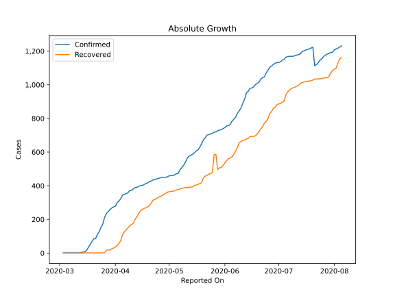

# Country Figures: Doubling Time of Infections for Jordan 

The doubling time below are calculated based on
* an exponential growth assumption
* for time difference of past seven (7) days.
The doubling time's unit is "days".

The first doubling time indicates the increase of confirmed (infected)
cases. There, the *higher* the number is, the better is to take control
of the disease.

The second doubling time indicates the increase of recovered (healed)
cases. There, the *lower* the number is, the better it is to take
control of the disease.

| Reported On | Confirmed | Doubling Time (Confirmed) | Recovered | Doubling Time (Recovered) |
|-------------|-----------|---------------------------|-----------|---------------------------|
| 2020-05-01 | 459 |  121.6 days  | 364 |  44.4 days  | 
| 2020-04-30 | 453 |  135.3 days  | 362 |  37.8 days  | 
| 2020-04-29 | 451 |  134.7 days  | 356 |  40.0 days  | 
| 2020-04-28 | 449 |  101.6 days  | 348 |  31.0 days  | 
| 2020-04-27 | 449 |  88.7 days  | 342 |  25.5 days  | 
| 2020-04-26 | 447 |  70.2 days  | 337 |  24.6 days  | 
| 2020-04-25 | 444 |  67.4 days  | 332 |  23.4 days  | 
| 2020-04-24 | 441 |  60.8 days  | 326 |  23.8 days  | 
| 2020-04-23 | 437 |  58.5 days  | 318 |  24.0 days  | 
| 2020-04-22 | 435 |  60.0 days  | 315 |  21.3 days  | 
| 2020-04-21 | 428 |  64.9 days  | 297 |  21.1 days  | 
| 2020-04-20 | 425 |  58.5 days  | 282 |  18.2 days  | 
| 2020-04-19 | 417 |  70.2 days  | 276 |  15.6 days  | 
| 2020-04-18 | 413 |  60.5 days  | 269 |  11.9 days  | 
| 2020-04-17 | 407 |  54.3 days  | 265 |  11.3 days  | 
| 2020-04-16 | 402 |  62.9 days  | 259 |  10.5 days  | 
| 2020-04-15 | 401 |  43.1 days  | 250 |  9.8 days  | 
| 2020-04-14 | 397 |  41.7 days  | 235 |  9.5 days  | 
| 2020-04-13 | 391 |  43.0 days  | 215 |  9.4 days  | 
| 2020-04-12 | 389 |  40.8 days  | 201 |  8.4 days  | 
| 2020-04-11 | 381 |  29.7 days  | 177 |  5.9 days  | 
| 2020-04-10 | 372 |  27.0 days  | 170 |  4.9 days  | 
| 2020-04-09 | 372 |  22.6 days  | 161 |  4.1 days  | 
| 2020-04-08 | 358 |  19.5 days  | 150 |  3.7 days  | 
| 2020-04-07 | 353 |  19.5 days  | 138 |  3.5 days  | 
| 2020-04-06 | 349 |  18.7 days  | 126 |  3.4 days  | 
| 2020-04-05 | 345 |  17.3 days  | 110 |  3.0 days  | 
| 2020-04-04 | 323 |  18.2 days  | 74 |  3.8 days  | 
| 2020-04-03 | 310 |  17.9 days  | 58 |  4.5 days  | 
| 2020-04-02 | 299 |  14.5 days  | 45 |  1.6 days  | 
| 2020-04-01 | 278 |  10.4 days  | 36 |  1.7 days  | 
| 2020-03-31 | 274 |  8.8 days  | 30 |  1.8 days  | 
| 2020-03-30 | 268 |  6.8 days  | 26 |  1.8 days  | 
| 2020-03-29 | 259 |  6.1 days  | 18 |  2.0 days  | 
| 2020-03-28 | 246 |  4.9 days  | 18 |  2.0 days  | 
| 2020-03-27 | 235 |  5.1 days  | 18 |  2.0 days  | 
| 2020-03-26 | 212 |  4.7 days  | 1 |  None  | 
| 2020-03-25 | 172 |  4.4 days  | 1 |  None  | 
| 2020-03-24 | 154 |  3.5 days  | 1 |  None  | 
| 2020-03-23 | 127 |  2.7 days  | 1 |  None  | 
| 2020-03-22 | 112 |  2.2 days  | 1 |  None  | 
| 2020-03-21 | 85 |  1.4 days  | 1 |  None  | 
| 2020-03-20 | 85 |  1.4 days  | 1 |  None  | 
| 2020-03-19 | 69 |  1.5 days  | 1 |  None  | 
| 2020-03-18 | 52 |  1.5 days  | 1 |  None  | 
| 2020-03-17 | 34 |  1.7 days  | 1 |  None  | 
| 2020-03-16 | 17 |  2.0 days  | 1 |  None  | 
| 2020-03-15 | 8 |  2.7 days  | 1 |  None  | 
| 2020-03-12 | 1 |  None  | 0 |  None  | 
| 2020-03-11 | 1 |  None  | 0 |  None  | 
| 2020-03-10 | 1 |  None  | 0 |  None  | 
| 2020-03-09 | 1 |  None  | 0 |  None  | 
| 2020-03-08 | 1 |  None  | 0 |  None  | 
| 2020-03-07 | 1 |  None  | 0 |  None  | 
| 2020-03-06 | 1 |  None  | 0 |  None  | 
| 2020-03-05 | 1 |  None  | 0 |  None  | 
| 2020-03-04 | 1 |  None  | 0 |  None  | 
| 2020-03-03 | 1 |  None  | 0 |  None  | 

