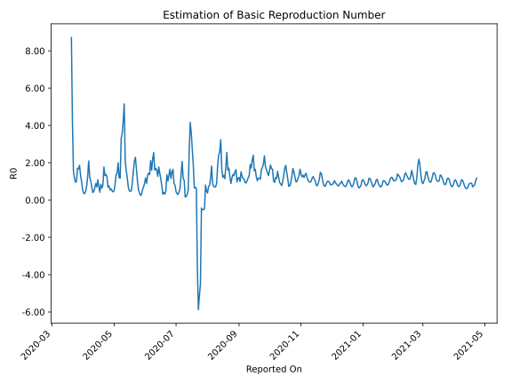

# Country Figures: Time Series for Basic Reproduction Number of Jordan 

| Reported On | &Delta; Confirmed | Total &Delta; Confirmed First Interval | Total &Delta; Confirmed Second Interval | Estimated Basic Reproduction Number R0 | 
|-------------|-------------------|----------------------------------------|-----------------------------------------|---------------------------------------------------|
| 2020-04-28 | 0 |  12  |  20  |  0.60  | 
| 2020-04-27 | 2 |  12  |  22  |  0.55  | 
| 2020-04-26 | 3 |  16  |  21  |  0.76  | 
| 2020-04-25 | 3 |  16  |  23  |  0.70  | 
| 2020-04-24 | 4 |  20  |  16  |  1.25  | 
| 2020-04-23 | 2 |  22  |  16  |  1.38  | 
| 2020-04-22 | 7 |  21  |  16  |  1.31  | 
| 2020-04-21 | 3 |  23  |  13  |  1.77  | 
| 2020-04-20 | 8 |  16  |  20  |  0.80  | 
| 2020-04-19 | 4 |  16  |  25  |  0.64  | 
| 2020-04-18 | 6 |  16  |  19  |  0.84  | 
| 2020-04-17 | 5 |  13  |  31  |  0.42  | 
| 2020-04-16 | 1 |  20  |  28  |  0.71  | 
| 2020-04-15 | 4 |  25  |  23  |  1.09  | 
| 2020-04-14 | 6 |  19  |  27  |  0.70  | 
| 2020-04-13 | 2 |  31  |  35  |  0.89  | 
| 2020-04-12 | 8 |  28  |  43  |  0.65  | 
| 2020-04-11 | 9 |  23  |  50  |  0.46  | 
| 2020-04-10 | 0 |  27  |  67  |  0.40  | 
| 2020-04-09 | 14 |  35  |  49  |  0.71  | 
| 2020-04-08 | 5 |  43  |  42  |  1.02  | 
| 2020-04-07 | 4 |  50  |  40  |  1.25  | 
| 2020-04-06 | 4 |  67  |  32  |  2.09  | 
| 2020-04-05 | 22 |  49  |  39  |  1.26  | 
| 2020-04-04 | 13 |  42  |  56  |  0.75  | 
| 2020-04-03 | 11 |  40  |  87  |  0.46  | 
| 2020-04-02 | 21 |  32  |  92  |  0.35  | 
| 2020-04-01 | 4 |  39  |  108  |  0.36  | 
| 2020-03-31 | 6 |  56  |  100  |  0.56  | 
| 2020-03-30 | 9 |  87  |  87  |  1.00  | 
| 2020-03-29 | 13 |  92  |  69  |  1.33  | 
| 2020-03-28 | 11 |  108  |  58  |  1.86  | 
| 2020-03-27 | 23 |  100  |  60  |  1.67  | 
| 2020-03-26 | 40 |  87  |  51  |  1.71  | 
| 2020-03-25 | 18 |  69  |  68  |  1.01  | 
| 2020-03-24 | 27 |  58  |  61  |  0.95  | 
| 2020-03-23 | 15 |  60  |  51  |  1.18  | 
| 2020-03-22 | 27 |  51  |  33  |  1.55  | 
| 2020-03-21 | 0 |  68  |  16  |  4.25  | 
| 2020-03-20 | 16 |  61  |  7  |  8.71  | 
| 2020-03-19 | 17 |  51  |  None  |  None  | 
| 2020-03-18 | 18 |  33  |  None  |  None  | 
| 2020-03-17 | 17 |  16  |  None  |  None  | 
| 2020-03-16 | 9 |  7  |  None  |  None  | 
| 2020-03-15 | 7 |  None  |  None  |  None  | 
| 2020-03-14 | 0 |  None  |  None  |  None  | 
| 2020-03-13 | 0 |  None  |  None  |  None  | 
| 2020-03-12 | 0 |  None  |  None  |  None  | 
| 2020-03-11 | 0 |  None  |  None  |  None  | 
| 2020-03-10 | 0 |  None  |  None  |  None  | 
| 2020-03-09 | 0 |  None  |  None  |  None  | 
| 2020-03-08 | 0 |  None  |  None  |  None  | 
| 2020-03-07 | 0 |  None  |  None  |  None  | 
| 2020-03-06 | 0 |  None  |  None  |  None  | 
| 2020-03-05 | 0 |  None  |  None  |  None  | 
| 2020-03-04 | 0 |  None  |  None  |  None  | 
| 2020-03-03 | None |  None  |  None  |  None  | 

