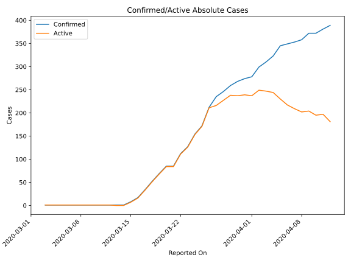
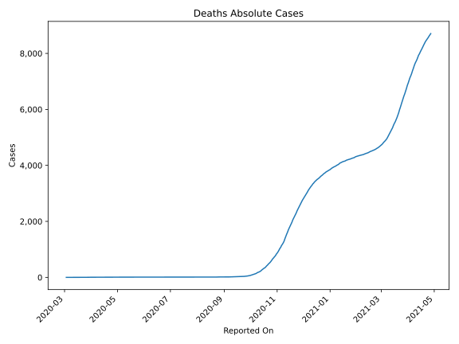
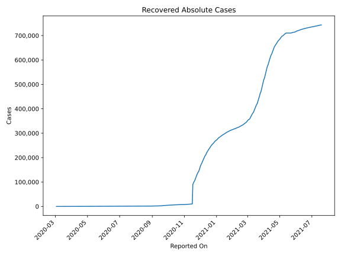
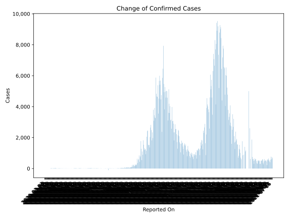
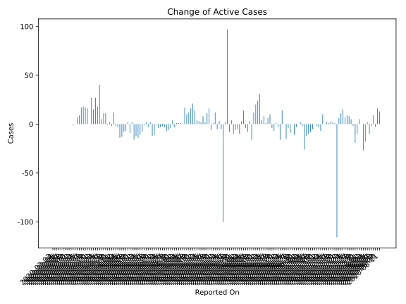
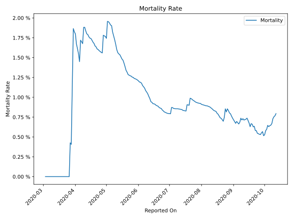

# Country Figures: Time Series for Jordan 

| Reported On | Confirmed | Deaths | Recovered | Active | Mortality | &Delta; Confirmed | &Delta; Deaths | &Delta; Active | % Active of Population |
|-------------|-----------|--------|-----------|--------|-----------|-------------------|----------------|----------------|------------------------|
| 2020-03-21 | 85 | 0 | 1 | 84 |  None  | 0 | 0 | 0 |  0.001 %  | 
| 2020-03-20 | 85 | 0 | 1 | 84 |  None  | 16 | 0 | 16 |  0.001 %  | 
| 2020-03-19 | 69 | 0 | 1 | 68 |  None  | 17 | 0 | 17 |  0.001 %  | 
| 2020-03-18 | 52 | 0 | 1 | 51 |  None  | 18 | 0 | 18 |  0.001 %  | 
| 2020-03-17 | 34 | 0 | 1 | 33 |  None  | 17 | 0 | 17 |  0.000 %  | 
| 2020-03-16 | 17 | 0 | 1 | 16 |  None  | 9 | 0 | 9 |  0.000 %  | 
| 2020-03-15 | 8 | 0 | 1 | 7 |  None  | 7 | 0 | 7 |  0.000 %  | 
| 2020-03-14 | 1 | 0 | 1 | 0 |  None  | 0 | 0 | 0 |  n/a  | 
| 2020-03-13 | 1 | 0 | 1 | 0 |  None  | 0 | 0 | -1 |  n/a  | 
| 2020-03-12 | 1 | 0 | 0 | 1 |  None  | 0 | 0 | 0 |  0.000 %  | 
| 2020-03-11 | 1 | 0 | 0 | 1 |  None  | 0 | 0 | 0 |  0.000 %  | 
| 2020-03-10 | 1 | 0 | 0 | 1 |  None  | 0 | 0 | 0 |  0.000 %  | 
| 2020-03-09 | 1 | 0 | 0 | 1 |  None  | 0 | 0 | 0 |  0.000 %  | 
| 2020-03-08 | 1 | 0 | 0 | 1 |  None  | 0 | 0 | 0 |  0.000 %  | 
| 2020-03-07 | 1 | 0 | 0 | 1 |  None  | 0 | 0 | 0 |  0.000 %  | 
| 2020-03-06 | 1 | 0 | 0 | 1 |  None  | 0 | 0 | 0 |  0.000 %  | 
| 2020-03-05 | 1 | 0 | 0 | 1 |  None  | 0 | 0 | 0 |  0.000 %  | 
| 2020-03-04 | 1 | 0 | 0 | 1 |  None  | 0 | 0 | 0 |  0.000 %  | 
| 2020-03-03 | 1 | 0 | 0 | 1 |  None  | None | None | None |  0.000 %  | 

