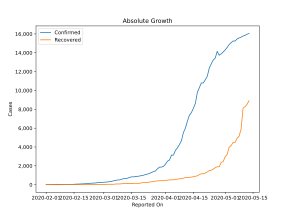
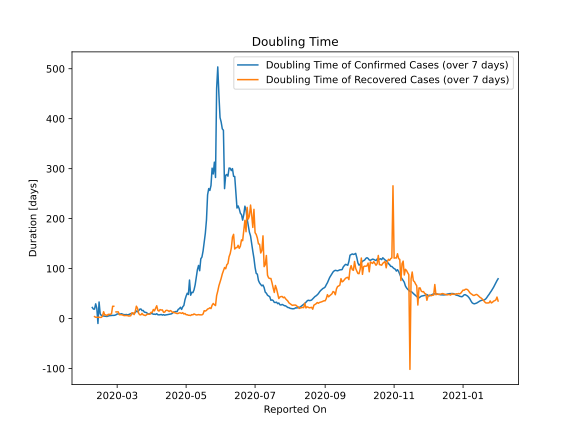

# Country Figures: Doubling Time of Infections for Japan 

The doubling time below are calculated based on
* an exponential growth assumption
* for time difference of past seven (7) days.
The doubling time's unit is "days".

The first doubling time indicates the increase of confirmed (infected)
cases. There, the *higher* the number is, the better is to take control
of the disease.

The second doubling time indicates the increase of recovered (healed)
cases. There, the *lower* the number is, the better it is to take
control of the disease.

| Reported On | Confirmed | Doubling Time (Confirmed) | Recovered | Doubling Time (Recovered) |
|-------------|-----------|---------------------------|-----------|---------------------------|
| 2020-04-19 | 10797 |  10.7 days  | 1159 |  11.9 days  | 
| 2020-04-18 | 10296 |  9.3 days  | 1069 |  14.7 days  | 
| 2020-04-17 | 9787 |  8.8 days  | 935 |  15.9 days  | 
| 2020-04-16 | 8626 |  8.2 days  | 901 |  14.0 days  | 
| 2020-04-15 | 8100 |  7.9 days  | 853 |  15.7 days  | 
| 2020-04-14 | 7645 |  7.6 days  | 799 |  16.5 days  | 
| 2020-04-13 | 7370 |  7.3 days  | 784 |  16.0 days  | 
| 2020-04-12 | 6748 |  6.7 days  | 762 |  12.7 days  | 
| 2020-04-11 | 6005 |  7.8 days  | 762 |  12.7 days  | 
| 2020-04-10 | 5530 |  6.8 days  | 685 |  17.2 days  | 
| 2020-04-09 | 4667 |  8.1 days  | 632 |  17.0 days  | 
| 2020-04-08 | 4257 |  7.6 days  | 622 |  17.9 days  | 
| 2020-04-07 | 3906 |  7.3 days  | 592 |  14.9 days  | 
| 2020-04-06 | 3654 |  7.6 days  | 575 |  16.3 days  | 
| 2020-04-05 | 3139 |  9.7 days  | 514 |  25.6 days  | 
| 2020-04-04 | 3139 |  8.2 days  | 514 |  20.5 days  | 
| 2020-04-03 | 2617 |  8.7 days  | 514 |  15.4 days  | 
| 2020-04-02 | 2495 |  8.6 days  | 472 |  18.1 days  | 
| 2020-04-01 | 2178 |  9.8 days  | 472 |  11.9 days  | 
| 2020-03-31 | 1953 |  10.2 days  | 424 |  12.6 days  | 
| 2020-03-30 | 1866 |  10.0 days  | 424 |  8.6 days  | 
| 2020-03-29 | 1866 |  9.3 days  | 424 |  8.6 days  | 
| 2020-03-28 | 1693 |  9.7 days  | 404 |  9.1 days  | 
| 2020-03-27 | 1468 |  11.9 days  | 372 |  7.6 days  | 
| 2020-03-26 | 1387 |  12.3 days  | 359 |  5.9 days  | 
| 2020-03-25 | 1307 |  12.9 days  | 310 |  6.7 days  | 
| 2020-03-24 | 1193 |  16.2 days  | 285 |  7.4 days  | 
| 2020-03-23 | 1128 |  15.9 days  | 235 |  10.2 days  | 
| 2020-03-22 | 1086 |  19.1 days  | 235 |  7.4 days  | 
| 2020-03-21 | 1007 |  18.7 days  | 232 |  7.5 days  | 
| 2020-03-20 | 963 |  15.6 days  | 191 |  10.4 days  | 
| 2020-03-19 | 924 |  13.5 days  | 150 |  20.6 days  | 
| 2020-03-18 | 889 |  15.0 days  | 144 |  24.7 days  | 
| 2020-03-17 | 878 |  12.1 days  | 144 |  14.0 days  | 
| 2020-03-16 | 825 |  10.5 days  | 144 |  7.9 days  | 
| 2020-03-15 | 839 |  9.8 days  | 118 |  11.4 days  | 
| 2020-03-14 | 773 |  9.7 days  | 118 |  11.4 days  | 
| 2020-03-13 | 701 |  9.8 days  | 118 |  5.5 days  | 
| 2020-03-12 | 639 |  8.8 days  | 118 |  5.1 days  | 
| 2020-03-11 | 639 |  7.7 days  | 118 |  5.1 days  | 
| 2020-03-10 | 581 |  7.4 days  | 101 |  6.0 days  | 
| 2020-03-09 | 511 |  8.1 days  | 76 |  5.9 days  | 
| 2020-03-08 | 502 |  7.5 days  | 76 |  5.9 days  | 
| 2020-03-07 | 461 |  7.8 days  | 76 |  5.9 days  | 
| 2020-03-06 | 420 |  8.3 days  | 46 |  6.9 days  | 
| 2020-03-05 | 360 |  9.7 days  | 43 |  7.6 days  | 
| 2020-03-04 | 331 |  9.0 days  | 43 |  7.6 days  | 
| 2020-03-03 | 293 |  9.3 days  | 43 |  7.6 days  | 
| 2020-03-02 | 274 |  9.3 days  | 32 |  13.3 days  | 
| 2020-03-01 | 256 |  9.1 days  | 32 |  13.3 days  | 
| 2020-02-29 | 241 |  7.5 days  | 32 |  13.3 days  | 
| 2020-02-28 | 228 |  6.6 days  | 22 |  None  | 
| 2020-02-27 | 214 |  6.2 days  | 22 |  24.5 days  | 
| 2020-02-26 | 189 |  6.3 days  | 22 |  24.5 days  | 
| 2020-02-25 | 170 |  6.2 days  | 22 |  9.6 days  | 
| 2020-02-24 | 159 |  5.9 days  | 22 |  8.3 days  | 
| 2020-02-23 | 147 |  5.7 days  | 22 |  8.3 days  | 
| 2020-02-22 | 122 |  5.0 days  | 22 |  8.3 days  | 
| 2020-02-21 | 105 |  4.1 days  | 22 |  5.8 days  | 
| 2020-02-20 | 94 |  4.3 days  | 18 |  7.3 days  | 
| 2020-02-19 | 84 |  4.8 days  | 18 |  7.3 days  | 
| 2020-02-18 | 74 |  5.0 days  | 13 |  13.5 days  | 
| 2020-02-17 | 66 |  5.5 days  | 12 |  4.8 days  | 
| 2020-02-16 | 59 |  6.3 days  | 12 |  2.3 days  | 
| 2020-02-15 | 43 |  9.3 days  | 12 |  2.3 days  | 
| 2020-02-14 | 29 |  33.0 days  | 9 |  2.5 days  | 
| 2020-02-13 | 28 |  -9.9 days  | 9 |  2.5 days  | 
| 2020-02-12 | 28 |  20.5 days  | 9 |  2.5 days  | 
| 2020-02-11 | 26 |  29.4 days  | 9 |  2.5 days  | 
| 2020-02-10 | 26 |  18.8 days  | 4 |  3.8 days  | 
| 2020-02-09 | 26 |  18.8 days  | 1 |  None  | 
| 2020-02-08 | 25 |  22.1 days  | 1 |  None  | 
| 2020-02-07 | 25 |  None  | 1 |  None  | 
| 2020-02-06 | 45 |  None  | 1 |  None  | 
| 2020-02-05 | 22 |  None  | 1 |  None  | 
| 2020-02-04 | 22 |  None  | 1 |  None  | 
| 2020-02-03 | 20 |  None  | 1 |  None  | 
| 2020-02-02 | 20 |  None  | 1 |  None  | 
| 2020-02-01 | 20 |  None  | 1 |  None  | 

