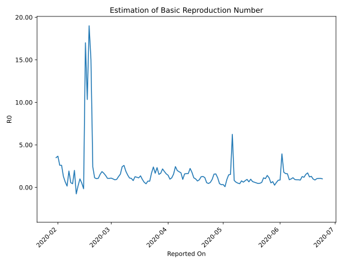

# Country Figures: Time Series for Basic Reproduction Number of Japan 

| Reported On | &Delta; Confirmed | Total &Delta; Confirmed First Interval | Total &Delta; Confirmed Second Interval | Estimated Basic Reproduction Number R0 | 
|-------------|-------------------|----------------------------------------|-----------------------------------------|---------------------------------------------------|
| 2020-05-04 | 201 |  982  |  664  |  1.48  | 
| 2020-05-03 | 306 |  835  |  907  |  0.92  | 
| 2020-05-02 | 266 |  152  |  1785  |  0.09  | 
| 2020-05-01 | 217 |  647  |  1929  |  0.34  | 
| 2020-04-30 | 193 |  664  |  2096  |  0.32  | 
| 2020-04-29 | 159 |  907  |  2032  |  0.45  | 
| 2020-04-28 | -417 |  1785  |  1571  |  1.14  | 
| 2020-04-27 | 712 |  1929  |  1216  |  1.59  | 
| 2020-04-26 | 210 |  2096  |  1348  |  1.55  | 
| 2020-04-25 | 402 |  2032  |  2171  |  0.94  | 
| 2020-04-24 | 461 |  1571  |  2697  |  0.58  | 
| 2020-04-23 | 856 |  1216  |  2651  |  0.46  | 
| 2020-04-22 | 377 |  1348  |  2417  |  0.56  | 
| 2020-04-21 | 338 |  2171  |  1878  |  1.16  | 
| 2020-04-20 | 0 |  2697  |  2095  |  1.29  | 
| 2020-04-19 | 501 |  2651  |  2115  |  1.25  | 
| 2020-04-18 | 509 |  2417  |  2703  |  0.89  | 
| 2020-04-17 | 1161 |  1878  |  2491  |  0.75  | 
| 2020-04-16 | 526 |  2095  |  2099  |  1.00  | 
| 2020-04-15 | 455 |  2115  |  1876  |  1.13  | 
| 2020-04-14 | 275 |  2703  |  1528  |  1.77  | 
| 2020-04-13 | 622 |  2491  |  1118  |  2.23  | 
| 2020-04-12 | 743 |  2099  |  1289  |  1.63  | 
| 2020-04-11 | 475 |  1876  |  1159  |  1.62  | 
| 2020-04-10 | 863 |  1528  |  961  |  1.59  | 
| 2020-04-09 | 410 |  1118  |  1186  |  0.94  | 
| 2020-04-08 | 351 |  1289  |  751  |  1.72  | 
| 2020-04-07 | 252 |  1159  |  629  |  1.84  | 
| 2020-04-06 | 515 |  961  |  485  |  1.98  | 
| 2020-04-05 | 0 |  1186  |  485  |  2.45  | 
| 2020-04-04 | 522 |  751  |  479  |  1.57  | 
| 2020-04-03 | 122 |  629  |  559  |  1.13  | 
| 2020-04-02 | 317 |  485  |  500  |  0.97  | 
| 2020-04-01 | 225 |  485  |  340  |  1.43  | 
| 2020-03-31 | 87 |  479  |  301  |  1.59  | 
| 2020-03-30 | 0 |  559  |  300  |  1.86  | 
| 2020-03-29 | 173 |  500  |  230  |  2.17  | 
| 2020-03-28 | 225 |  340  |  204  |  1.67  | 
| 2020-03-27 | 81 |  301  |  197  |  1.53  | 
| 2020-03-26 | 80 |  300  |  129  |  2.33  | 
| 2020-03-25 | 114 |  230  |  138  |  1.67  | 
| 2020-03-24 | 65 |  204  |  85  |  2.40  | 
| 2020-03-23 | 42 |  197  |  116  |  1.70  | 
| 2020-03-22 | 79 |  129  |  177  |  0.73  | 
| 2020-03-21 | 44 |  138  |  186  |  0.74  | 
| 2020-03-20 | 39 |  85  |  200  |  0.42  | 
| 2020-03-19 | 35 |  116  |  192  |  0.60  | 
| 2020-03-18 | 11 |  177  |  190  |  0.93  | 
| 2020-03-17 | 53 |  186  |  137  |  1.36  | 
| 2020-03-16 | -14 |  200  |  178  |  1.12  | 
| 2020-03-15 | 66 |  192  |  161  |  1.19  | 
| 2020-03-14 | 72 |  190  |  151  |  1.26  | 
| 2020-03-13 | 62 |  137  |  171  |  0.80  | 
| 2020-03-12 | 0 |  178  |  168  |  1.06  | 
| 2020-03-11 | 58 |  161  |  146  |  1.10  | 
| 2020-03-10 | 70 |  151  |  104  |  1.45  | 
| 2020-03-09 | 9 |  171  |  90  |  1.90  | 
| 2020-03-08 | 41 |  168  |  65  |  2.58  | 
| 2020-03-07 | 41 |  146  |  60  |  2.43  | 
| 2020-03-06 | 60 |  104  |  67  |  1.55  | 
| 2020-03-05 | 29 |  90  |  71  |  1.27  | 
| 2020-03-04 | 38 |  65  |  69  |  0.94  | 
| 2020-03-03 | 19 |  60  |  67  |  0.90  | 
| 2020-03-02 | 18 |  67  |  67  |  1.00  | 
| 2020-03-01 | 15 |  71  |  65  |  1.09  | 
| 2020-02-29 | 13 |  69  |  65  |  1.06  | 
| 2020-02-28 | 14 |  67  |  63  |  1.06  | 
| 2020-02-27 | 25 |  67  |  48  |  1.40  | 
| 2020-02-26 | 19 |  65  |  39  |  1.67  | 
| 2020-02-25 | 11 |  65  |  35  |  1.86  | 
| 2020-02-24 | 12 |  63  |  41  |  1.54  | 
| 2020-02-23 | 25 |  48  |  45  |  1.07  | 
| 2020-02-22 | 17 |  39  |  38  |  1.03  | 
| 2020-02-21 | 11 |  35  |  31  |  1.13  | 
| 2020-02-20 | 10 |  41  |  17  |  2.41  | 
| 2020-02-19 | 10 |  45  |  3  |  15.00  | 
| 2020-02-18 | 8 |  38  |  2  |  19.00  | 
| 2020-02-17 | 7 |  31  |  3  |  10.33  | 
| 2020-02-16 | 16 |  17  |  1  |  17.00  | 
| 2020-02-15 | 14 |  3  |  -19  |  -0.16  | 
| 2020-02-14 | 1 |  2  |  4  |  0.50  | 
| 2020-02-13 | 0 |  3  |  3  |  1.00  | 
| 2020-02-12 | 2 |  1  |  5  |  0.20  | 
| 2020-02-11 | 0 |  -19  |  25  |  -0.76  | 
| 2020-02-10 | 0 |  4  |  2  |  2.00  | 
| 2020-02-09 | 1 |  3  |  7  |  0.43  | 
| 2020-02-08 | 0 |  5  |  9  |  0.56  | 
| 2020-02-07 | -20 |  25  |  13  |  1.92  | 
| 2020-02-06 | 23 |  2  |  13  |  0.15  | 
| 2020-02-05 | 0 |  7  |  11  |  0.64  | 
| 2020-02-04 | 2 |  9  |  7  |  1.29  | 
| 2020-02-03 | 0 |  13  |  5  |  2.60  | 
| 2020-02-02 | 0 |  13  |  5  |  2.60  | 
| 2020-02-01 | 5 |  11  |  3  |  3.67  | 
| 2020-01-31 | 4 |  7  |  2  |  3.50  | 
| 2020-01-30 | 4 |  5  |  None  |  None  | 
| 2020-01-29 | 0 |  5  |  None  |  None  | 
| 2020-01-28 | 3 |  3  |  -1  |  -3.00  | 
| 2020-01-27 | 0 |  2  |  None  |  None  | 
| 2020-01-26 | 2 |  None  |  None  |  None  | 
| 2020-01-25 | 0 |  None  |  None  |  None  | 
| 2020-01-24 | 1 |  -1  |  None  |  None  | 
| 2020-01-23 | -1 |  None  |  None  |  None  | 
| 2020-01-22 | None |  None  |  None  |  None  | 

