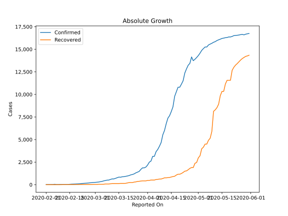
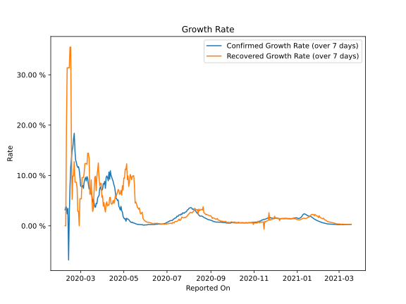

# Country Figures: Growth Rate for Japan 

The growth rates below are calculated based on
* an exponential growth assumption
* for time difference of past seven (7) days.
The growth rate is to be understood as on "growth per day".

The first growth rate indicates the increase of confirmed (infected) cases.

The second growth rate indicates the increase of recovered (healed) cases.

| Reported On | Confirmed | Growth Rate (Confirmed) | Recovered | Growth Rate (Recovered) |
|-------------|-----------|-------------------------|-----------|-------------------------|
| 2020-05-08 | 15575 |  1.22 %  | 5146 |  7.828 %  | 
| 2020-05-07 | 15477 |  1.34 %  | 4918 |  9.896 %  | 
| 2020-05-06 | 15253 |  1.33 %  | 4496 |  9.159 %  | 
| 2020-05-05 | 15253 |  1.50 %  | 4496 |  12.312 %  | 
| 2020-05-04 | 15078 |  0.90 %  | 4156 |  11.189 %  | 
| 2020-05-03 | 14877 |  1.45 %  | 3981 |  11.268 %  | 
| 2020-05-02 | 14571 |  1.38 %  | 3205 |  9.433 %  | 
| 2020-05-01 | 14305 |  1.56 %  | 2975 |  9.500 %  | 
| 2020-04-30 | 14088 |  1.86 %  | 2460 |  7.124 %  | 
| 2020-04-29 | 13895 |  2.69 %  | 2368 |  7.964 %  | 
| 2020-04-28 | 13736 |  3.00 %  | 1899 |  6.100 %  | 
| 2020-04-27 | 14153 |  3.87 %  | 1899 |  7.054 %  | 
| 2020-04-26 | 13441 |  3.13 %  | 1809 |  6.360 %  | 
| 2020-04-25 | 13231 |  3.58 %  | 1656 |  6.253 %  | 
| 2020-04-24 | 12829 |  3.87 %  | 1530 |  7.035 %  | 
| 2020-04-23 | 12368 |  5.15 %  | 1494 |  7.224 %  | 
| 2020-04-22 | 11512 |  5.02 %  | 1356 |  6.622 %  | 
| 2020-04-21 | 11135 |  5.37 %  | 1239 |  6.267 %  | 
| 2020-04-20 | 10797 |  5.46 %  | 1159 |  5.584 %  | 
| 2020-04-19 | 10797 |  6.71 %  | 1159 |  5.991 %  | 
| 2020-04-18 | 10296 |  7.70 %  | 1069 |  4.836 %  | 
| 2020-04-17 | 9787 |  8.16 %  | 935 |  4.445 %  | 
| 2020-04-16 | 8626 |  8.78 %  | 901 |  5.066 %  | 
| 2020-04-15 | 8100 |  9.19 %  | 853 |  4.512 %  | 
| 2020-04-14 | 7645 |  9.59 %  | 799 |  4.284 %  | 
| 2020-04-13 | 7370 |  10.02 %  | 784 |  4.429 %  | 
| 2020-04-12 | 6748 |  10.93 %  | 762 |  5.625 %  | 
| 2020-04-11 | 6005 |  9.27 %  | 762 |  5.625 %  | 
| 2020-04-10 | 5530 |  10.69 %  | 685 |  4.103 %  | 
| 2020-04-09 | 4667 |  8.95 %  | 632 |  4.170 %  | 
| 2020-04-08 | 4257 |  9.57 %  | 622 |  3.942 %  | 
| 2020-04-07 | 3906 |  9.90 %  | 592 |  4.768 %  | 
| 2020-04-06 | 3654 |  9.60 %  | 575 |  4.352 %  | 
| 2020-04-05 | 3139 |  7.43 %  | 514 |  2.750 %  | 
| 2020-04-04 | 3139 |  8.82 %  | 514 |  3.440 %  | 
| 2020-04-03 | 2617 |  8.26 %  | 514 |  4.619 %  | 
| 2020-04-02 | 2495 |  8.39 %  | 472 |  3.909 %  | 
| 2020-04-01 | 2178 |  7.30 %  | 472 |  6.006 %  | 
| 2020-03-31 | 1953 |  7.04 %  | 424 |  5.675 %  | 
| 2020-03-30 | 1866 |  7.19 %  | 424 |  8.431 %  | 
| 2020-03-29 | 1866 |  7.73 %  | 424 |  8.431 %  | 
| 2020-03-28 | 1693 |  7.42 %  | 404 |  7.924 %  | 
| 2020-03-27 | 1468 |  6.02 %  | 372 |  9.523 %  | 
| 2020-03-26 | 1387 |  5.80 %  | 359 |  12.467 %  | 
| 2020-03-25 | 1307 |  5.51 %  | 310 |  10.954 %  | 
| 2020-03-24 | 1193 |  4.38 %  | 285 |  9.753 %  | 
| 2020-03-23 | 1128 |  4.47 %  | 235 |  6.997 %  | 
| 2020-03-22 | 1086 |  3.69 %  | 235 |  9.841 %  | 
| 2020-03-21 | 1007 |  3.78 %  | 232 |  9.658 %  | 
| 2020-03-20 | 963 |  4.54 %  | 191 |  6.880 %  | 
| 2020-03-19 | 924 |  5.27 %  | 150 |  3.428 %  | 
| 2020-03-18 | 889 |  4.72 %  | 144 |  2.845 %  | 
| 2020-03-17 | 878 |  5.90 %  | 144 |  5.067 %  | 
| 2020-03-16 | 825 |  6.84 %  | 144 |  9.130 %  | 
| 2020-03-15 | 839 |  7.34 %  | 118 |  6.285 %  | 
| 2020-03-14 | 773 |  7.38 %  | 118 |  6.285 %  | 
| 2020-03-13 | 701 |  7.32 %  | 118 |  13.458 %  | 
| 2020-03-12 | 639 |  8.20 %  | 118 |  14.421 %  | 
| 2020-03-11 | 639 |  9.40 %  | 118 |  14.421 %  | 
| 2020-03-10 | 581 |  9.78 %  | 101 |  12.199 %  | 
| 2020-03-09 | 511 |  8.90 %  | 76 |  12.357 %  | 
| 2020-03-08 | 502 |  9.62 %  | 76 |  12.357 %  | 
| 2020-03-07 | 461 |  9.27 %  | 76 |  12.357 %  | 
| 2020-03-06 | 420 |  8.73 %  | 46 |  10.537 %  | 
| 2020-03-05 | 360 |  7.43 %  | 43 |  9.574 %  | 
| 2020-03-04 | 331 |  8.01 %  | 43 |  9.574 %  | 
| 2020-03-03 | 293 |  7.78 %  | 43 |  9.574 %  | 
| 2020-03-02 | 274 |  7.77 %  | 32 |  5.353 %  | 
| 2020-03-01 | 256 |  7.92 %  | 32 |  5.353 %  | 
| 2020-02-29 | 241 |  9.73 %  | 32 |  5.353 %  | 
| 2020-02-28 | 228 |  11.08 %  | 22 |  None  | 
| 2020-02-27 | 214 |  11.75 %  | 22 |  2.867 %  | 
| 2020-02-26 | 189 |  11.58 %  | 22 |  2.867 %  | 
| 2020-02-25 | 170 |  11.88 %  | 22 |  7.516 %  | 
| 2020-02-24 | 159 |  12.56 %  | 22 |  8.659 %  | 
| 2020-02-23 | 147 |  13.04 %  | 22 |  8.659 %  | 
| 2020-02-22 | 122 |  14.90 %  | 22 |  8.659 %  | 
| 2020-02-21 | 105 |  18.38 %  | 22 |  12.769 %  | 
| 2020-02-20 | 94 |  17.30 %  | 18 |  9.902 %  | 
| 2020-02-19 | 84 |  15.69 %  | 18 |  9.902 %  | 
| 2020-02-18 | 74 |  14.94 %  | 13 |  5.253 %  | 
| 2020-02-17 | 66 |  13.31 %  | 12 |  15.694 %  | 
| 2020-02-16 | 59 |  11.71 %  | 12 |  35.499 %  | 
| 2020-02-15 | 43 |  7.75 %  | 12 |  35.499 %  | 
| 2020-02-14 | 29 |  2.12 %  | 9 |  31.389 %  | 
| 2020-02-13 | 28 |  -6.78 %  | 9 |  31.389 %  | 
| 2020-02-12 | 28 |  3.45 %  | 9 |  31.389 %  | 
| 2020-02-11 | 26 |  2.39 %  | 9 |  31.389 %  | 
| 2020-02-10 | 26 |  3.75 %  | 4 |  19.804 %  | 
| 2020-02-09 | 26 |  3.75 %  | 1 |  None  | 
| 2020-02-08 | 25 |  3.19 %  | 1 |  None  | 
| 2020-02-07 | 25 |  None  | 1 |  None  | 
| 2020-02-06 | 45 |  None  | 1 |  None  | 
| 2020-02-05 | 22 |  None  | 1 |  None  | 
| 2020-02-04 | 22 |  None  | 1 |  None  | 
| 2020-02-03 | 20 |  None  | 1 |  None  | 
| 2020-02-02 | 20 |  None  | 1 |  None  | 
| 2020-02-01 | 20 |  None  | 1 |  None  | 

