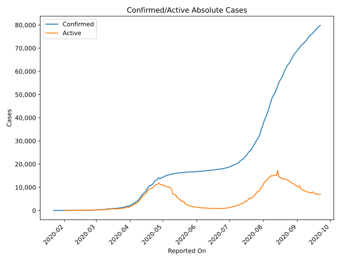
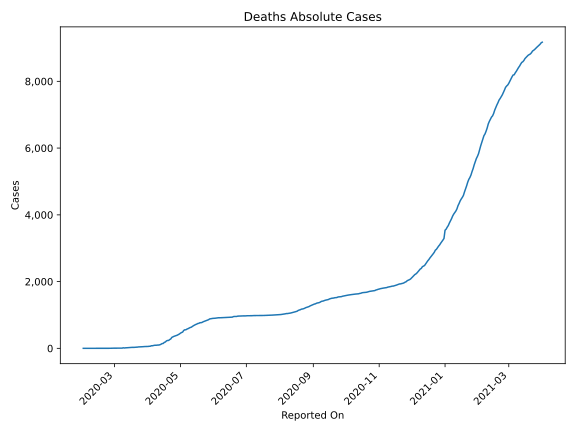
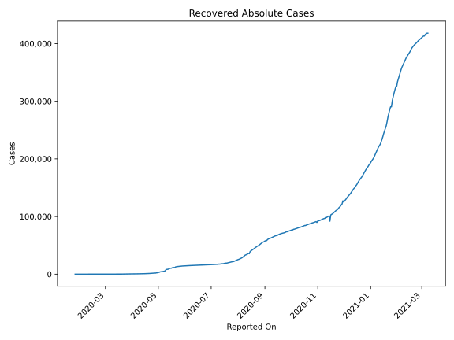
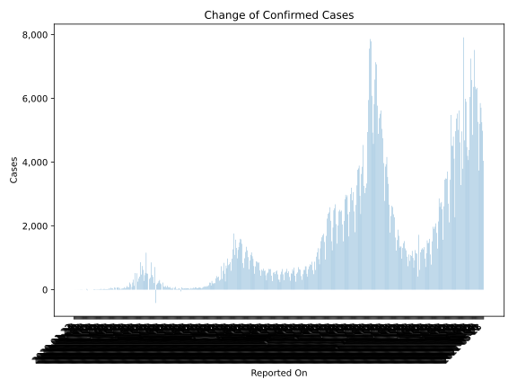
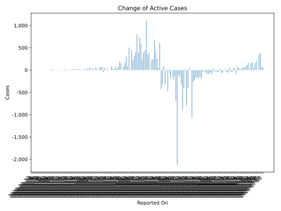
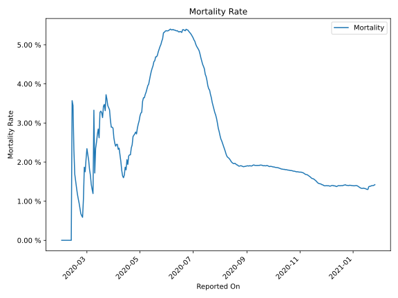

# Country Figures: Time Series for Japan 

| Reported On | Confirmed | Deaths | Recovered | Active | Mortality | &Delta; Confirmed | &Delta; Deaths | &Delta; Active | % Active of Population |
|-------------|-----------|--------|-----------|--------|-----------|-------------------|----------------|----------------|------------------------|
| 2020-04-02 | 2495 | 62 | 472 | 1961 |  2.48 %  | 317 | 5 | 312 |  0.002 %  | 
| 2020-04-01 | 2178 | 57 | 472 | 1649 |  2.62 %  | 225 | 1 | 176 |  0.001 %  | 
| 2020-03-31 | 1953 | 56 | 424 | 1473 |  2.87 %  | 87 | 2 | 85 |  0.001 %  | 
| 2020-03-30 | 1866 | 54 | 424 | 1388 |  2.89 %  | 0 | 0 | 0 |  0.001 %  | 
| 2020-03-29 | 1866 | 54 | 424 | 1388 |  2.89 %  | 173 | 2 | 151 |  0.001 %  | 
| 2020-03-28 | 1693 | 52 | 404 | 1237 |  3.07 %  | 225 | 3 | 190 |  0.001 %  | 
| 2020-03-27 | 1468 | 49 | 372 | 1047 |  3.34 %  | 81 | 2 | 66 |  0.001 %  | 
| 2020-03-26 | 1387 | 47 | 359 | 981 |  3.39 %  | 80 | 2 | 29 |  0.001 %  | 
| 2020-03-25 | 1307 | 45 | 310 | 952 |  3.44 %  | 114 | 2 | 87 |  0.001 %  | 
| 2020-03-24 | 1193 | 43 | 285 | 865 |  3.60 %  | 65 | 1 | 14 |  0.001 %  | 
| 2020-03-23 | 1128 | 42 | 235 | 851 |  3.72 %  | 42 | 6 | 36 |  0.001 %  | 
| 2020-03-22 | 1086 | 36 | 235 | 815 |  3.31 %  | 79 | 1 | 75 |  0.001 %  | 
| 2020-03-21 | 1007 | 35 | 232 | 740 |  3.48 %  | 44 | 2 | 1 |  0.001 %  | 
| 2020-03-20 | 963 | 33 | 191 | 739 |  3.43 %  | 39 | 4 | -6 |  0.001 %  | 
| 2020-03-19 | 924 | 29 | 150 | 745 |  3.14 %  | 35 | 0 | 29 |  0.001 %  | 
| 2020-03-18 | 889 | 29 | 144 | 716 |  3.26 %  | 11 | 0 | 11 |  0.001 %  | 
| 2020-03-17 | 878 | 29 | 144 | 705 |  3.30 %  | 53 | 2 | 51 |  0.001 %  | 
| 2020-03-16 | 825 | 27 | 144 | 654 |  3.27 %  | -14 | 5 | -45 |  0.001 %  | 
| 2020-03-15 | 839 | 22 | 118 | 699 |  2.62 %  | 66 | 0 | 66 |  0.001 %  | 
| 2020-03-14 | 773 | 22 | 118 | 633 |  2.85 %  | 72 | 3 | 69 |  0.001 %  | 
| 2020-03-13 | 701 | 19 | 118 | 564 |  2.71 %  | 62 | 3 | 59 |  0.000 %  | 
| 2020-03-12 | 639 | 16 | 118 | 505 |  2.50 %  | 0 | 1 | -1 |  0.000 %  | 
| 2020-03-11 | 639 | 15 | 118 | 506 |  2.35 %  | 58 | 5 | 36 |  0.000 %  | 
| 2020-03-10 | 581 | 10 | 101 | 470 |  1.72 %  | 70 | -7 | 52 |  0.000 %  | 
| 2020-03-09 | 511 | 17 | 76 | 418 |  3.33 %  | 9 | 11 | -2 |  0.000 %  | 
| 2020-03-08 | 502 | 6 | 76 | 420 |  1.20 %  | 41 | 0 | 41 |  0.000 %  | 
| 2020-03-07 | 461 | 6 | 76 | 379 |  1.30 %  | 41 | 0 | 11 |  0.000 %  | 
| 2020-03-06 | 420 | 6 | 46 | 368 |  1.43 %  | 60 | 0 | 57 |  0.000 %  | 
| 2020-03-05 | 360 | 6 | 43 | 311 |  1.67 %  | 29 | 0 | 29 |  0.000 %  | 
| 2020-03-04 | 331 | 6 | 43 | 282 |  1.81 %  | 38 | 0 | 38 |  0.000 %  | 
| 2020-03-03 | 293 | 6 | 43 | 244 |  2.05 %  | 19 | 0 | 8 |  0.000 %  | 
| 2020-03-02 | 274 | 6 | 32 | 236 |  2.19 %  | 18 | 0 | 18 |  0.000 %  | 
| 2020-03-01 | 256 | 6 | 32 | 218 |  2.34 %  | 15 | 1 | 14 |  0.000 %  | 
| 2020-02-29 | 241 | 5 | 32 | 204 |  2.07 %  | 13 | 1 | 2 |  0.000 %  | 
| 2020-02-28 | 228 | 4 | 22 | 202 |  1.75 %  | 14 | 0 | 14 |  0.000 %  | 
| 2020-02-27 | 214 | 4 | 22 | 188 |  1.87 %  | 25 | 2 | 23 |  0.000 %  | 
| 2020-02-26 | 189 | 2 | 22 | 165 |  1.06 %  | 19 | 1 | 18 |  0.000 %  | 
| 2020-02-25 | 170 | 1 | 22 | 147 |  0.59 %  | 11 | 0 | 11 |  0.000 %  | 
| 2020-02-24 | 159 | 1 | 22 | 136 |  0.63 %  | 12 | 0 | 12 |  0.000 %  | 
| 2020-02-23 | 147 | 1 | 22 | 124 |  0.68 %  | 25 | 0 | 25 |  0.000 %  | 
| 2020-02-22 | 122 | 1 | 22 | 99 |  0.82 %  | 17 | 0 | 17 |  0.000 %  | 
| 2020-02-21 | 105 | 1 | 22 | 82 |  0.95 %  | 11 | 0 | 7 |  0.000 %  | 
| 2020-02-20 | 94 | 1 | 18 | 75 |  1.06 %  | 10 | 0 | 10 |  0.000 %  | 
| 2020-02-19 | 84 | 1 | 18 | 65 |  1.19 %  | 10 | 0 | 5 |  0.000 %  | 
| 2020-02-18 | 74 | 1 | 13 | 60 |  1.35 %  | 8 | 0 | 7 |  0.000 %  | 
| 2020-02-17 | 66 | 1 | 12 | 53 |  1.52 %  | 7 | 0 | 7 |  0.000 %  | 
| 2020-02-16 | 59 | 1 | 12 | 46 |  1.69 %  | 16 | 0 | 16 |  0.000 %  | 
| 2020-02-15 | 43 | 1 | 12 | 30 |  2.33 %  | 14 | 0 | 11 |  0.000 %  | 
| 2020-02-14 | 29 | 1 | 9 | 19 |  3.45 %  | 1 | 0 | 1 |  0.000 %  | 
| 2020-02-13 | 28 | 1 | 9 | 18 |  3.57 %  | 0 | 1 | -1 |  0.000 %  | 
| 2020-02-12 | 28 | 0 | 9 | 19 |  None  | 2 | 0 | 2 |  0.000 %  | 
| 2020-02-11 | 26 | 0 | 9 | 17 |  None  | 0 | 0 | -5 |  0.000 %  | 
| 2020-02-10 | 26 | 0 | 4 | 22 |  None  | 0 | 0 | -3 |  0.000 %  | 
| 2020-02-09 | 26 | 0 | 1 | 25 |  None  | 1 | 0 | 1 |  0.000 %  | 
| 2020-02-08 | 25 | 0 | 1 | 24 |  None  | 0 | 0 | 0 |  0.000 %  | 
| 2020-02-07 | 25 | 0 | 1 | 24 |  None  | -20 | 0 | -20 |  0.000 %  | 
| 2020-02-06 | 45 | 0 | 1 | 44 |  None  | 23 | 0 | 23 |  0.000 %  | 
| 2020-02-05 | 22 | 0 | 1 | 21 |  None  | 0 | 0 | 0 |  0.000 %  | 
| 2020-02-04 | 22 | 0 | 1 | 21 |  None  | 2 | 0 | 2 |  0.000 %  | 
| 2020-02-03 | 20 | 0 | 1 | 19 |  None  | 0 | 0 | 0 |  0.000 %  | 
| 2020-02-02 | 20 | 0 | 1 | 19 |  None  | 0 | 0 | 0 |  0.000 %  | 
| 2020-02-01 | 20 | 0 | 1 | 19 |  None  | 5 | None | None |  0.000 %  | 
| 2020-01-31 | 15 | None | 1 | None |  None  | 4 | None | None |  n/a  | 
| 2020-01-30 | 11 | None | 1 | None |  None  | 4 | None | None |  n/a  | 
| 2020-01-29 | 7 | None | 1 | None |  None  | 0 | None | None |  n/a  | 
| 2020-01-28 | 7 | None | 1 | None |  None  | 3 | None | None |  n/a  | 
| 2020-01-27 | 4 | None | 1 | None |  None  | 0 | None | None |  n/a  | 
| 2020-01-26 | 4 | None | 1 | None |  None  | 2 | None | None |  n/a  | 
| 2020-01-25 | 2 | None | None | None |  None  | 0 | None | None |  n/a  | 
| 2020-01-24 | 2 | None | None | None |  None  | 1 | None | None |  n/a  | 
| 2020-01-23 | 1 | None | None | None |  None  | -1 | None | None |  n/a  | 
| 2020-01-22 | 2 | None | None | None |  None  | None | None | None |  n/a  | 

