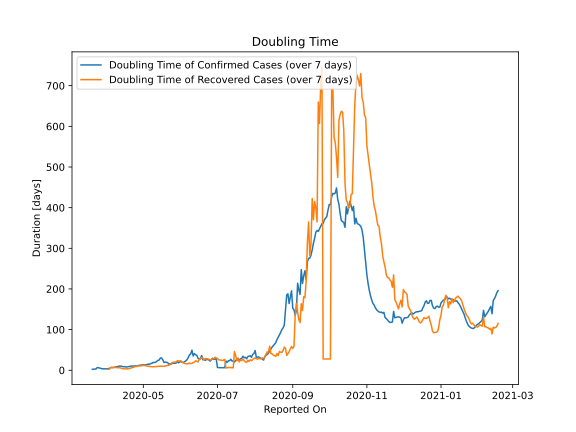

# Country Figures: New Infections in Previous 7 Days per 100,000 Population for Kazakhstan 

<!--  --> 

| Reported On | &Delta; Confirmed (on the day) | &Delta; Confirmed (last 7 days) | New Cases in Previous 7 Days per 100,000 Population |
|-------------|--------------------------------|---------------------------------|-----------------------------------------------------|
| 2020-05-08 |  256  |  1237  |  6.768  |
| 2020-05-07 |  156  |  1176  |  6.434  |
| 2020-05-06 |  217  |  1284  |  7.025  |
| 2020-05-05 |  156  |  1178  |  6.445  |
| 2020-05-04 |  129  |  1214  |  6.642  |
| 2020-05-03 |  63  |  1203  |  6.582  |
| 2020-05-02 |  260  |  1256  |  6.872  |
| 2020-05-01 |  195  |  1115  |  6.101  |
| 2020-04-30 |  264  |  1113  |  6.090  |
| 2020-04-29 |  111  |  1003  |  5.488  |
| 2020-04-28 |  192  |  1032  |  5.647  |
| 2020-04-27 |  118  |  983  |  5.378  |
| 2020-04-26 |  116  |  1041  |  5.696  |
| 2020-04-25 |  119  |  986  |  5.395  |
| 2020-04-24 |  193  |  936  |  5.121  |
| 2020-04-23 |  154  |  887  |  4.853  |
| 2020-04-22 |  140  |  840  |  4.596  |
| 2020-04-21 |  143  |  763  |  4.175  |
| 2020-04-20 |  176  |  761  |  4.164  |
| 2020-04-19 |  61  |  725  |  3.967  |
| 2020-04-18 |  69  |  750  |  4.104  |
| 2020-04-17 |  144  |  734  |  4.016  |
| 2020-04-16 |  107  |  621  |  3.398  |
| 2020-04-15 |  63  |  568  |  3.108  |
| 2020-04-14 |  141  |  535  |  2.927  |
| 2020-04-13 |  140  |  429  |  2.347  |
| 2020-04-12 |  86  |  367  |  2.008  |
| 2020-04-11 |  53  |  334  |  1.827  |
| 2020-04-10 |  31  |  348  |  1.904  |
| 2020-04-09 |  54  |  346  |  1.893  |
| 2020-04-08 |  30  |  347  |  1.899  |
| 2020-04-07 |  35  |  354  |  1.937  |
| 2020-04-06 |  78  |  360  |  1.970  |
| 2020-04-05 |  53  |  300  |  1.641  |
| 2020-04-04 |  67  |  303  |  1.658  |
| 2020-04-03 |  29  |  314  |  1.718  |
| 2020-04-02 |  55  |  324  |  1.773  |
| 2020-04-01 |  37  |  299  |  1.636  |
| 2020-03-31 |  41  |  271  |  1.483  |
| 2020-03-30 |  18  |  240  |  1.313  |
| 2020-03-29 |  56  |  225  |  1.231  |
| 2020-03-28 |  78  |  175  |  0.958  |
| 2020-03-27 |  39  |  101  |  0.553  |
| 2020-03-26 |  30  |  67  |  0.367  |
| 2020-03-25 |  9  |  46  |  0.252  |
| 2020-03-24 |  10  |  39  |  0.213  |
| 2020-03-23 |  3  |  52  |  0.285  |
| 2020-03-22 |  6  |  50  |  0.274  |
| 2020-03-21 |  4  |  47  |  0.257  |
| 2020-03-20 |  5  |  45  |  0.246  |
| 2020-03-19 |  9  |  40  |  0.219  |
| 2020-03-18 |  2  |  31  |  0.170  |
| 2020-03-17 |  23  |  29  |  0.159  |
| 2020-03-16 |  1  |  6  |  0.033  |
| 2020-03-15 |  3  |  5  |  0.027  |
| 2020-03-14 |  2  |  2  |  0.011  |
| 2020-03-13 |  None  |  None  |  None  |

