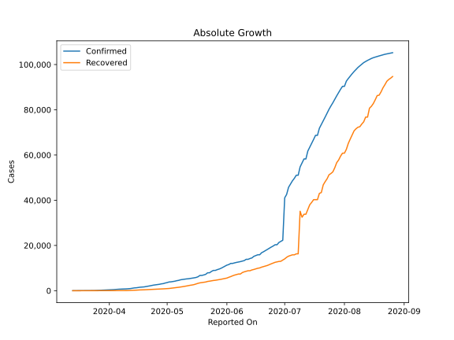

# Country Figures: Doubling Time of Infections for Kazakhstan 

The doubling time below are calculated based on
* an exponential growth assumption
* for time difference of past seven (7) days.
The doubling time's unit is "days".

The first doubling time indicates the increase of confirmed (infected)
cases. There, the *higher* the number is, the better is to take control
of the disease.

The second doubling time indicates the increase of recovered (healed)
cases. There, the *lower* the number is, the better it is to take
control of the disease.

| Reported On | Confirmed | Doubling Time (Confirmed) | Recovered | Doubling Time (Recovered) |
|-------------|-----------|---------------------------|-----------|---------------------------|
| 2020-04-13 | 1091 |  10.1 days  | 138 |  4.8 days  | 
| 2020-04-12 | 951 |  10.3 days  | 99 |  6.0 days  | 
| 2020-04-11 | 865 |  10.3 days  | 81 |  6.3 days  | 
| 2020-04-10 | 812 |  9.0 days  | 64 |  6.5 days  | 
| 2020-04-09 | 781 |  8.6 days  | 60 |  6.4 days  | 
| 2020-04-08 | 727 |  7.8 days  | 54 |  7.0 days  | 
| 2020-04-07 | 697 |  7.2 days  | 51 |  6.8 days  | 
| 2020-04-06 | 662 |  6.5 days  | 46 |  6.5 days  | 
| 2020-04-05 | 584 |  7.1 days  | 42 |  6.9 days  | 
| 2020-04-04 | 531 |  6.1 days  | 36 |  6.3 days  | 
| 2020-04-03 | 464 |  4.6 days  | 29 |  2.5 days  | 
| 2020-04-02 | 435 |  3.9 days  | 27 |  2.2 days  | 
| 2020-04-01 | 380 |  3.5 days  | 26 |  None  | 
| 2020-03-31 | 343 |  3.4 days  | 24 |  None  | 
| 2020-03-30 | 302 |  3.4 days  | 21 |  None  | 
| 2020-03-29 | 284 |  3.4 days  | 20 |  None  | 
| 2020-03-28 | 228 |  3.7 days  | 16 |  None  | 
| 2020-03-27 | 150 |  4.7 days  | 3 |  None  | 
| 2020-03-26 | 111 |  5.6 days  | 2 |  None  | 
| 2020-03-25 | 81 |  6.1 days  | 0 |  None  | 
| 2020-03-24 | 72 |  6.6 days  | 0 |  None  | 
| 2020-03-23 | 62 |  3.0 days  | 0 |  None  | 
| 2020-03-22 | 59 |  2.9 days  | 0 |  None  | 
| 2020-03-21 | 53 |  2.6 days  | 0 |  None  | 
| 2020-03-20 | 49 |  2.3 days  | 0 |  None  | 
| 2020-03-19 | 44 |  None  | 0 |  None  | 
| 2020-03-18 | 35 |  None  | 0 |  None  | 
| 2020-03-17 | 33 |  None  | 0 |  None  | 
| 2020-03-16 | 10 |  None  | 0 |  None  | 
| 2020-03-15 | 9 |  None  | 0 |  None  | 
| 2020-03-14 | 6 |  None  | 0 |  None  | 
| 2020-03-13 | 4 |  None  | 0 |  None  | 

