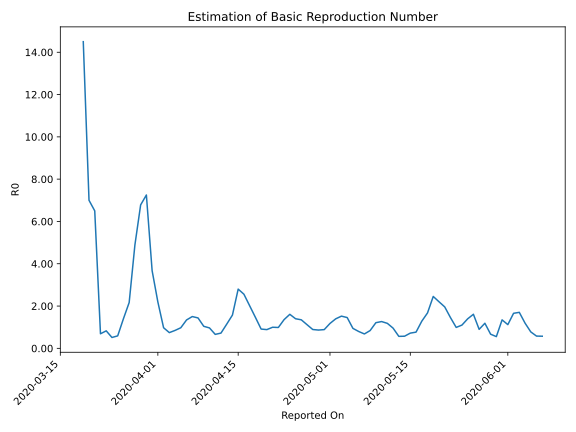

# Country Figures: Time Series for Basic Reproduction Number of Kazakhstan 

| Reported On | &Delta; Confirmed | Total &Delta; Confirmed First Interval | Total &Delta; Confirmed Second Interval | Estimated Basic Reproduction Number R0 | 
|-------------|-------------------|----------------------------------------|-----------------------------------------|---------------------------------------------------|
| 2020-05-09 | 141 |  785  |  647  |  1.21  | 
| 2020-05-08 | 256 |  658  |  782  |  0.84  | 
| 2020-05-07 | 156 |  565  |  830  |  0.68  | 
| 2020-05-06 | 217 |  608  |  762  |  0.80  | 
| 2020-05-05 | 156 |  647  |  685  |  0.94  | 
| 2020-05-04 | 129 |  782  |  537  |  1.46  | 
| 2020-05-03 | 63 |  830  |  545  |  1.52  | 
| 2020-05-02 | 260 |  762  |  546  |  1.40  | 
| 2020-05-01 | 195 |  685  |  582  |  1.18  | 
| 2020-04-30 | 264 |  537  |  606  |  0.89  | 
| 2020-04-29 | 111 |  545  |  630  |  0.87  | 
| 2020-04-28 | 192 |  546  |  613  |  0.89  | 
| 2020-04-27 | 118 |  582  |  520  |  1.12  | 
| 2020-04-26 | 116 |  606  |  449  |  1.35  | 
| 2020-04-25 | 119 |  630  |  450  |  1.40  | 
| 2020-04-24 | 193 |  613  |  381  |  1.61  | 
| 2020-04-23 | 154 |  520  |  383  |  1.36  | 
| 2020-04-22 | 140 |  449  |  455  |  0.99  | 
| 2020-04-21 | 143 |  450  |  451  |  1.00  | 
| 2020-04-20 | 176 |  381  |  430  |  0.89  | 
| 2020-04-19 | 61 |  383  |  420  |  0.91  | 
| 2020-04-18 | 69 |  455  |  310  |  1.47  | 
| 2020-04-17 | 144 |  451  |  224  |  2.01  | 
| 2020-04-16 | 107 |  430  |  168  |  2.56  | 
| 2020-04-15 | 63 |  420  |  150  |  2.80  | 
| 2020-04-14 | 141 |  310  |  197  |  1.57  | 
| 2020-04-13 | 140 |  224  |  196  |  1.14  | 
| 2020-04-12 | 86 |  168  |  233  |  0.72  | 
| 2020-04-11 | 53 |  150  |  227  |  0.66  | 
| 2020-04-10 | 31 |  197  |  204  |  0.97  | 
| 2020-04-09 | 54 |  196  |  188  |  1.04  | 
| 2020-04-08 | 30 |  233  |  162  |  1.44  | 
| 2020-04-07 | 35 |  227  |  151  |  1.50  | 
| 2020-04-06 | 78 |  204  |  152  |  1.34  | 
| 2020-04-05 | 53 |  188  |  193  |  0.97  | 
| 2020-04-04 | 67 |  162  |  191  |  0.85  | 
| 2020-04-03 | 29 |  151  |  203  |  0.74  | 
| 2020-04-02 | 55 |  152  |  156  |  0.97  | 
| 2020-04-01 | 37 |  193  |  88  |  2.19  | 
| 2020-03-31 | 41 |  191  |  52  |  3.67  | 
| 2020-03-30 | 18 |  203  |  28  |  7.25  | 
| 2020-03-29 | 56 |  156  |  23  |  6.78  | 
| 2020-03-28 | 78 |  88  |  18  |  4.89  | 
| 2020-03-27 | 39 |  52  |  24  |  2.17  | 
| 2020-03-26 | 30 |  28  |  20  |  1.40  | 
| 2020-03-25 | 9 |  23  |  39  |  0.59  | 
| 2020-03-24 | 10 |  18  |  35  |  0.51  | 
| 2020-03-23 | 3 |  24  |  29  |  0.83  | 
| 2020-03-22 | 6 |  20  |  29  |  0.69  | 
| 2020-03-21 | 4 |  39  |  6  |  6.50  | 
| 2020-03-20 | 5 |  35  |  5  |  7.00  | 
| 2020-03-19 | 9 |  29  |  2  |  14.50  | 
| 2020-03-18 | 2 |  29  |  None  |  None  | 
| 2020-03-17 | 23 |  6  |  None  |  None  | 
| 2020-03-16 | 1 |  5  |  None  |  None  | 
| 2020-03-15 | 3 |  2  |  None  |  None  | 
| 2020-03-14 | 2 |  None  |  None  |  None  | 
| 2020-03-13 | None |  None  |  None  |  None  | 

