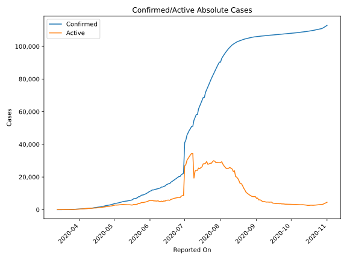
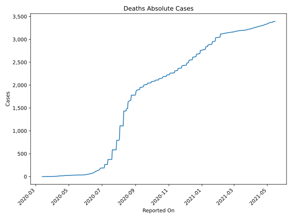
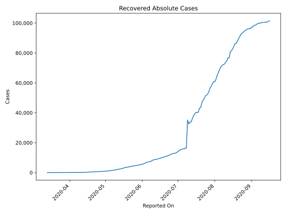
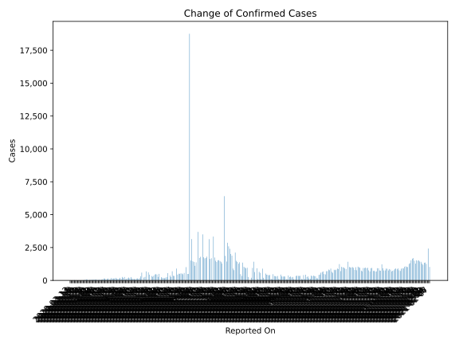
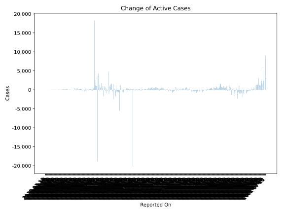
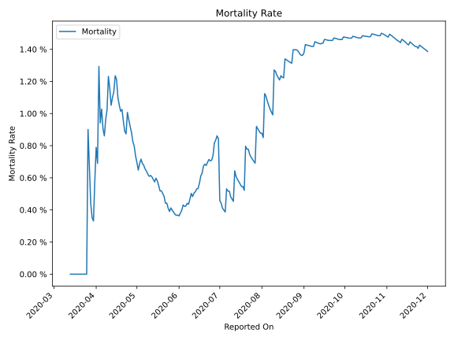

# Country Figures: Time Series for Kazakhstan 

| Reported On | Confirmed | Deaths | Recovered | Active | Mortality | &Delta; Confirmed | &Delta; Deaths | &Delta; Recovered | &Delta; Active | % Active of Population |
|-------------|-----------|--------|-----------|--------|-----------|-------------------|----------------|-------------------|----------------|------------------------|
| 2020-04-19 | 1676 | 17 | 400 | 1259 |  1.01 %  | 61 | 0 | 23 | 38 |  0.007 %  | 
| 2020-04-18 | 1615 | 17 | 377 | 1221 |  1.05 %  | 69 | 0 | 30 | 39 |  0.007 %  | 
| 2020-04-17 | 1546 | 17 | 347 | 1182 |  1.10 %  | 144 | 0 | 70 | 74 |  0.006 %  | 
| 2020-04-16 | 1402 | 17 | 277 | 1108 |  1.21 %  | 107 | 1 | 37 | 69 |  0.006 %  | 
| 2020-04-15 | 1295 | 16 | 240 | 1039 |  1.24 %  | 63 | 2 | 37 | 24 |  0.006 %  | 
| 2020-04-14 | 1232 | 14 | 203 | 1015 |  1.14 %  | 141 | 2 | 65 | 74 |  0.006 %  | 
| 2020-04-13 | 1091 | 12 | 138 | 941 |  1.10 %  | 140 | 2 | 39 | 99 |  0.005 %  | 
| 2020-04-12 | 951 | 10 | 99 | 842 |  1.05 %  | 86 | 0 | 18 | 68 |  0.005 %  | 
| 2020-04-11 | 865 | 10 | 81 | 774 |  1.16 %  | 53 | 0 | 17 | 36 |  0.004 %  | 
| 2020-04-10 | 812 | 10 | 64 | 738 |  1.23 %  | 31 | 2 | 4 | 25 |  0.004 %  | 
| 2020-04-09 | 781 | 8 | 60 | 713 |  1.02 %  | 54 | 1 | 6 | 47 |  0.004 %  | 
| 2020-04-08 | 727 | 7 | 54 | 666 |  0.96 %  | 30 | 1 | 3 | 26 |  0.004 %  | 
| 2020-04-07 | 697 | 6 | 51 | 640 |  0.86 %  | 35 | 0 | 5 | 30 |  0.004 %  | 
| 2020-04-06 | 662 | 6 | 46 | 610 |  0.91 %  | 78 | 0 | 4 | 74 |  0.003 %  | 
| 2020-04-05 | 584 | 6 | 42 | 536 |  1.03 %  | 53 | 1 | 6 | 46 |  0.003 %  | 
| 2020-04-04 | 531 | 5 | 36 | 490 |  0.94 %  | 67 | -1 | 7 | 61 |  0.003 %  | 
| 2020-04-03 | 464 | 6 | 29 | 429 |  1.29 %  | 29 | 3 | 2 | 24 |  0.002 %  | 
| 2020-04-02 | 435 | 3 | 27 | 405 |  0.69 %  | 55 | 0 | 1 | 54 |  0.002 %  | 
| 2020-04-01 | 380 | 3 | 26 | 351 |  0.79 %  | 37 | 1 | 2 | 34 |  0.002 %  | 
| 2020-03-31 | 343 | 2 | 24 | 317 |  0.58 %  | 41 | 1 | 3 | 37 |  0.002 %  | 
| 2020-03-30 | 302 | 1 | 21 | 280 |  0.33 %  | 18 | 0 | 1 | 17 |  0.002 %  | 
| 2020-03-29 | 284 | 1 | 20 | 263 |  0.35 %  | 56 | 0 | 4 | 52 |  0.001 %  | 
| 2020-03-28 | 228 | 1 | 16 | 211 |  0.44 %  | 78 | 0 | 13 | 65 |  0.001 %  | 
| 2020-03-27 | 150 | 1 | 3 | 146 |  0.67 %  | 39 | 0 | 1 | 38 |  0.001 %  | 
| 2020-03-26 | 111 | 1 | 2 | 108 |  0.90 %  | 30 | 1 | 2 | 27 |  0.001 %  | 
| 2020-03-25 | 81 | 0 | 0 | 81 |  None  | 9 | 0 | 0 | 9 |  0.000 %  | 
| 2020-03-24 | 72 | 0 | 0 | 72 |  None  | 10 | 0 | 0 | 10 |  0.000 %  | 
| 2020-03-23 | 62 | 0 | 0 | 62 |  None  | 3 | 0 | 0 | 3 |  0.000 %  | 
| 2020-03-22 | 59 | 0 | 0 | 59 |  None  | 6 | 0 | 0 | 6 |  0.000 %  | 
| 2020-03-21 | 53 | 0 | 0 | 53 |  None  | 4 | -3 | 0 | 7 |  0.000 %  | 
| 2020-03-20 | 49 | 3 | 0 | 46 |  6.12 %  | 5 | 3 | 0 | 2 |  0.000 %  | 
| 2020-03-19 | 44 | 0 | 0 | 44 |  None  | 9 | 0 | 0 | 9 |  0.000 %  | 
| 2020-03-18 | 35 | 0 | 0 | 35 |  None  | 2 | 0 | 0 | 2 |  0.000 %  | 
| 2020-03-17 | 33 | 0 | 0 | 33 |  None  | 23 | 0 | 0 | 23 |  0.000 %  | 
| 2020-03-16 | 10 | 0 | 0 | 10 |  None  | 1 | 0 | 0 | 1 |  0.000 %  | 
| 2020-03-15 | 9 | 0 | 0 | 9 |  None  | 3 | 0 | 0 | 3 |  0.000 %  | 
| 2020-03-14 | 6 | 0 | 0 | 6 |  None  | 2 | 0 | 0 | 2 |  0.000 %  | 
| 2020-03-13 | 4 | 0 | 0 | 4 |  None  | None | None | None | None |  0.000 %  | 

