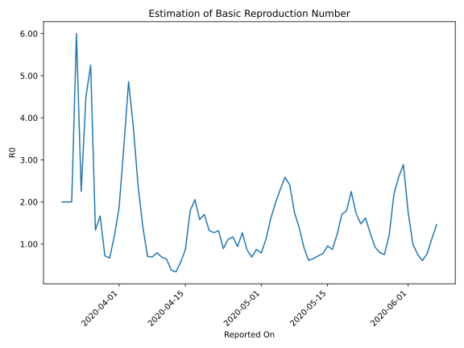

# Country Figures: Time Series for Basic Reproduction Number of Kenya 

| Reported On | &Delta; Confirmed | Total &Delta; Confirmed First Interval | Total &Delta; Confirmed Second Interval | Estimated Basic Reproduction Number R0 | 
|-------------|-------------------|----------------------------------------|-----------------------------------------|---------------------------------------------------|
| 2020-05-06 | 47 |  124  |  48  |  2.58  | 
| 2020-05-05 | 45 |  94  |  41  |  2.29  | 
| 2020-05-04 | 25 |  81  |  41  |  1.98  | 
| 2020-05-03 | 30 |  61  |  38  |  1.61  | 
| 2020-05-02 | 24 |  48  |  43  |  1.12  | 
| 2020-05-01 | 15 |  41  |  52  |  0.79  | 
| 2020-04-30 | 12 |  41  |  47  |  0.87  | 
| 2020-04-29 | 10 |  38  |  55  |  0.69  | 
| 2020-04-28 | 11 |  43  |  50  |  0.86  | 
| 2020-04-27 | 8 |  52  |  41  |  1.27  | 
| 2020-04-26 | 12 |  47  |  50  |  0.94  | 
| 2020-04-25 | 7 |  55  |  47  |  1.17  | 
| 2020-04-24 | 16 |  50  |  45  |  1.11  | 
| 2020-04-23 | 17 |  41  |  46  |  0.89  | 
| 2020-04-22 | 7 |  50  |  38  |  1.32  | 
| 2020-04-21 | 15 |  47  |  37  |  1.27  | 
| 2020-04-20 | 11 |  45  |  34  |  1.32  | 
| 2020-04-19 | 8 |  46  |  27  |  1.70  | 
| 2020-04-18 | 16 |  38  |  24  |  1.58  | 
| 2020-04-17 | 12 |  37  |  18  |  2.06  | 
| 2020-04-16 | 9 |  34  |  19  |  1.79  | 
| 2020-04-15 | 9 |  27  |  31  |  0.87  | 
| 2020-04-14 | 8 |  24  |  42  |  0.57  | 
| 2020-04-13 | 11 |  18  |  53  |  0.34  | 
| 2020-04-12 | 6 |  19  |  50  |  0.38  | 
| 2020-04-11 | 2 |  31  |  48  |  0.65  | 
| 2020-04-10 | 5 |  42  |  61  |  0.69  | 
| 2020-04-09 | 5 |  53  |  67  |  0.79  | 
| 2020-04-08 | 7 |  50  |  72  |  0.69  | 
| 2020-04-07 | 14 |  48  |  68  |  0.71  | 
| 2020-04-06 | 16 |  61  |  43  |  1.42  | 
| 2020-04-05 | 16 |  67  |  28  |  2.39  | 
| 2020-04-04 | 4 |  72  |  19  |  3.79  | 
| 2020-04-03 | 12 |  68  |  14  |  4.86  | 
| 2020-04-02 | 29 |  43  |  13  |  3.31  | 
| 2020-04-01 | 22 |  28  |  15  |  1.87  | 
| 2020-03-31 | 9 |  19  |  16  |  1.19  | 
| 2020-03-30 | 8 |  14  |  21  |  0.67  | 
| 2020-03-29 | 4 |  13  |  18  |  0.72  | 
| 2020-03-28 | 7 |  15  |  9  |  1.67  | 
| 2020-03-27 | 0 |  16  |  12  |  1.33  | 
| 2020-03-26 | 3 |  21  |  4  |  5.25  | 
| 2020-03-25 | 3 |  18  |  4  |  4.50  | 
| 2020-03-24 | 9 |  9  |  4  |  2.25  | 
| 2020-03-23 | 1 |  12  |  2  |  6.00  | 
| 2020-03-22 | 8 |  4  |  2  |  2.00  | 
| 2020-03-21 | 0 |  4  |  2  |  2.00  | 
| 2020-03-20 | 0 |  4  |  2  |  2.00  | 
| 2020-03-19 | 4 |  2  |  None  |  None  | 
| 2020-03-18 | 0 |  2  |  None  |  None  | 
| 2020-03-17 | 0 |  2  |  None  |  None  | 
| 2020-03-16 | 0 |  2  |  None  |  None  | 
| 2020-03-15 | 2 |  None  |  None  |  None  | 
| 2020-03-14 | 0 |  None  |  None  |  None  | 
| 2020-03-13 | None |  None  |  None  |  None  | 

