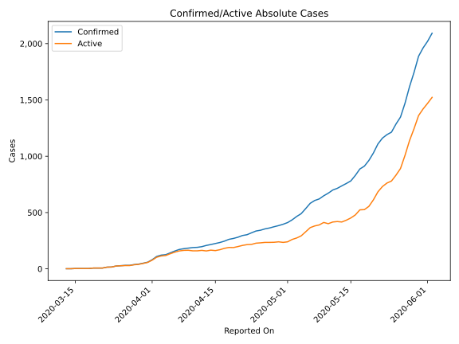
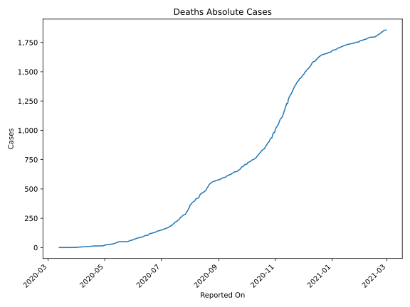
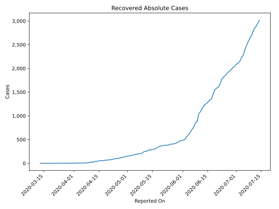
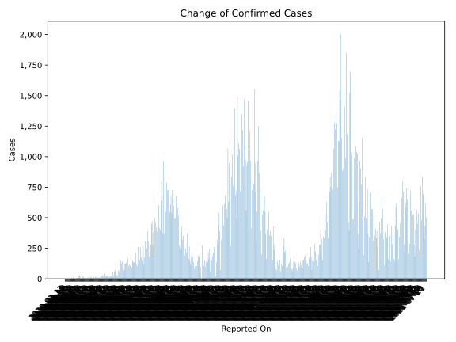
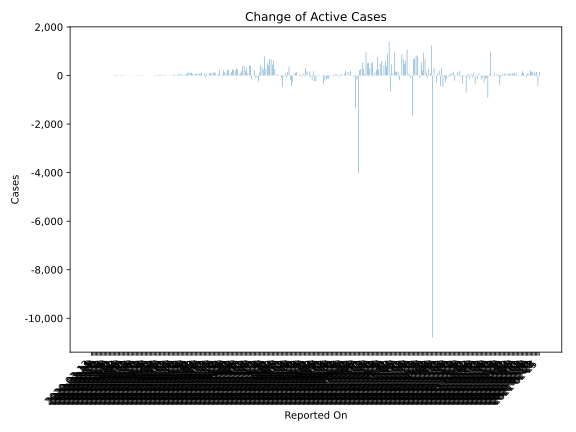
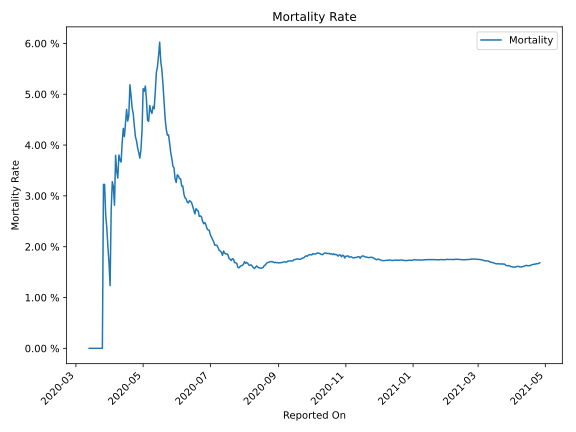

# Country Figures: Time Series for Kenya 

| Reported On | Confirmed | Deaths | Recovered | Active | Mortality | &Delta; Confirmed | &Delta; Deaths | &Delta; Recovered | &Delta; Active | % Active of Population |
|-------------|-----------|--------|-----------|--------|-----------|-------------------|----------------|-------------------|----------------|------------------------|
| 2020-04-29 | 384 | 15 | 129 | 240 |  3.91 %  | 10 | 1 | 5 | 4 |  0.000 %  | 
| 2020-04-28 | 374 | 14 | 124 | 236 |  3.74 %  | 11 | 0 | 10 | 1 |  0.000 %  | 
| 2020-04-27 | 363 | 14 | 114 | 235 |  3.86 %  | 8 | 0 | 8 | 0 |  0.000 %  | 
| 2020-04-26 | 355 | 14 | 106 | 235 |  3.94 %  | 12 | 0 | 8 | 4 |  0.000 %  | 
| 2020-04-25 | 343 | 14 | 98 | 231 |  4.08 %  | 7 | 0 | 4 | 3 |  0.000 %  | 
| 2020-04-24 | 336 | 14 | 94 | 228 |  4.17 %  | 16 | 0 | 5 | 11 |  0.000 %  | 
| 2020-04-23 | 320 | 14 | 89 | 217 |  4.38 %  | 17 | 0 | 15 | 2 |  0.000 %  | 
| 2020-04-22 | 303 | 14 | 74 | 215 |  4.62 %  | 7 | 0 | 0 | 7 |  0.000 %  | 
| 2020-04-21 | 296 | 14 | 74 | 208 |  4.73 %  | 15 | 0 | 5 | 10 |  0.000 %  | 
| 2020-04-20 | 281 | 14 | 69 | 198 |  4.98 %  | 11 | 0 | 2 | 9 |  0.000 %  | 
| 2020-04-19 | 270 | 14 | 67 | 189 |  5.19 %  | 8 | 2 | 7 | -1 |  0.000 %  | 
| 2020-04-18 | 262 | 12 | 60 | 190 |  4.58 %  | 16 | 1 | 7 | 8 |  0.000 %  | 
| 2020-04-17 | 246 | 11 | 53 | 182 |  4.47 %  | 12 | 0 | 0 | 12 |  0.000 %  | 
| 2020-04-16 | 234 | 11 | 53 | 170 |  4.70 %  | 9 | 1 | 0 | 8 |  0.000 %  | 
| 2020-04-15 | 225 | 10 | 53 | 162 |  4.44 %  | 9 | 1 | 12 | -4 |  0.000 %  | 
| 2020-04-14 | 216 | 9 | 41 | 166 |  4.17 %  | 8 | 0 | 1 | 7 |  0.000 %  | 
| 2020-04-13 | 208 | 9 | 40 | 159 |  4.33 %  | 11 | 1 | 15 | -5 |  0.000 %  | 
| 2020-04-12 | 197 | 8 | 25 | 164 |  4.06 %  | 6 | 1 | 1 | 4 |  0.000 %  | 
| 2020-04-11 | 191 | 7 | 24 | 160 |  3.66 %  | 2 | 0 | 2 | 0 |  0.000 %  | 
| 2020-04-10 | 189 | 7 | 22 | 160 |  3.70 %  | 5 | 0 | 10 | -5 |  0.000 %  | 
| 2020-04-09 | 184 | 7 | 12 | 165 |  3.80 %  | 5 | 1 | 3 | 1 |  0.000 %  | 
| 2020-04-08 | 179 | 6 | 9 | 164 |  3.35 %  | 7 | 0 | 2 | 5 |  0.000 %  | 
| 2020-04-07 | 172 | 6 | 7 | 159 |  3.49 %  | 14 | 0 | 3 | 11 |  0.000 %  | 
| 2020-04-06 | 158 | 6 | 4 | 148 |  3.80 %  | 16 | 2 | 0 | 14 |  0.000 %  | 
| 2020-04-05 | 142 | 4 | 4 | 134 |  2.82 %  | 16 | 0 | 0 | 16 |  0.000 %  | 
| 2020-04-04 | 126 | 4 | 4 | 118 |  3.17 %  | 4 | 0 | 0 | 4 |  0.000 %  | 
| 2020-04-03 | 122 | 4 | 4 | 114 |  3.28 %  | 12 | 1 | 0 | 11 |  0.000 %  | 
| 2020-04-02 | 110 | 3 | 4 | 103 |  2.73 %  | 29 | 2 | 1 | 26 |  0.000 %  | 
| 2020-04-01 | 81 | 1 | 3 | 77 |  1.23 %  | 22 | 0 | 2 | 20 |  0.000 %  | 
| 2020-03-31 | 59 | 1 | 1 | 57 |  1.69 %  | 9 | 0 | 0 | 9 |  0.000 %  | 
| 2020-03-30 | 50 | 1 | 1 | 48 |  2.00 %  | 8 | 0 | 0 | 8 |  0.000 %  | 
| 2020-03-29 | 42 | 1 | 1 | 40 |  2.38 %  | 4 | 0 | 0 | 4 |  0.000 %  | 
| 2020-03-28 | 38 | 1 | 1 | 36 |  2.63 %  | 7 | 0 | 0 | 7 |  0.000 %  | 
| 2020-03-27 | 31 | 1 | 1 | 29 |  3.23 %  | 0 | 0 | 0 | 0 |  0.000 %  | 
| 2020-03-26 | 31 | 1 | 1 | 29 |  3.23 %  | 3 | 1 | 0 | 2 |  0.000 %  | 
| 2020-03-25 | 28 | 0 | 1 | 27 |  None  | 3 | 0 | 1 | 2 |  0.000 %  | 
| 2020-03-24 | 25 | 0 | 0 | 25 |  None  | 9 | 0 | 0 | 9 |  0.000 %  | 
| 2020-03-23 | 16 | 0 | 0 | 16 |  None  | 1 | 0 | 0 | 1 |  0.000 %  | 
| 2020-03-22 | 15 | 0 | 0 | 15 |  None  | 8 | 0 | 0 | 8 |  0.000 %  | 
| 2020-03-21 | 7 | 0 | 0 | 7 |  None  | 0 | 0 | 0 | 0 |  0.000 %  | 
| 2020-03-20 | 7 | 0 | 0 | 7 |  None  | 0 | 0 | 0 | 0 |  0.000 %  | 
| 2020-03-19 | 7 | 0 | 0 | 7 |  None  | 4 | 0 | 0 | 4 |  0.000 %  | 
| 2020-03-18 | 3 | 0 | 0 | 3 |  None  | 0 | 0 | 0 | 0 |  0.000 %  | 
| 2020-03-17 | 3 | 0 | 0 | 3 |  None  | 0 | 0 | 0 | 0 |  0.000 %  | 
| 2020-03-16 | 3 | 0 | 0 | 3 |  None  | 0 | 0 | 0 | 0 |  0.000 %  | 
| 2020-03-15 | 3 | 0 | 0 | 3 |  None  | 2 | 0 | 0 | 2 |  0.000 %  | 
| 2020-03-14 | 1 | 0 | 0 | 1 |  None  | 0 | 0 | 0 | 0 |  0.000 %  | 
| 2020-03-13 | 1 | 0 | 0 | 1 |  None  | None | None | None | None |  0.000 %  | 

