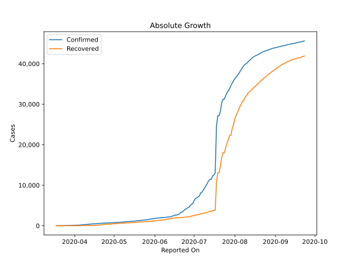
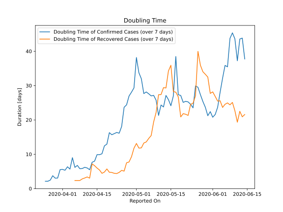

# Country Figures: Doubling Time of Infections for Kyrgyzstan 

The doubling time below are calculated based on
* an exponential growth assumption
* for time difference of past seven (7) days.
The doubling time's unit is "days".

The first doubling time indicates the increase of confirmed (infected)
cases. There, the *higher* the number is, the better is to take control
of the disease.

The second doubling time indicates the increase of recovered (healed)
cases. There, the *lower* the number is, the better it is to take
control of the disease.

| Reported On | Confirmed | Doubling Time (Confirmed) | Recovered | Doubling Time (Recovered) |
|-------------|-----------|---------------------------|-----------|---------------------------|
| 2020-05-06 | 871 |  27.6 days  | 614 |  14.6 days  | 
| 2020-05-05 | 843 |  28.1 days  | 600 |  13.6 days  | 
| 2020-05-04 | 830 |  27.7 days  | 575 |  13.3 days  | 
| 2020-05-03 | 795 |  32.0 days  | 564 |  11.9 days  | 
| 2020-05-02 | 769 |  33.7 days  | 527 |  11.8 days  | 
| 2020-05-01 | 756 |  38.2 days  | 504 |  13.1 days  | 
| 2020-04-30 | 746 |  29.3 days  | 462 |  11.8 days  | 
| 2020-04-29 | 729 |  28.1 days  | 437 |  9.3 days  | 
| 2020-04-28 | 708 |  27.0 days  | 416 |  7.7 days  | 
| 2020-04-27 | 695 |  24.4 days  | 395 |  7.5 days  | 
| 2020-04-26 | 682 |  23.7 days  | 370 |  5.1 days  | 
| 2020-04-25 | 665 |  18.1 days  | 345 |  5.3 days  | 
| 2020-04-24 | 665 |  16.1 days  | 345 |  4.7 days  | 
| 2020-04-23 | 631 |  16.4 days  | 302 |  4.4 days  | 
| 2020-04-22 | 612 |  16.0 days  | 254 |  4.4 days  | 
| 2020-04-21 | 590 |  15.7 days  | 216 |  4.7 days  | 
| 2020-04-20 | 568 |  16.3 days  | 201 |  4.8 days  | 
| 2020-04-19 | 554 |  12.9 days  | 133 |  5.7 days  | 
| 2020-04-18 | 506 |  12.5 days  | 130 |  4.8 days  | 
| 2020-04-17 | 489 |  10.1 days  | 114 |  4.4 days  | 
| 2020-04-16 | 466 |  9.9 days  | 91 |  5.4 days  | 
| 2020-04-15 | 449 |  9.9 days  | 78 |  6.0 days  | 
| 2020-04-14 | 430 |  8.0 days  | 71 |  6.7 days  | 
| 2020-04-13 | 419 |  7.7 days  | 67 |  7.2 days  | 
| 2020-04-12 | 377 |  5.5 days  | 54 |  3.0 days  | 
| 2020-04-11 | 339 |  6.0 days  | 44 |  3.4 days  | 
| 2020-04-10 | 298 |  6.2 days  | 35 |  3.1 days  | 
| 2020-04-09 | 280 |  5.8 days  | 35 |  2.8 days  | 
| 2020-04-08 | 270 |  5.8 days  | 33 |  2.4 days  | 
| 2020-04-07 | 228 |  6.8 days  | 33 |  2.4 days  | 
| 2020-04-06 | 216 |  6.2 days  | 33 |  2.4 days  | 
| 2020-04-05 | 147 |  9.0 days  | 9 |  None  | 
| 2020-04-04 | 144 |  5.7 days  | 9 |  None  | 
| 2020-04-03 | 130 |  6.4 days  | 6 |  None  | 
| 2020-04-02 | 116 |  5.3 days  | 5 |  None  | 
| 2020-04-01 | 111 |  5.6 days  | 3 |  None  | 
| 2020-03-31 | 107 |  5.5 days  | 3 |  None  | 
| 2020-03-30 | 94 |  3.1 days  | 3 |  None  | 
| 2020-03-29 | 84 |  3.0 days  | 0 |  None  | 
| 2020-03-28 | 58 |  3.7 days  | 0 |  None  | 
| 2020-03-27 | 58 |  2.5 days  | 0 |  None  | 
| 2020-03-26 | 44 |  2.1 days  | 0 |  None  | 
| 2020-03-25 | 44 |  2.1 days  | 0 |  None  | 
| 2020-03-24 | 42 |  None  | 0 |  None  | 
| 2020-03-23 | 16 |  None  | 0 |  None  | 
| 2020-03-22 | 14 |  None  | 0 |  None  | 
| 2020-03-21 | 14 |  None  | 0 |  None  | 
| 2020-03-20 | 6 |  None  | 0 |  None  | 
| 2020-03-19 | 3 |  None  | 0 |  None  | 
| 2020-03-18 | 3 |  None  | 0 |  None  | 

