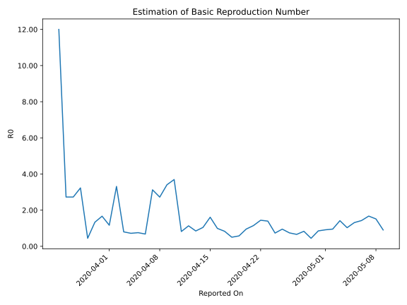

# Country Figures: Time Series for Basic Reproduction Number of Kyrgyzstan 

| Reported On | &Delta; Confirmed | Total &Delta; Confirmed First Interval | Total &Delta; Confirmed Second Interval | Estimated Basic Reproduction Number R0 | 
|-------------|-------------------|----------------------------------------|-----------------------------------------|---------------------------------------------------|
| 2020-05-04 | 35 |  66  |  64  |  1.03  | 
| 2020-05-03 | 26 |  61  |  43  |  1.42  | 
| 2020-05-02 | 13 |  61  |  64  |  0.95  | 
| 2020-05-01 | 10 |  64  |  70  |  0.91  | 
| 2020-04-30 | 17 |  64  |  75  |  0.85  | 
| 2020-04-29 | 21 |  43  |  97  |  0.44  | 
| 2020-04-28 | 13 |  64  |  77  |  0.83  | 
| 2020-04-27 | 13 |  70  |  106  |  0.66  | 
| 2020-04-26 | 17 |  75  |  101  |  0.74  | 
| 2020-04-25 | 0 |  97  |  102  |  0.95  | 
| 2020-04-24 | 34 |  77  |  105  |  0.73  | 
| 2020-04-23 | 19 |  106  |  76  |  1.39  | 
| 2020-04-22 | 22 |  101  |  70  |  1.44  | 
| 2020-04-21 | 22 |  102  |  89  |  1.15  | 
| 2020-04-20 | 14 |  105  |  110  |  0.95  | 
| 2020-04-19 | 48 |  76  |  132  |  0.58  | 
| 2020-04-18 | 17 |  70  |  139  |  0.50  | 
| 2020-04-17 | 23 |  89  |  107  |  0.83  | 
| 2020-04-16 | 17 |  110  |  111  |  0.99  | 
| 2020-04-15 | 19 |  132  |  82  |  1.61  | 
| 2020-04-14 | 11 |  139  |  133  |  1.05  | 
| 2020-04-13 | 42 |  107  |  126  |  0.85  | 
| 2020-04-12 | 38 |  111  |  98  |  1.13  | 
| 2020-04-11 | 41 |  82  |  100  |  0.82  | 
| 2020-04-10 | 18 |  133  |  36  |  3.69  | 
| 2020-04-09 | 10 |  126  |  37  |  3.41  | 
| 2020-04-08 | 42 |  98  |  36  |  2.72  | 
| 2020-04-07 | 12 |  100  |  32  |  3.12  | 
| 2020-04-06 | 69 |  36  |  53  |  0.68  | 
| 2020-04-05 | 3 |  37  |  49  |  0.76  | 
| 2020-04-04 | 14 |  36  |  50  |  0.72  | 
| 2020-04-03 | 14 |  32  |  40  |  0.80  | 
| 2020-04-02 | 5 |  53  |  16  |  3.31  | 
| 2020-04-01 | 4 |  49  |  42  |  1.17  | 
| 2020-03-31 | 13 |  50  |  30  |  1.67  | 
| 2020-03-30 | 10 |  40  |  30  |  1.33  | 
| 2020-03-29 | 26 |  16  |  36  |  0.44  | 
| 2020-03-28 | 0 |  42  |  13  |  3.23  | 
| 2020-03-27 | 14 |  30  |  11  |  2.73  | 
| 2020-03-26 | 0 |  30  |  11  |  2.73  | 
| 2020-03-25 | 2 |  36  |  3  |  12.00  | 
| 2020-03-24 | 26 |  13  |  None  |  None  | 
| 2020-03-23 | 2 |  11  |  None  |  None  | 
| 2020-03-22 | 0 |  11  |  None  |  None  | 
| 2020-03-21 | 8 |  3  |  None  |  None  | 
| 2020-03-20 | 3 |  None  |  None  |  None  | 
| 2020-03-19 | 0 |  None  |  None  |  None  | 
| 2020-03-18 | None |  None  |  None  |  None  | 

