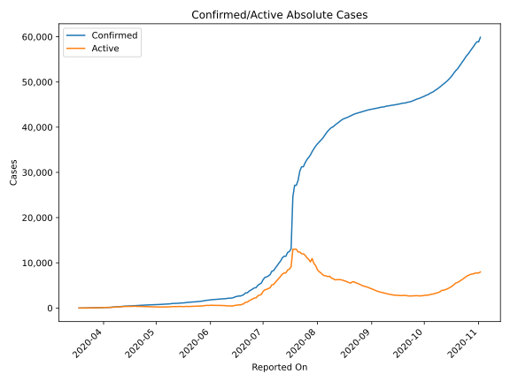
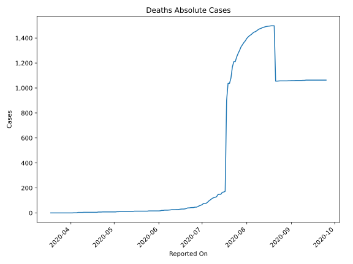
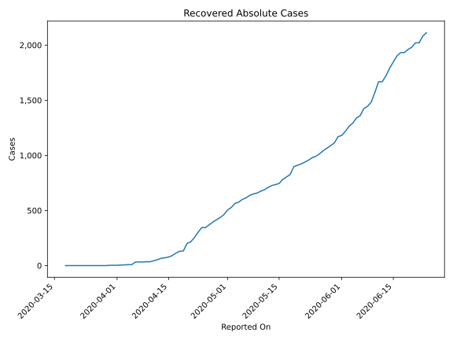
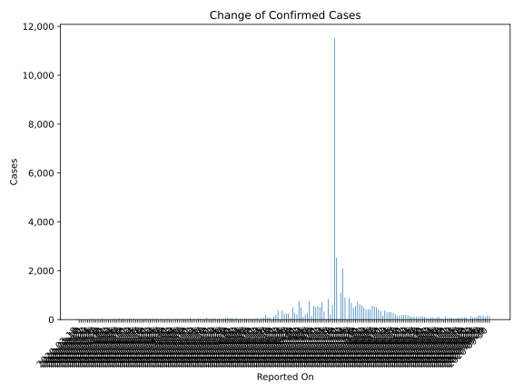
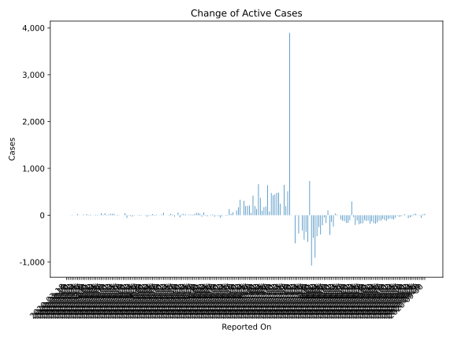
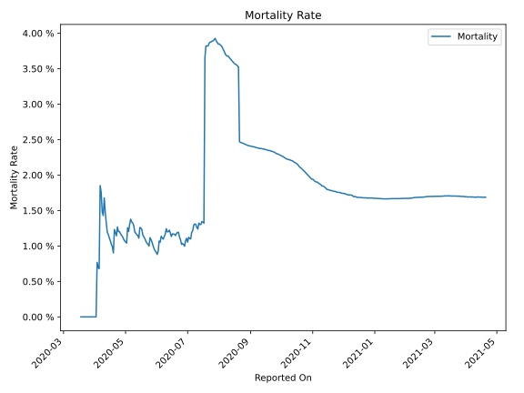

# Country Figures: Time Series for Kyrgyzstan 

| Reported On | Confirmed | Deaths | Recovered | Active | Mortality | &Delta; Confirmed | &Delta; Deaths | &Delta; Recovered | &Delta; Active | % Active of Population |
|-------------|-----------|--------|-----------|--------|-----------|-------------------|----------------|-------------------|----------------|------------------------|
| 2020-04-26 | 682 | 8 | 370 | 304 |  1.17 %  | 17 | 0 | 25 | -8 |  0.005 %  | 
| 2020-04-25 | 665 | 8 | 345 | 312 |  1.20 %  | 0 | 0 | 0 | 0 |  0.005 %  | 
| 2020-04-24 | 665 | 8 | 345 | 312 |  1.20 %  | 34 | 0 | 43 | -9 |  0.005 %  | 
| 2020-04-23 | 631 | 8 | 302 | 321 |  1.27 %  | 19 | 1 | 48 | -30 |  0.005 %  | 
| 2020-04-22 | 612 | 7 | 254 | 351 |  1.14 %  | 22 | 0 | 38 | -16 |  0.006 %  | 
| 2020-04-21 | 590 | 7 | 216 | 367 |  1.19 %  | 22 | 0 | 15 | 7 |  0.006 %  | 
| 2020-04-20 | 568 | 7 | 201 | 360 |  1.23 %  | 14 | 2 | 68 | -56 |  0.006 %  | 
| 2020-04-19 | 554 | 5 | 133 | 416 |  0.90 %  | 48 | 0 | 3 | 45 |  0.007 %  | 
| 2020-04-18 | 506 | 5 | 130 | 371 |  0.99 %  | 17 | 0 | 16 | 1 |  0.006 %  | 
| 2020-04-17 | 489 | 5 | 114 | 370 |  1.02 %  | 23 | 0 | 23 | 0 |  0.006 %  | 
| 2020-04-16 | 466 | 5 | 91 | 370 |  1.07 %  | 17 | 0 | 13 | 4 |  0.006 %  | 
| 2020-04-15 | 449 | 5 | 78 | 366 |  1.11 %  | 19 | 0 | 7 | 12 |  0.006 %  | 
| 2020-04-14 | 430 | 5 | 71 | 354 |  1.16 %  | 11 | 0 | 4 | 7 |  0.006 %  | 
| 2020-04-13 | 419 | 5 | 67 | 347 |  1.19 %  | 42 | 0 | 13 | 29 |  0.005 %  | 
| 2020-04-12 | 377 | 5 | 54 | 318 |  1.33 %  | 38 | 0 | 10 | 28 |  0.005 %  | 
| 2020-04-11 | 339 | 5 | 44 | 290 |  1.47 %  | 41 | 0 | 9 | 32 |  0.005 %  | 
| 2020-04-10 | 298 | 5 | 35 | 258 |  1.68 %  | 18 | 1 | 0 | 17 |  0.004 %  | 
| 2020-04-09 | 280 | 4 | 35 | 241 |  1.43 %  | 10 | 0 | 2 | 8 |  0.004 %  | 
| 2020-04-08 | 270 | 4 | 33 | 233 |  1.48 %  | 42 | 0 | 0 | 42 |  0.004 %  | 
| 2020-04-07 | 228 | 4 | 33 | 191 |  1.75 %  | 12 | 0 | 0 | 12 |  0.003 %  | 
| 2020-04-06 | 216 | 4 | 33 | 179 |  1.85 %  | 69 | 3 | 24 | 42 |  0.003 %  | 
| 2020-04-05 | 147 | 1 | 9 | 137 |  0.68 %  | 3 | 0 | 0 | 3 |  0.002 %  | 
| 2020-04-04 | 144 | 1 | 9 | 134 |  0.69 %  | 14 | 0 | 3 | 11 |  0.002 %  | 
| 2020-04-03 | 130 | 1 | 6 | 123 |  0.77 %  | 14 | 1 | 1 | 12 |  0.002 %  | 
| 2020-04-02 | 116 | 0 | 5 | 111 |  None  | 5 | 0 | 2 | 3 |  0.002 %  | 
| 2020-04-01 | 111 | 0 | 3 | 108 |  None  | 4 | 0 | 0 | 4 |  0.002 %  | 
| 2020-03-31 | 107 | 0 | 3 | 104 |  None  | 13 | 0 | 0 | 13 |  0.002 %  | 
| 2020-03-30 | 94 | 0 | 3 | 91 |  None  | 10 | 0 | 3 | 7 |  0.001 %  | 
| 2020-03-29 | 84 | 0 | 0 | 84 |  None  | 26 | 0 | 0 | 26 |  0.001 %  | 
| 2020-03-28 | 58 | 0 | 0 | 58 |  None  | 0 | 0 | 0 | 0 |  0.001 %  | 
| 2020-03-27 | 58 | 0 | 0 | 58 |  None  | 14 | 0 | 0 | 14 |  0.001 %  | 
| 2020-03-26 | 44 | 0 | 0 | 44 |  None  | 0 | 0 | 0 | 0 |  0.001 %  | 
| 2020-03-25 | 44 | 0 | 0 | 44 |  None  | 2 | 0 | 0 | 2 |  0.001 %  | 
| 2020-03-24 | 42 | 0 | 0 | 42 |  None  | 26 | 0 | 0 | 26 |  0.001 %  | 
| 2020-03-23 | 16 | 0 | 0 | 16 |  None  | 2 | 0 | 0 | 2 |  0.000 %  | 
| 2020-03-22 | 14 | 0 | 0 | 14 |  None  | 0 | 0 | 0 | 0 |  0.000 %  | 
| 2020-03-21 | 14 | 0 | 0 | 14 |  None  | 8 | 0 | 0 | 8 |  0.000 %  | 
| 2020-03-20 | 6 | 0 | 0 | 6 |  None  | 3 | 0 | 0 | 3 |  0.000 %  | 
| 2020-03-19 | 3 | 0 | 0 | 3 |  None  | 0 | 0 | 0 | 0 |  0.000 %  | 
| 2020-03-18 | 3 | 0 | 0 | 3 |  None  | None | None | None | None |  0.000 %  | 

