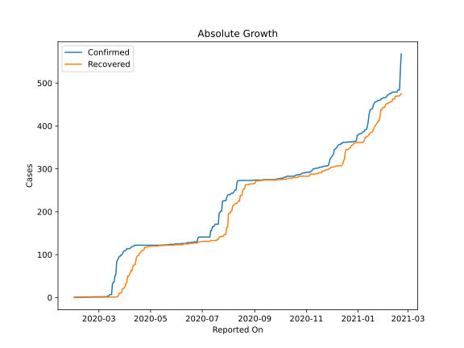
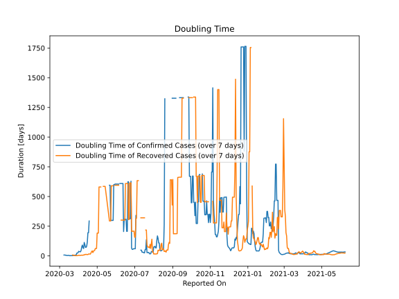

# Country Figures: Doubling Time of Infections for Cambodia 

The doubling time below are calculated based on
* an exponential growth assumption
* for time difference of past seven (7) days.
The doubling time's unit is "days".

The first doubling time indicates the increase of confirmed (infected)
cases. There, the *higher* the number is, the better is to take control
of the disease.

The second doubling time indicates the increase of recovered (healed)
cases. There, the *lower* the number is, the better it is to take
control of the disease.

| Reported On | Confirmed | Doubling Time (Confirmed) | Recovered | Doubling Time (Recovered) |
|-------------|-----------|---------------------------|-----------|---------------------------|
| 2020-05-08 | 122 |  None  | 120 |  None  | 
| 2020-05-07 | 122 |  None  | 120 |  580.2 days  | 
| 2020-05-06 | 122 |  None  | 120 |  580.2 days  | 
| 2020-05-05 | 122 |  None  | 120 |  580.2 days  | 
| 2020-05-04 | 122 |  None  | 120 |  580.2 days  | 
| 2020-05-03 | 122 |  None  | 120 |  192.0 days  | 
| 2020-05-02 | 122 |  None  | 120 |  192.0 days  | 
| 2020-05-01 | 122 |  None  | 120 |  192.0 days  | 
| 2020-04-30 | 122 |  None  | 119 |  62.0 days  | 
| 2020-04-29 | 122 |  None  | 119 |  62.0 days  | 
| 2020-04-28 | 122 |  None  | 119 |  62.0 days  | 
| 2020-04-27 | 122 |  None  | 119 |  46.0 days  | 
| 2020-04-26 | 122 |  None  | 117 |  45.2 days  | 
| 2020-04-25 | 122 |  None  | 117 |  38.4 days  | 
| 2020-04-24 | 122 |  None  | 117 |  27.7 days  | 
| 2020-04-23 | 122 |  None  | 110 |  42.3 days  | 
| 2020-04-22 | 122 |  None  | 110 |  36.0 days  | 
| 2020-04-21 | 122 |  None  | 110 |  25.9 days  | 
| 2020-04-20 | 122 |  None  | 107 |  15.1 days  | 
| 2020-04-19 | 122 |  None  | 105 |  16.0 days  | 
| 2020-04-18 | 122 |  293.9 days  | 103 |  15.6 days  | 
| 2020-04-17 | 122 |  195.2 days  | 98 |  16.1 days  | 
| 2020-04-16 | 122 |  195.2 days  | 98 |  10.9 days  | 
| 2020-04-15 | 122 |  116.3 days  | 96 |  11.9 days  | 
| 2020-04-14 | 122 |  82.5 days  | 91 |  11.1 days  | 
| 2020-04-13 | 122 |  71.9 days  | 77 |  13.3 days  | 
| 2020-04-12 | 122 |  71.9 days  | 77 |  11.6 days  | 
| 2020-04-11 | 120 |  94.9 days  | 75 |  12.3 days  | 
| 2020-04-10 | 119 |  113.4 days  | 72 |  7.1 days  | 
| 2020-04-09 | 119 |  62.0 days  | 62 |  8.4 days  | 
| 2020-04-08 | 117 |  68.9 days  | 63 |  5.6 days  | 
| 2020-04-07 | 115 |  90.9 days  | 58 |  5.6 days  | 
| 2020-04-06 | 114 |  76.9 days  | 53 |  5.6 days  | 
| 2020-04-05 | 114 |  48.2 days  | 50 |  5.9 days  | 
| 2020-04-04 | 114 |  34.7 days  | 50 |  3.9 days  | 
| 2020-04-03 | 114 |  34.7 days  | 35 |  4.5 days  | 
| 2020-04-02 | 110 |  36.0 days  | 34 |  4.3 days  | 
| 2020-04-01 | 109 |  38.6 days  | 25 |  5.6 days  | 
| 2020-03-31 | 109 |  27.2 days  | 23 |  3.1 days  | 
| 2020-03-30 | 107 |  23.8 days  | 21 |  2.4 days  | 
| 2020-03-29 | 103 |  24.1 days  | 21 |  2.4 days  | 
| 2020-03-28 | 99 |  8.1 days  | 13 |  2.2 days  | 
| 2020-03-27 | 99 |  7.7 days  | 11 |  2.4 days  | 
| 2020-03-26 | 96 |  5.4 days  | 10 |  2.4 days  | 
| 2020-03-25 | 96 |  5.1 days  | 10 |  2.4 days  | 
| 2020-03-24 | 91 |  5.1 days  | 4 |  3.8 days  | 
| 2020-03-23 | 87 |  2.3 days  | 2 |  7.3 days  | 
| 2020-03-22 | 84 |  2.3 days  | 2 |  7.3 days  | 
| 2020-03-21 | 53 |  2.7 days  | 1 |  None  | 
| 2020-03-20 | 51 |  2.4 days  | 1 |  None  | 
| 2020-03-19 | 37 |  2.3 days  | 1 |  None  | 
| 2020-03-18 | 35 |  2.3 days  | 1 |  None  | 
| 2020-03-17 | 33 |  2.1 days  | 1 |  None  | 
| 2020-03-16 | 7 |  4.2 days  | 1 |  None  | 
| 2020-03-15 | 7 |  4.2 days  | 1 |  None  | 
| 2020-03-14 | 7 |  2.8 days  | 1 |  None  | 
| 2020-03-13 | 5 |  3.3 days  | 1 |  None  | 
| 2020-03-12 | 3 |  4.8 days  | 1 |  None  | 
| 2020-03-11 | 3 |  4.8 days  | 1 |  None  | 
| 2020-03-10 | 2 |  7.3 days  | 1 |  None  | 
| 2020-03-09 | 2 |  7.3 days  | 1 |  None  | 
| 2020-03-08 | 2 |  7.3 days  | 1 |  None  | 
| 2020-02-11 | 1 |  None  | 0 |  None  | 
| 2020-02-10 | 1 |  None  | 0 |  None  | 
| 2020-02-09 | 1 |  None  | 0 |  None  | 
| 2020-02-08 | 1 |  None  | 0 |  None  | 
| 2020-02-07 | 1 |  None  | 0 |  None  | 
| 2020-02-06 | 1 |  None  | 0 |  None  | 
| 2020-02-05 | 1 |  None  | 0 |  None  | 
| 2020-02-04 | 1 |  None  | 0 |  None  | 
| 2020-02-03 | 1 |  None  | 0 |  None  | 
| 2020-02-02 | 1 |  None  | 0 |  None  | 
| 2020-02-01 | 1 |  None  | 0 |  None  | 

