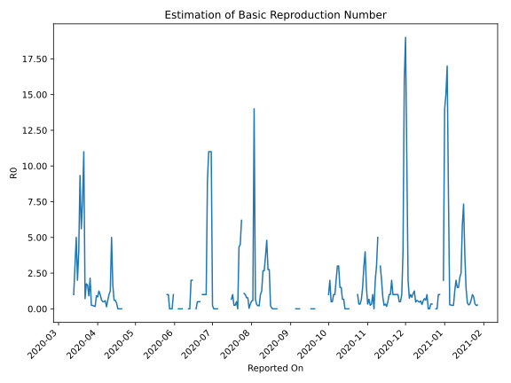

# Country Figures: Time Series for Basic Reproduction Number of Cambodia 

| Reported On | &Delta; Confirmed | Total &Delta; Confirmed First Interval | Total &Delta; Confirmed Second Interval | Estimated Basic Reproduction Number R0 | 
|-------------|-------------------|----------------------------------------|-----------------------------------------|---------------------------------------------------|
| 2020-05-07 | 0 |  None  |  None  |  None  | 
| 2020-05-06 | 0 |  None  |  None  |  None  | 
| 2020-05-05 | 0 |  None  |  None  |  None  | 
| 2020-05-04 | 0 |  None  |  None  |  None  | 
| 2020-05-03 | 0 |  None  |  None  |  None  | 
| 2020-05-02 | 0 |  None  |  None  |  None  | 
| 2020-05-01 | 0 |  None  |  None  |  None  | 
| 2020-04-30 | 0 |  None  |  None  |  None  | 
| 2020-04-29 | 0 |  None  |  None  |  None  | 
| 2020-04-28 | 0 |  None  |  None  |  None  | 
| 2020-04-27 | 0 |  None  |  None  |  None  | 
| 2020-04-26 | 0 |  None  |  None  |  None  | 
| 2020-04-25 | 0 |  None  |  None  |  None  | 
| 2020-04-24 | 0 |  None  |  None  |  None  | 
| 2020-04-23 | 0 |  None  |  None  |  None  | 
| 2020-04-22 | 0 |  None  |  None  |  None  | 
| 2020-04-21 | 0 |  None  |  None  |  None  | 
| 2020-04-20 | 0 |  None  |  2  |  None  | 
| 2020-04-19 | 0 |  None  |  3  |  None  | 
| 2020-04-18 | 0 |  None  |  3  |  None  | 
| 2020-04-17 | 0 |  None  |  5  |  None  | 
| 2020-04-16 | 0 |  2  |  5  |  0.40  | 
| 2020-04-15 | 0 |  3  |  5  |  0.60  | 
| 2020-04-14 | 0 |  3  |  5  |  0.60  | 
| 2020-04-13 | 0 |  5  |  3  |  1.67  | 
| 2020-04-12 | 2 |  5  |  1  |  5.00  | 
| 2020-04-11 | 1 |  5  |  4  |  1.25  | 
| 2020-04-10 | 0 |  5  |  5  |  1.00  | 
| 2020-04-09 | 2 |  3  |  5  |  0.60  | 
| 2020-04-08 | 2 |  1  |  7  |  0.14  | 
| 2020-04-07 | 1 |  4  |  7  |  0.57  | 
| 2020-04-06 | 0 |  5  |  10  |  0.50  | 
| 2020-04-05 | 0 |  5  |  10  |  0.50  | 
| 2020-04-04 | 0 |  7  |  11  |  0.64  | 
| 2020-04-03 | 4 |  7  |  7  |  1.00  | 
| 2020-04-02 | 1 |  10  |  8  |  1.25  | 
| 2020-04-01 | 0 |  10  |  12  |  0.83  | 
| 2020-03-31 | 2 |  11  |  12  |  0.92  | 
| 2020-03-30 | 4 |  7  |  43  |  0.16  | 
| 2020-03-29 | 4 |  8  |  40  |  0.20  | 
| 2020-03-28 | 0 |  12  |  50  |  0.24  | 
| 2020-03-27 | 3 |  12  |  49  |  0.24  | 
| 2020-03-26 | 0 |  43  |  20  |  2.15  | 
| 2020-03-25 | 5 |  40  |  44  |  0.91  | 
| 2020-03-24 | 4 |  50  |  30  |  1.67  | 
| 2020-03-23 | 3 |  49  |  28  |  1.75  | 
| 2020-03-22 | 31 |  20  |  28  |  0.71  | 
| 2020-03-21 | 2 |  44  |  4  |  11.00  | 
| 2020-03-20 | 14 |  30  |  4  |  7.50  | 
| 2020-03-19 | 2 |  28  |  5  |  5.60  | 
| 2020-03-18 | 2 |  28  |  3  |  9.33  | 
| 2020-03-17 | 26 |  4  |  1  |  4.00  | 
| 2020-03-16 | 0 |  4  |  2  |  2.00  | 
| 2020-03-15 | 0 |  5  |  1  |  5.00  | 
| 2020-03-14 | 2 |  3  |  1  |  3.00  | 
| 2020-03-13 | 2 |  1  |  1  |  1.00  | 
| 2020-03-12 | 0 |  2  |  None  |  None  | 
| 2020-03-11 | 1 |  1  |  None  |  None  | 
| 2020-03-10 | 0 |  1  |  None  |  None  | 
| 2020-03-09 | 0 |  1  |  None  |  None  | 
| 2020-03-08 | 1 |  None  |  None  |  None  | 
| 2020-03-07 | 0 |  None  |  None  |  None  | 
| 2020-03-06 | 0 |  None  |  None  |  None  | 
| 2020-03-05 | 0 |  None  |  None  |  None  | 
| 2020-03-04 | 0 |  None  |  None  |  None  | 
| 2020-03-03 | 0 |  None  |  None  |  None  | 
| 2020-03-02 | 0 |  None  |  None  |  None  | 
| 2020-03-01 | 0 |  None  |  None  |  None  | 
| 2020-02-29 | 0 |  None  |  None  |  None  | 
| 2020-02-28 | 0 |  None  |  None  |  None  | 
| 2020-02-27 | 0 |  None  |  None  |  None  | 
| 2020-02-26 | 0 |  None  |  None  |  None  | 
| 2020-02-25 | 0 |  None  |  None  |  None  | 
| 2020-02-24 | 0 |  None  |  None  |  None  | 
| 2020-02-23 | 0 |  None  |  None  |  None  | 
| 2020-02-22 | 0 |  None  |  None  |  None  | 
| 2020-02-21 | 0 |  None  |  None  |  None  | 
| 2020-02-20 | 0 |  None  |  None  |  None  | 
| 2020-02-19 | 0 |  None  |  None  |  None  | 
| 2020-02-18 | 0 |  None  |  None  |  None  | 
| 2020-02-17 | 0 |  None  |  None  |  None  | 
| 2020-02-16 | 0 |  None  |  None  |  None  | 
| 2020-02-15 | 0 |  None  |  None  |  None  | 
| 2020-02-14 | 0 |  None  |  None  |  None  | 
| 2020-02-13 | 0 |  None  |  None  |  None  | 
| 2020-02-12 | 0 |  None  |  None  |  None  | 
| 2020-02-11 | 0 |  None  |  None  |  None  | 
| 2020-02-10 | 0 |  None  |  None  |  None  | 
| 2020-02-09 | 0 |  None  |  None  |  None  | 
| 2020-02-08 | 0 |  None  |  None  |  None  | 
| 2020-02-07 | 0 |  None  |  None  |  None  | 
| 2020-02-06 | 0 |  None  |  None  |  None  | 
| 2020-02-05 | 0 |  None  |  None  |  None  | 
| 2020-02-04 | 0 |  None  |  None  |  None  | 
| 2020-02-03 | 0 |  None  |  None  |  None  | 
| 2020-02-02 | 0 |  None  |  None  |  None  | 
| 2020-02-01 | 0 |  None  |  None  |  None  | 
| 2020-01-31 | 0 |  None  |  None  |  None  | 
| 2020-01-30 | 0 |  None  |  None  |  None  | 
| 2020-01-29 | 0 |  None  |  None  |  None  | 
| 2020-01-28 | 0 |  None  |  None  |  None  | 
| 2020-01-27 | None |  None  |  None  |  None  | 

