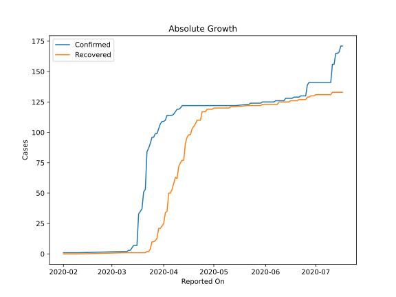
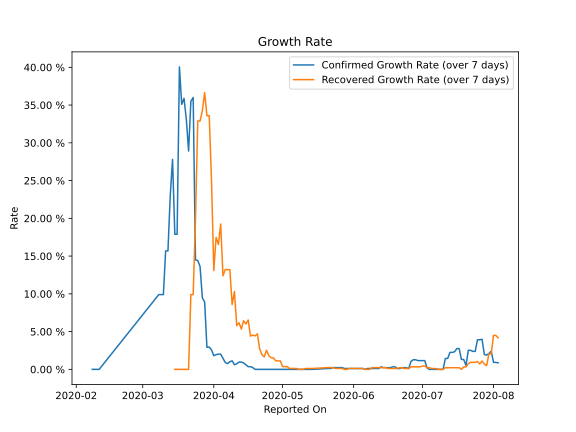

# Country Figures: Growth Rate for Cambodia 

The growth rates below are calculated based on
* an exponential growth assumption
* for time difference of past seven (7) days.
The growth rate is to be understood as on "growth per day".

The first growth rate indicates the increase of confirmed (infected) cases.

The second growth rate indicates the increase of recovered (healed) cases.

| Reported On | Confirmed | Growth Rate (Confirmed) | Recovered | Growth Rate (Recovered) |
|-------------|-----------|-------------------------|-----------|-------------------------|
| 2020-05-06 | 122 |  None  | 120 |  0.120 %  | 
| 2020-05-05 | 122 |  None  | 120 |  0.120 %  | 
| 2020-05-04 | 122 |  None  | 120 |  0.120 %  | 
| 2020-05-03 | 122 |  None  | 120 |  0.362 %  | 
| 2020-05-02 | 122 |  None  | 120 |  0.362 %  | 
| 2020-05-01 | 122 |  None  | 120 |  0.362 %  | 
| 2020-04-30 | 122 |  None  | 119 |  1.123 %  | 
| 2020-04-29 | 122 |  None  | 119 |  1.123 %  | 
| 2020-04-28 | 122 |  None  | 119 |  1.123 %  | 
| 2020-04-27 | 122 |  None  | 119 |  1.518 %  | 
| 2020-04-26 | 122 |  None  | 117 |  1.546 %  | 
| 2020-04-25 | 122 |  None  | 117 |  1.821 %  | 
| 2020-04-24 | 122 |  None  | 117 |  2.532 %  | 
| 2020-04-23 | 122 |  None  | 110 |  1.650 %  | 
| 2020-04-22 | 122 |  None  | 110 |  1.945 %  | 
| 2020-04-21 | 122 |  None  | 110 |  2.709 %  | 
| 2020-04-20 | 122 |  None  | 107 |  4.700 %  | 
| 2020-04-19 | 122 |  None  | 105 |  4.431 %  | 
| 2020-04-18 | 122 |  0.24 %  | 103 |  4.532 %  | 
| 2020-04-17 | 122 |  0.36 %  | 98 |  4.404 %  | 
| 2020-04-16 | 122 |  0.36 %  | 98 |  6.540 %  | 
| 2020-04-15 | 122 |  0.60 %  | 96 |  6.017 %  | 
| 2020-04-14 | 122 |  0.84 %  | 91 |  6.435 %  | 
| 2020-04-13 | 122 |  0.97 %  | 77 |  5.336 %  | 
| 2020-04-12 | 122 |  0.97 %  | 77 |  6.168 %  | 
| 2020-04-11 | 120 |  0.73 %  | 75 |  5.792 %  | 
| 2020-04-10 | 119 |  0.61 %  | 72 |  10.305 %  | 
| 2020-04-09 | 119 |  1.12 %  | 62 |  8.582 %  | 
| 2020-04-08 | 117 |  1.01 %  | 63 |  13.204 %  | 
| 2020-04-07 | 115 |  0.77 %  | 58 |  13.214 %  | 
| 2020-04-06 | 114 |  0.91 %  | 53 |  13.225 %  | 
| 2020-04-05 | 114 |  1.45 %  | 50 |  12.393 %  | 
| 2020-04-04 | 114 |  2.02 %  | 50 |  19.244 %  | 
| 2020-04-03 | 114 |  2.02 %  | 35 |  16.535 %  | 
| 2020-04-02 | 110 |  1.94 %  | 34 |  17.483 %  | 
| 2020-04-01 | 109 |  1.81 %  | 25 |  13.090 %  | 
| 2020-03-31 | 109 |  2.58 %  | 23 |  24.989 %  | 
| 2020-03-30 | 107 |  2.96 %  | 21 |  33.591 %  | 
| 2020-03-29 | 103 |  2.91 %  | 21 |  33.591 %  | 
| 2020-03-28 | 99 |  8.93 %  | 13 |  36.642 %  | 
| 2020-03-27 | 99 |  9.48 %  | 11 |  34.256 %  | 
| 2020-03-26 | 96 |  13.62 %  | 10 |  32.894 %  | 
| 2020-03-25 | 96 |  14.41 %  | 10 |  32.894 %  | 
| 2020-03-24 | 91 |  14.49 %  | 4 |  19.804 %  | 
| 2020-03-23 | 87 |  36.00 %  | 2 |  9.902 %  | 
| 2020-03-22 | 84 |  35.50 %  | 2 |  9.902 %  | 
| 2020-03-21 | 53 |  28.92 %  | 1 |  None  | 
| 2020-03-20 | 51 |  33.18 %  | 1 |  None  | 
| 2020-03-19 | 37 |  35.89 %  | 1 |  None  | 
| 2020-03-18 | 35 |  35.10 %  | 1 |  None  | 
| 2020-03-17 | 33 |  40.05 %  | 1 |  None  | 
| 2020-03-16 | 7 |  17.90 %  | 1 |  None  | 
| 2020-03-15 | 7 |  17.90 %  | 1 |  None  | 
| 2020-03-14 | 7 |  27.80 %  | 1 |  None  | 
| 2020-03-13 | 5 |  22.99 %  | 1 |  None  | 
| 2020-03-12 | 3 |  15.69 %  | 1 |  None  | 
| 2020-03-11 | 3 |  15.69 %  | 1 |  None  | 
| 2020-03-10 | 2 |  9.90 %  | 1 |  None  | 
| 2020-03-09 | 2 |  9.90 %  | 1 |  None  | 
| 2020-03-08 | 2 |  9.90 %  | 1 |  None  | 
| 2020-02-11 | 1 |  None  | 0 |  None  | 
| 2020-02-10 | 1 |  None  | 0 |  None  | 
| 2020-02-09 | 1 |  None  | 0 |  None  | 
| 2020-02-08 | 1 |  None  | 0 |  None  | 
| 2020-02-07 | 1 |  None  | 0 |  None  | 
| 2020-02-06 | 1 |  None  | 0 |  None  | 
| 2020-02-05 | 1 |  None  | 0 |  None  | 
| 2020-02-04 | 1 |  None  | 0 |  None  | 
| 2020-02-03 | 1 |  None  | 0 |  None  | 
| 2020-02-02 | 1 |  None  | 0 |  None  | 
| 2020-02-01 | 1 |  None  | 0 |  None  | 

