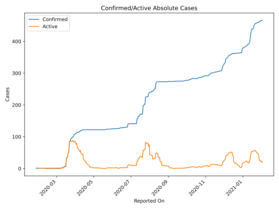
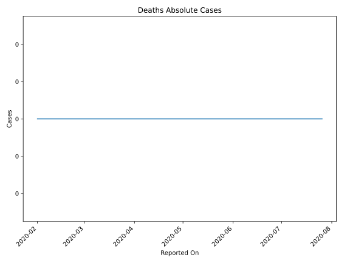
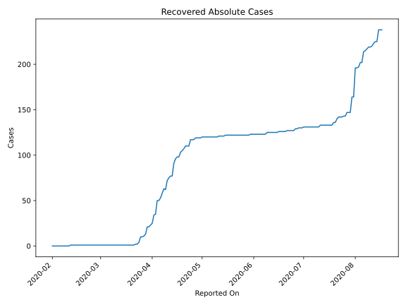
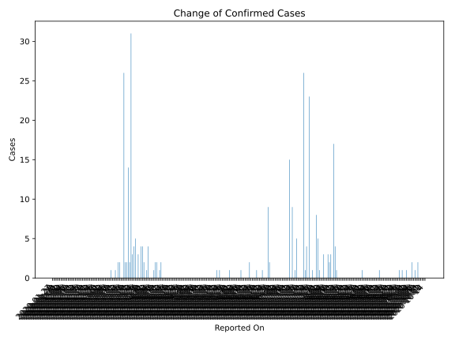
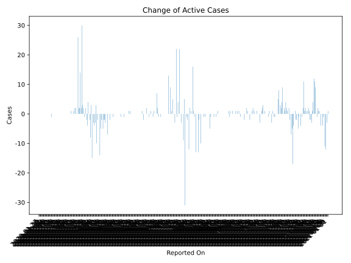
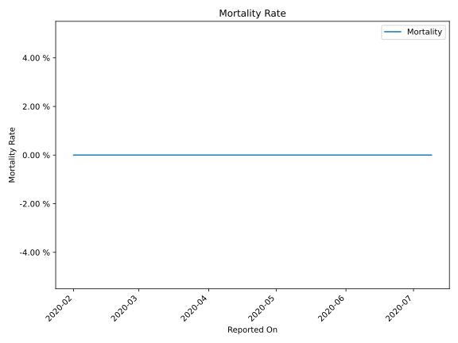

# Country Figures: Time Series for Cambodia 

| Reported On | Confirmed | Deaths | Recovered | Active | Mortality | &Delta; Confirmed | &Delta; Deaths | &Delta; Recovered | &Delta; Active | % Active of Population |
|-------------|-----------|--------|-----------|--------|-----------|-------------------|----------------|-------------------|----------------|------------------------|
| 2020-04-29 | 122 | 0 | 119 | 3 |  None  | 0 | 0 | 0 | 0 |  0.000 %  | 
| 2020-04-28 | 122 | 0 | 119 | 3 |  None  | 0 | 0 | 0 | 0 |  0.000 %  | 
| 2020-04-27 | 122 | 0 | 119 | 3 |  None  | 0 | 0 | 2 | -2 |  0.000 %  | 
| 2020-04-26 | 122 | 0 | 117 | 5 |  None  | 0 | 0 | 0 | 0 |  0.000 %  | 
| 2020-04-25 | 122 | 0 | 117 | 5 |  None  | 0 | 0 | 0 | 0 |  0.000 %  | 
| 2020-04-24 | 122 | 0 | 117 | 5 |  None  | 0 | 0 | 7 | -7 |  0.000 %  | 
| 2020-04-23 | 122 | 0 | 110 | 12 |  None  | 0 | 0 | 0 | 0 |  0.000 %  | 
| 2020-04-22 | 122 | 0 | 110 | 12 |  None  | 0 | 0 | 0 | 0 |  0.000 %  | 
| 2020-04-21 | 122 | 0 | 110 | 12 |  None  | 0 | 0 | 3 | -3 |  0.000 %  | 
| 2020-04-20 | 122 | 0 | 107 | 15 |  None  | 0 | 0 | 2 | -2 |  0.000 %  | 
| 2020-04-19 | 122 | 0 | 105 | 17 |  None  | 0 | 0 | 2 | -2 |  0.000 %  | 
| 2020-04-18 | 122 | 0 | 103 | 19 |  None  | 0 | 0 | 5 | -5 |  0.000 %  | 
| 2020-04-17 | 122 | 0 | 98 | 24 |  None  | 0 | 0 | 0 | 0 |  0.000 %  | 
| 2020-04-16 | 122 | 0 | 98 | 24 |  None  | 0 | 0 | 2 | -2 |  0.000 %  | 
| 2020-04-15 | 122 | 0 | 96 | 26 |  None  | 0 | 0 | 5 | -5 |  0.000 %  | 
| 2020-04-14 | 122 | 0 | 91 | 31 |  None  | 0 | 0 | 14 | -14 |  0.000 %  | 
| 2020-04-13 | 122 | 0 | 77 | 45 |  None  | 0 | 0 | 0 | 0 |  0.000 %  | 
| 2020-04-12 | 122 | 0 | 77 | 45 |  None  | 2 | 0 | 2 | 0 |  0.000 %  | 
| 2020-04-11 | 120 | 0 | 75 | 45 |  None  | 1 | 0 | 3 | -2 |  0.000 %  | 
| 2020-04-10 | 119 | 0 | 72 | 47 |  None  | 0 | 0 | 10 | -10 |  0.000 %  | 
| 2020-04-09 | 119 | 0 | 62 | 57 |  None  | 2 | 0 | -1 | 3 |  0.000 %  | 
| 2020-04-08 | 117 | 0 | 63 | 54 |  None  | 2 | 0 | 5 | -3 |  0.000 %  | 
| 2020-04-07 | 115 | 0 | 58 | 57 |  None  | 1 | 0 | 5 | -4 |  0.000 %  | 
| 2020-04-06 | 114 | 0 | 53 | 61 |  None  | 0 | 0 | 3 | -3 |  0.000 %  | 
| 2020-04-05 | 114 | 0 | 50 | 64 |  None  | 0 | 0 | 0 | 0 |  0.000 %  | 
| 2020-04-04 | 114 | 0 | 50 | 64 |  None  | 0 | 0 | 15 | -15 |  0.000 %  | 
| 2020-04-03 | 114 | 0 | 35 | 79 |  None  | 4 | 0 | 1 | 3 |  0.000 %  | 
| 2020-04-02 | 110 | 0 | 34 | 76 |  None  | 1 | 0 | 9 | -8 |  0.000 %  | 
| 2020-04-01 | 109 | 0 | 25 | 84 |  None  | 0 | 0 | 2 | -2 |  0.001 %  | 
| 2020-03-31 | 109 | 0 | 23 | 86 |  None  | 2 | 0 | 2 | 0 |  0.001 %  | 
| 2020-03-30 | 107 | 0 | 21 | 86 |  None  | 4 | 0 | 0 | 4 |  0.001 %  | 
| 2020-03-29 | 103 | 0 | 21 | 82 |  None  | 4 | 0 | 8 | -4 |  0.001 %  | 
| 2020-03-28 | 99 | 0 | 13 | 86 |  None  | 0 | 0 | 2 | -2 |  0.001 %  | 
| 2020-03-27 | 99 | 0 | 11 | 88 |  None  | 3 | 0 | 1 | 2 |  0.001 %  | 
| 2020-03-26 | 96 | 0 | 10 | 86 |  None  | 0 | 0 | 0 | 0 |  0.001 %  | 
| 2020-03-25 | 96 | 0 | 10 | 86 |  None  | 5 | 0 | 6 | -1 |  0.001 %  | 
| 2020-03-24 | 91 | 0 | 4 | 87 |  None  | 4 | 0 | 2 | 2 |  0.001 %  | 
| 2020-03-23 | 87 | 0 | 2 | 85 |  None  | 3 | 0 | 0 | 3 |  0.001 %  | 
| 2020-03-22 | 84 | 0 | 2 | 82 |  None  | 31 | 0 | 1 | 30 |  0.001 %  | 
| 2020-03-21 | 53 | 0 | 1 | 52 |  None  | 2 | 0 | 0 | 2 |  0.000 %  | 
| 2020-03-20 | 51 | 0 | 1 | 50 |  None  | 14 | 0 | 0 | 14 |  0.000 %  | 
| 2020-03-19 | 37 | 0 | 1 | 36 |  None  | 2 | 0 | 0 | 2 |  0.000 %  | 
| 2020-03-18 | 35 | 0 | 1 | 34 |  None  | 2 | 0 | 0 | 2 |  0.000 %  | 
| 2020-03-17 | 33 | 0 | 1 | 32 |  None  | 26 | 0 | 0 | 26 |  0.000 %  | 
| 2020-03-16 | 7 | 0 | 1 | 6 |  None  | 0 | 0 | 0 | 0 |  0.000 %  | 
| 2020-03-15 | 7 | 0 | 1 | 6 |  None  | 0 | 0 | 0 | 0 |  0.000 %  | 
| 2020-03-14 | 7 | 0 | 1 | 6 |  None  | 2 | 0 | 0 | 2 |  0.000 %  | 
| 2020-03-13 | 5 | 0 | 1 | 4 |  None  | 2 | 0 | 0 | 2 |  0.000 %  | 
| 2020-03-12 | 3 | 0 | 1 | 2 |  None  | 0 | 0 | 0 | 0 |  0.000 %  | 
| 2020-03-11 | 3 | 0 | 1 | 2 |  None  | 1 | 0 | 0 | 1 |  0.000 %  | 
| 2020-03-10 | 2 | 0 | 1 | 1 |  None  | 0 | 0 | 0 | 0 |  0.000 %  | 
| 2020-03-09 | 2 | 0 | 1 | 1 |  None  | 0 | 0 | 0 | 0 |  0.000 %  | 
| 2020-03-08 | 2 | 0 | 1 | 1 |  None  | 1 | 0 | 0 | 1 |  0.000 %  | 
| 2020-03-07 | 1 | 0 | 1 | 0 |  None  | 0 | 0 | 0 | 0 |  n/a  | 
| 2020-03-06 | 1 | 0 | 1 | 0 |  None  | 0 | 0 | 0 | 0 |  n/a  | 
| 2020-03-05 | 1 | 0 | 1 | 0 |  None  | 0 | 0 | 0 | 0 |  n/a  | 
| 2020-03-04 | 1 | 0 | 1 | 0 |  None  | 0 | 0 | 0 | 0 |  n/a  | 
| 2020-03-03 | 1 | 0 | 1 | 0 |  None  | 0 | 0 | 0 | 0 |  n/a  | 
| 2020-03-02 | 1 | 0 | 1 | 0 |  None  | 0 | 0 | 0 | 0 |  n/a  | 
| 2020-03-01 | 1 | 0 | 1 | 0 |  None  | 0 | 0 | 0 | 0 |  n/a  | 
| 2020-02-29 | 1 | 0 | 1 | 0 |  None  | 0 | 0 | 0 | 0 |  n/a  | 
| 2020-02-28 | 1 | 0 | 1 | 0 |  None  | 0 | 0 | 0 | 0 |  n/a  | 
| 2020-02-27 | 1 | 0 | 1 | 0 |  None  | 0 | 0 | 0 | 0 |  n/a  | 
| 2020-02-26 | 1 | 0 | 1 | 0 |  None  | 0 | 0 | 0 | 0 |  n/a  | 
| 2020-02-25 | 1 | 0 | 1 | 0 |  None  | 0 | 0 | 0 | 0 |  n/a  | 
| 2020-02-24 | 1 | 0 | 1 | 0 |  None  | 0 | 0 | 0 | 0 |  n/a  | 
| 2020-02-23 | 1 | 0 | 1 | 0 |  None  | 0 | 0 | 0 | 0 |  n/a  | 
| 2020-02-22 | 1 | 0 | 1 | 0 |  None  | 0 | 0 | 0 | 0 |  n/a  | 
| 2020-02-21 | 1 | 0 | 1 | 0 |  None  | 0 | 0 | 0 | 0 |  n/a  | 
| 2020-02-20 | 1 | 0 | 1 | 0 |  None  | 0 | 0 | 0 | 0 |  n/a  | 
| 2020-02-19 | 1 | 0 | 1 | 0 |  None  | 0 | 0 | 0 | 0 |  n/a  | 
| 2020-02-18 | 1 | 0 | 1 | 0 |  None  | 0 | 0 | 0 | 0 |  n/a  | 
| 2020-02-17 | 1 | 0 | 1 | 0 |  None  | 0 | 0 | 0 | 0 |  n/a  | 
| 2020-02-16 | 1 | 0 | 1 | 0 |  None  | 0 | 0 | 0 | 0 |  n/a  | 
| 2020-02-15 | 1 | 0 | 1 | 0 |  None  | 0 | 0 | 0 | 0 |  n/a  | 
| 2020-02-14 | 1 | 0 | 1 | 0 |  None  | 0 | 0 | 0 | 0 |  n/a  | 
| 2020-02-13 | 1 | 0 | 1 | 0 |  None  | 0 | 0 | 0 | 0 |  n/a  | 
| 2020-02-12 | 1 | 0 | 1 | 0 |  None  | 0 | 0 | 1 | -1 |  n/a  | 
| 2020-02-11 | 1 | 0 | 0 | 1 |  None  | 0 | 0 | 0 | 0 |  0.000 %  | 
| 2020-02-10 | 1 | 0 | 0 | 1 |  None  | 0 | 0 | 0 | 0 |  0.000 %  | 
| 2020-02-09 | 1 | 0 | 0 | 1 |  None  | 0 | 0 | 0 | 0 |  0.000 %  | 
| 2020-02-08 | 1 | 0 | 0 | 1 |  None  | 0 | 0 | 0 | 0 |  0.000 %  | 
| 2020-02-07 | 1 | 0 | 0 | 1 |  None  | 0 | 0 | 0 | 0 |  0.000 %  | 
| 2020-02-06 | 1 | 0 | 0 | 1 |  None  | 0 | 0 | 0 | 0 |  0.000 %  | 
| 2020-02-05 | 1 | 0 | 0 | 1 |  None  | 0 | 0 | 0 | 0 |  0.000 %  | 
| 2020-02-04 | 1 | 0 | 0 | 1 |  None  | 0 | 0 | 0 | 0 |  0.000 %  | 
| 2020-02-03 | 1 | 0 | 0 | 1 |  None  | 0 | 0 | 0 | 0 |  0.000 %  | 
| 2020-02-02 | 1 | 0 | 0 | 1 |  None  | 0 | 0 | 0 | 0 |  0.000 %  | 
| 2020-02-01 | 1 | 0 | 0 | 1 |  None  | 0 | None | None | None |  0.000 %  | 
| 2020-01-31 | 1 | None | None | None |  None  | 0 | None | None | None |  n/a  | 
| 2020-01-30 | 1 | None | None | None |  None  | 0 | None | None | None |  n/a  | 
| 2020-01-29 | 1 | None | None | None |  None  | 0 | None | None | None |  n/a  | 
| 2020-01-28 | 1 | None | None | None |  None  | 0 | None | None | None |  n/a  | 
| 2020-01-27 | 1 | None | None | None |  None  | None | None | None | None |  n/a  | 

