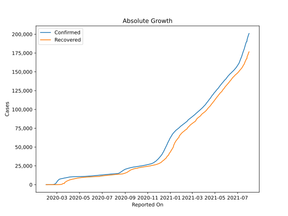
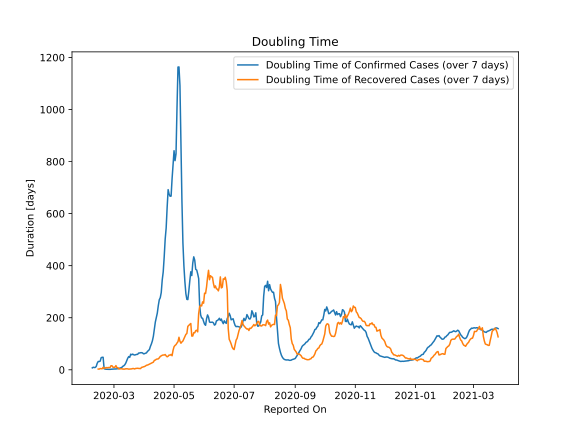

# Country Figures: Doubling Time of Infections for Korea,South 

The doubling time below are calculated based on
* an exponential growth assumption
* for time difference of past seven (7) days.
The doubling time's unit is "days".

The first doubling time indicates the increase of confirmed (infected)
cases. There, the *higher* the number is, the better is to take control
of the disease.

The second doubling time indicates the increase of recovered (healed)
cases. There, the *lower* the number is, the better it is to take
control of the disease.

| Reported On | Confirmed | Doubling Time (Confirmed) | Recovered | Doubling Time (Recovered) |
|-------------|-----------|---------------------------|-----------|---------------------------|
| 2020-05-05 | 10806 |  1163.1 days  | 9333 |  108.1 days  | 
| 2020-05-04 | 10804 |  1006.0 days  | 9283 |  102.9 days  | 
| 2020-05-03 | 10801 |  829.8 days  | 9217 |  96.6 days  | 
| 2020-05-02 | 10793 |  803.6 days  | 9183 |  93.5 days  | 
| 2020-05-01 | 10780 |  841.5 days  | 9123 |  88.6 days  | 
| 2020-04-30 | 10774 |  790.0 days  | 9072 |  75.0 days  | 
| 2020-04-29 | 10765 |  733.6 days  | 9059 |  54.1 days  | 
| 2020-04-28 | 10761 |  667.3 days  | 8922 |  58.9 days  | 
| 2020-04-27 | 10752 |  666.8 days  | 8854 |  55.9 days  | 
| 2020-04-26 | 10738 |  674.6 days  | 8764 |  56.8 days  | 
| 2020-04-25 | 10728 |  692.0 days  | 8717 |  52.1 days  | 
| 2020-04-24 | 10718 |  624.5 days  | 8635 |  49.9 days  | 
| 2020-04-23 | 10708 |  544.8 days  | 8501 |  53.3 days  | 
| 2020-04-22 | 10694 |  501.7 days  | 8277 |  58.6 days  | 
| 2020-04-21 | 10683 |  433.5 days  | 8213 |  56.6 days  | 
| 2020-04-20 | 10674 |  375.9 days  | 8114 |  56.9 days  | 
| 2020-04-19 | 10661 |  345.1 days  | 8042 |  55.8 days  | 
| 2020-04-18 | 10653 |  296.7 days  | 7937 |  53.4 days  | 
| 2020-04-17 | 10635 |  276.8 days  | 7829 |  51.2 days  | 
| 2020-04-16 | 10613 |  268.9 days  | 7757 |  45.9 days  | 
| 2020-04-15 | 10591 |  246.2 days  | 7616 |  41.9 days  | 
| 2020-04-14 | 10564 |  217.9 days  | 7534 |  41.4 days  | 
| 2020-04-13 | 10537 |  200.0 days  | 7447 |  40.4 days  | 
| 2020-04-12 | 10512 |  183.4 days  | 7368 |  37.4 days  | 
| 2020-04-11 | 10480 |  154.8 days  | 7243 |  36.1 days  | 
| 2020-04-10 | 10450 |  128.6 days  | 7117 |  29.4 days  | 
| 2020-04-09 | 10423 |  111.0 days  | 6973 |  27.4 days  | 
| 2020-04-08 | 10384 |  99.3 days  | 6776 |  25.0 days  | 
| 2020-04-07 | 10331 |  89.9 days  | 6694 |  23.1 days  | 
| 2020-04-06 | 10284 |  78.0 days  | 6598 |  21.2 days  | 
| 2020-04-05 | 10237 |  73.8 days  | 6463 |  19.7 days  | 
| 2020-04-04 | 10156 |  70.6 days  | 6325 |  18.1 days  | 
| 2020-04-03 | 10062 |  64.8 days  | 6021 |  17.4 days  | 
| 2020-04-02 | 9976 |  63.7 days  | 5828 |  14.6 days  | 
| 2020-04-01 | 9887 |  61.9 days  | 5567 |  12.5 days  | 
| 2020-03-31 | 9786 |  61.3 days  | 5408 |  11.5 days  | 
| 2020-03-30 | 9661 |  64.9 days  | 5228 |  10.0 days  | 
| 2020-03-29 | 9583 |  65.7 days  | 5033 |  9.2 days  | 
| 2020-03-28 | 9478 |  65.6 days  | 4811 |  4.6 days  | 
| 2020-03-27 | 9332 |  64.5 days  | 4528 |  4.8 days  | 
| 2020-03-26 | 9241 |  64.2 days  | 4144 |  5.2 days  | 
| 2020-03-25 | 9137 |  59.1 days  | 3730 |  5.8 days  | 
| 2020-03-24 | 9037 |  59.0 days  | 3507 |  5.7 days  | 
| 2020-03-23 | 8961 |  57.9 days  | 3166 |  5.1 days  | 
| 2020-03-22 | 8897 |  56.6 days  | 2909 |  3.1 days  | 
| 2020-03-21 | 8799 |  57.8 days  | 1540 |  4.7 days  | 
| 2020-03-20 | 8652 |  60.3 days  | 1540 |  4.7 days  | 
| 2020-03-19 | 8565 |  57.6 days  | 1540 |  3.5 days  | 
| 2020-03-18 | 8413 |  59.9 days  | 1540 |  3.2 days  | 
| 2020-03-17 | 8320 |  47.9 days  | 1407 |  3.1 days  | 
| 2020-03-16 | 8236 |  50.6 days  | 1137 |  2.5 days  | 
| 2020-03-15 | 8162 |  44.6 days  | 510 |  3.7 days  | 
| 2020-03-14 | 8086 |  35.4 days  | 510 |  4.0 days  | 
| 2020-03-13 | 7979 |  25.8 days  | 510 |  4.0 days  | 
| 2020-03-12 | 7869 |  19.3 days  | 333 |  2.6 days  | 
| 2020-03-11 | 7755 |  15.4 days  | 288 |  2.8 days  | 
| 2020-03-10 | 7513 |  13.4 days  | 247 |  2.6 days  | 
| 2020-03-09 | 7478 |  9.2 days  | 118 |  3.9 days  | 
| 2020-03-08 | 7314 |  7.6 days  | 118 |  3.9 days  | 
| 2020-03-07 | 7041 |  6.4 days  | 135 |  3.3 days  | 
| 2020-03-06 | 6593 |  5.0 days  | 135 |  3.0 days  | 
| 2020-03-05 | 6088 |  4.3 days  | 41 |  8.1 days  | 
| 2020-03-04 | 5621 |  3.6 days  | 41 |  8.1 days  | 
| 2020-03-03 | 5186 |  3.2 days  | 30 |  16.0 days  | 
| 2020-03-02 | 4335 |  3.3 days  | 30 |  9.8 days  | 
| 2020-03-01 | 3736 |  3.0 days  | 30 |  9.8 days  | 
| 2020-02-29 | 3150 |  2.8 days  | 27 |  9.6 days  | 
| 2020-02-28 | 2337 |  2.3 days  | 22 |  15.6 days  | 
| 2020-02-27 | 1766 |  2.0 days  | 22 |  15.6 days  | 
| 2020-02-26 | 1261 |  1.6 days  | 22 |  8.3 days  | 
| 2020-02-25 | 977 |  1.7 days  | 22 |  8.3 days  | 
| 2020-02-24 | 833 |  1.8 days  | 18 |  8.6 days  | 
| 2020-02-23 | 602 |  1.9 days  | 18 |  7.3 days  | 
| 2020-02-22 | 433 |  2.1 days  | 16 |  8.8 days  | 
| 2020-02-21 | 204 |  2.8 days  | 16 |  6.2 days  | 
| 2020-02-20 | 104 |  4.0 days  | 16 |  6.2 days  | 
| 2020-02-19 | 31 |  48.0 days  | 12 |  9.3 days  | 
| 2020-02-18 | 31 |  48.0 days  | 12 |  3.8 days  | 
| 2020-02-17 | 30 |  46.4 days  | 10 |  4.4 days  | 
| 2020-02-16 | 29 |  33.0 days  | 9 |  4.8 days  | 
| 2020-02-15 | 28 |  31.8 days  | 9 |  2.5 days  | 
| 2020-02-14 | 28 |  31.8 days  | 7 |  2.8 days  | 
| 2020-02-13 | 28 |  25.0 days  | 7 |  None  | 
| 2020-02-12 | 28 |  12.9 days  | 7 |  None  | 
| 2020-02-11 | 28 |  9.0 days  | 3 |  None  | 
| 2020-02-10 | 27 |  8.6 days  | 3 |  None  | 
| 2020-02-09 | 25 |  9.8 days  | 3 |  None  | 
| 2020-02-08 | 24 |  7.3 days  | 1 |  None  | 
| 2020-02-07 | 24 |  None  | 1 |  None  | 
| 2020-02-06 | 23 |  None  | 0 |  None  | 
| 2020-02-05 | 19 |  None  | 0 |  None  | 
| 2020-02-04 | 16 |  None  | 0 |  None  | 
| 2020-02-03 | 15 |  None  | 0 |  None  | 
| 2020-02-02 | 15 |  None  | 0 |  None  | 
| 2020-02-01 | 12 |  None  | 0 |  None  | 

