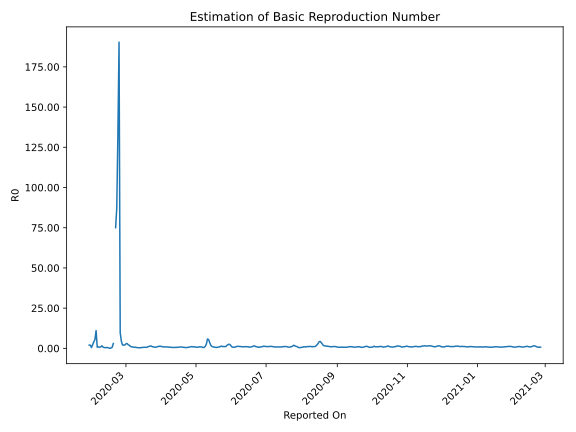

# Country Figures: Time Series for Basic Reproduction Number of Korea,South 

| Reported On | &Delta; Confirmed | Total &Delta; Confirmed First Interval | Total &Delta; Confirmed Second Interval | Estimated Basic Reproduction Number R0 | 
|-------------|-------------------|----------------------------------------|-----------------------------------------|---------------------------------------------------|
| 2020-04-30 | 9 |  37  |  45  |  0.82  | 
| 2020-04-29 | 4 |  43  |  44  |  0.98  | 
| 2020-04-28 | 9 |  44  |  47  |  0.94  | 
| 2020-04-27 | 14 |  44  |  41  |  1.07  | 
| 2020-04-26 | 10 |  45  |  48  |  0.94  | 
| 2020-04-25 | 10 |  44  |  61  |  0.72  | 
| 2020-04-24 | 10 |  47  |  70  |  0.67  | 
| 2020-04-23 | 14 |  41  |  89  |  0.46  | 
| 2020-04-22 | 11 |  48  |  98  |  0.49  | 
| 2020-04-21 | 9 |  61  |  101  |  0.60  | 
| 2020-04-20 | 13 |  70  |  111  |  0.63  | 
| 2020-04-19 | 8 |  89  |  114  |  0.78  | 
| 2020-04-18 | 18 |  98  |  114  |  0.86  | 
| 2020-04-17 | 22 |  101  |  128  |  0.79  | 
| 2020-04-16 | 22 |  111  |  149  |  0.74  | 
| 2020-04-15 | 27 |  114  |  166  |  0.69  | 
| 2020-04-14 | 27 |  114  |  186  |  0.61  | 
| 2020-04-13 | 25 |  128  |  228  |  0.56  | 
| 2020-04-12 | 32 |  149  |  269  |  0.55  | 
| 2020-04-11 | 30 |  166  |  308  |  0.54  | 
| 2020-04-10 | 27 |  186  |  350  |  0.53  | 
| 2020-04-09 | 39 |  228  |  370  |  0.62  | 
| 2020-04-08 | 53 |  269  |  401  |  0.67  | 
| 2020-04-07 | 47 |  308  |  393  |  0.78  | 
| 2020-04-06 | 47 |  350  |  409  |  0.86  | 
| 2020-04-05 | 81 |  370  |  454  |  0.81  | 
| 2020-04-04 | 94 |  401  |  420  |  0.95  | 
| 2020-04-03 | 86 |  393  |  446  |  0.88  | 
| 2020-04-02 | 89 |  409  |  441  |  0.93  | 
| 2020-04-01 | 101 |  454  |  371  |  1.22  | 
| 2020-03-31 | 125 |  420  |  344  |  1.22  | 
| 2020-03-30 | 78 |  446  |  338  |  1.32  | 
| 2020-03-29 | 105 |  441  |  385  |  1.15  | 
| 2020-03-28 | 146 |  371  |  396  |  0.94  | 
| 2020-03-27 | 91 |  344  |  484  |  0.71  | 
| 2020-03-26 | 104 |  338  |  479  |  0.71  | 
| 2020-03-25 | 100 |  385  |  416  |  0.93  | 
| 2020-03-24 | 76 |  396  |  403  |  0.98  | 
| 2020-03-23 | 64 |  484  |  327  |  1.48  | 
| 2020-03-22 | 98 |  479  |  341  |  1.40  | 
| 2020-03-21 | 147 |  416  |  367  |  1.13  | 
| 2020-03-20 | 87 |  403  |  407  |  0.99  | 
| 2020-03-19 | 152 |  327  |  573  |  0.57  | 
| 2020-03-18 | 93 |  341  |  501  |  0.68  | 
| 2020-03-17 | 84 |  367  |  555  |  0.66  | 
| 2020-03-16 | 74 |  407  |  714  |  0.57  | 
| 2020-03-15 | 76 |  573  |  920  |  0.62  | 
| 2020-03-14 | 107 |  501  |  1390  |  0.36  | 
| 2020-03-13 | 110 |  555  |  1693  |  0.33  | 
| 2020-03-12 | 114 |  714  |  1855  |  0.38  | 
| 2020-03-11 | 242 |  920  |  2258  |  0.41  | 
| 2020-03-10 | 35 |  1390  |  2352  |  0.59  | 
| 2020-03-09 | 164 |  1693  |  2471  |  0.69  | 
| 2020-03-08 | 273 |  1855  |  2849  |  0.65  | 
| 2020-03-07 | 448 |  2258  |  2569  |  0.88  | 
| 2020-03-06 | 505 |  2352  |  2475  |  0.95  | 
| 2020-03-05 | 467 |  2471  |  2173  |  1.14  | 
| 2020-03-04 | 435 |  2849  |  1504  |  1.89  | 
| 2020-03-03 | 851 |  2569  |  1164  |  2.21  | 
| 2020-03-02 | 599 |  2475  |  828  |  2.99  | 
| 2020-03-01 | 586 |  2173  |  773  |  2.81  | 
| 2020-02-29 | 813 |  1504  |  729  |  2.06  | 
| 2020-02-28 | 571 |  1164  |  571  |  2.04  | 
| 2020-02-27 | 505 |  828  |  402  |  2.06  | 
| 2020-02-26 | 284 |  773  |  174  |  4.44  | 
| 2020-02-25 | 144 |  729  |  75  |  9.72  | 
| 2020-02-24 | 231 |  571  |  3  |  190.33  | 
| 2020-02-23 | 169 |  402  |  3  |  134.00  | 
| 2020-02-22 | 229 |  174  |  2  |  87.00  | 
| 2020-02-21 | 100 |  75  |  1  |  75.00  | 
| 2020-02-20 | 73 |  3  |  None  |  None  | 
| 2020-02-19 | 0 |  3  |  1  |  3.00  | 
| 2020-02-18 | 1 |  2  |  3  |  0.67  | 
| 2020-02-17 | 1 |  1  |  4  |  0.25  | 
| 2020-02-16 | 1 |  None  |  4  |  None  | 
| 2020-02-15 | 0 |  1  |  4  |  0.25  | 
| 2020-02-14 | 0 |  3  |  6  |  0.50  | 
| 2020-02-13 | 0 |  4  |  8  |  0.50  | 
| 2020-02-12 | 0 |  4  |  9  |  0.44  | 
| 2020-02-11 | 1 |  4  |  8  |  0.50  | 
| 2020-02-10 | 2 |  6  |  7  |  0.86  | 
| 2020-02-09 | 1 |  8  |  5  |  1.60  | 
| 2020-02-08 | 0 |  9  |  11  |  0.82  | 
| 2020-02-07 | 1 |  8  |  11  |  0.73  | 
| 2020-02-06 | 4 |  7  |  8  |  0.88  | 
| 2020-02-05 | 3 |  5  |  7  |  0.71  | 
| 2020-02-04 | 1 |  11  |  1  |  11.00  | 
| 2020-02-03 | 0 |  11  |  2  |  5.50  | 
| 2020-02-02 | 3 |  8  |  2  |  4.00  | 
| 2020-02-01 | 1 |  7  |  3  |  2.33  | 
| 2020-01-31 | 7 |  1  |  2  |  0.50  | 
| 2020-01-30 | 0 |  2  |  1  |  2.00  | 
| 2020-01-29 | 0 |  2  |  1  |  2.00  | 
| 2020-01-28 | 0 |  3  |  None  |  None  | 
| 2020-01-27 | 1 |  2  |  None  |  None  | 
| 2020-01-26 | 1 |  1  |  None  |  None  | 
| 2020-01-25 | 0 |  1  |  None  |  None  | 
| 2020-01-24 | 1 |  None  |  None  |  None  | 
| 2020-01-23 | 0 |  None  |  None  |  None  | 
| 2020-01-22 | None |  None  |  None  |  None  | 

