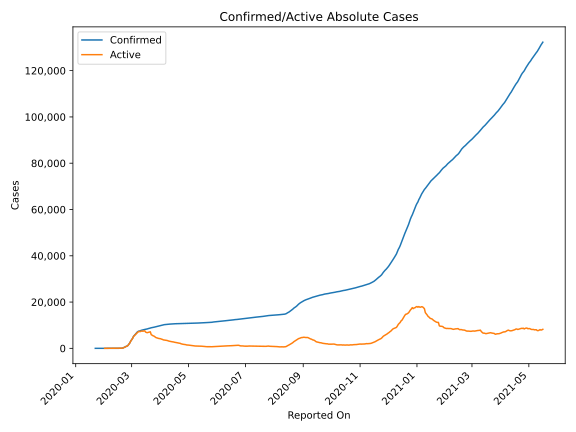
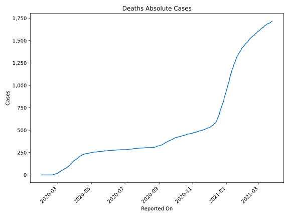
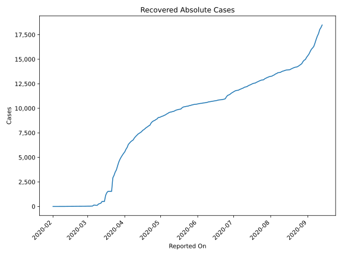
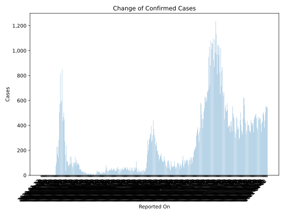
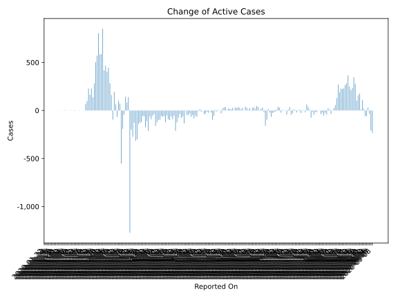
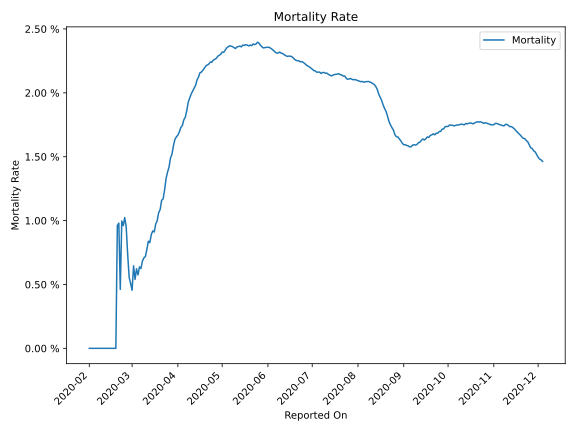

# Country Figures: Time Series for Korea,South 

| Reported On | Confirmed | Deaths | Recovered | Active | Mortality | &Delta; Confirmed | &Delta; Deaths | &Delta; Recovered | &Delta; Active | % Active of Population |
|-------------|-----------|--------|-----------|--------|-----------|-------------------|----------------|-------------------|----------------|------------------------|
| 2020-04-11 | 10480 | 211 | 7243 | 3026 |  2.01 %  | 30 | 3 | 126 | -99 |  0.006 %  | 
| 2020-04-10 | 10450 | 208 | 7117 | 3125 |  1.99 %  | 27 | 4 | 144 | -121 |  0.006 %  | 
| 2020-04-09 | 10423 | 204 | 6973 | 3246 |  1.96 %  | 39 | 4 | 197 | -162 |  0.006 %  | 
| 2020-04-08 | 10384 | 200 | 6776 | 3408 |  1.93 %  | 53 | 8 | 82 | -37 |  0.007 %  | 
| 2020-04-07 | 10331 | 192 | 6694 | 3445 |  1.86 %  | 47 | 6 | 96 | -55 |  0.007 %  | 
| 2020-04-06 | 10284 | 186 | 6598 | 3500 |  1.81 %  | 47 | 3 | 135 | -91 |  0.007 %  | 
| 2020-04-05 | 10237 | 183 | 6463 | 3591 |  1.79 %  | 81 | 6 | 138 | -63 |  0.007 %  | 
| 2020-04-04 | 10156 | 177 | 6325 | 3654 |  1.74 %  | 94 | 3 | 304 | -213 |  0.007 %  | 
| 2020-04-03 | 10062 | 174 | 6021 | 3867 |  1.73 %  | 86 | 5 | 193 | -112 |  0.007 %  | 
| 2020-04-02 | 9976 | 169 | 5828 | 3979 |  1.69 %  | 89 | 4 | 261 | -176 |  0.008 %  | 
| 2020-04-01 | 9887 | 165 | 5567 | 4155 |  1.67 %  | 101 | 3 | 159 | -61 |  0.008 %  | 
| 2020-03-31 | 9786 | 162 | 5408 | 4216 |  1.66 %  | 125 | 4 | 180 | -59 |  0.008 %  | 
| 2020-03-30 | 9661 | 158 | 5228 | 4275 |  1.64 %  | 78 | 6 | 195 | -123 |  0.008 %  | 
| 2020-03-29 | 9583 | 152 | 5033 | 4398 |  1.59 %  | 105 | 8 | 222 | -125 |  0.009 %  | 
| 2020-03-28 | 9478 | 144 | 4811 | 4523 |  1.52 %  | 146 | 5 | 283 | -142 |  0.009 %  | 
| 2020-03-27 | 9332 | 139 | 4528 | 4665 |  1.49 %  | 91 | 8 | 384 | -301 |  0.009 %  | 
| 2020-03-26 | 9241 | 131 | 4144 | 4966 |  1.42 %  | 104 | 5 | 414 | -315 |  0.010 %  | 
| 2020-03-25 | 9137 | 126 | 3730 | 5281 |  1.38 %  | 100 | 6 | 223 | -129 |  0.010 %  | 
| 2020-03-24 | 9037 | 120 | 3507 | 5410 |  1.33 %  | 76 | 9 | 341 | -274 |  0.010 %  | 
| 2020-03-23 | 8961 | 111 | 3166 | 5684 |  1.24 %  | 64 | 7 | 257 | -200 |  0.011 %  | 
| 2020-03-22 | 8897 | 104 | 2909 | 5884 |  1.17 %  | 98 | 2 | 1369 | -1273 |  0.011 %  | 
| 2020-03-21 | 8799 | 102 | 1540 | 7157 |  1.16 %  | 147 | 8 | 0 | 139 |  0.014 %  | 
| 2020-03-20 | 8652 | 94 | 1540 | 7018 |  1.09 %  | 87 | 3 | 0 | 84 |  0.014 %  | 
| 2020-03-19 | 8565 | 91 | 1540 | 6934 |  1.06 %  | 152 | 7 | 0 | 145 |  0.013 %  | 
| 2020-03-18 | 8413 | 84 | 1540 | 6789 |  1.00 %  | 93 | 3 | 133 | -43 |  0.013 %  | 
| 2020-03-17 | 8320 | 81 | 1407 | 6832 |  0.97 %  | 84 | 6 | 270 | -192 |  0.013 %  | 
| 2020-03-16 | 8236 | 75 | 1137 | 7024 |  0.91 %  | 74 | 0 | 627 | -553 |  0.014 %  | 
| 2020-03-15 | 8162 | 75 | 510 | 7577 |  0.92 %  | 76 | 3 | 0 | 73 |  0.015 %  | 
| 2020-03-14 | 8086 | 72 | 510 | 7504 |  0.89 %  | 107 | 6 | 0 | 101 |  0.015 %  | 
| 2020-03-13 | 7979 | 66 | 510 | 7403 |  0.83 %  | 110 | 0 | 177 | -67 |  0.014 %  | 
| 2020-03-12 | 7869 | 66 | 333 | 7470 |  0.84 %  | 114 | 6 | 45 | 63 |  0.014 %  | 
| 2020-03-11 | 7755 | 60 | 288 | 7407 |  0.77 %  | 242 | 6 | 41 | 195 |  0.014 %  | 
| 2020-03-10 | 7513 | 54 | 247 | 7212 |  0.72 %  | 35 | 1 | 129 | -95 |  0.014 %  | 
| 2020-03-09 | 7478 | 53 | 118 | 7307 |  0.71 %  | 164 | 3 | 0 | 161 |  0.014 %  | 
| 2020-03-08 | 7314 | 50 | 118 | 7146 |  0.68 %  | 273 | 6 | -17 | 284 |  0.014 %  | 
| 2020-03-07 | 7041 | 44 | 135 | 6862 |  0.62 %  | 448 | 2 | 0 | 446 |  0.013 %  | 
| 2020-03-06 | 6593 | 42 | 135 | 6416 |  0.64 %  | 505 | 7 | 94 | 404 |  0.012 %  | 
| 2020-03-05 | 6088 | 35 | 41 | 6012 |  0.57 %  | 467 | 0 | 0 | 467 |  0.012 %  | 
| 2020-03-04 | 5621 | 35 | 41 | 5545 |  0.62 %  | 435 | 7 | 11 | 417 |  0.011 %  | 
| 2020-03-03 | 5186 | 28 | 30 | 5128 |  0.54 %  | 851 | 0 | 0 | 851 |  0.010 %  | 
| 2020-03-02 | 4335 | 28 | 30 | 4277 |  0.65 %  | 599 | 11 | 0 | 588 |  0.008 %  | 
| 2020-03-01 | 3736 | 17 | 30 | 3689 |  0.46 %  | 586 | 1 | 3 | 582 |  0.007 %  | 
| 2020-02-29 | 3150 | 16 | 27 | 3107 |  0.51 %  | 813 | 3 | 5 | 805 |  0.006 %  | 
| 2020-02-28 | 2337 | 13 | 22 | 2302 |  0.56 %  | 571 | 0 | 0 | 571 |  0.004 %  | 
| 2020-02-27 | 1766 | 13 | 22 | 1731 |  0.74 %  | 505 | 1 | 0 | 504 |  0.003 %  | 
| 2020-02-26 | 1261 | 12 | 22 | 1227 |  0.95 %  | 284 | 2 | 0 | 282 |  0.002 %  | 
| 2020-02-25 | 977 | 10 | 22 | 945 |  1.02 %  | 144 | 2 | 4 | 138 |  0.002 %  | 
| 2020-02-24 | 833 | 8 | 18 | 807 |  0.96 %  | 231 | 2 | 0 | 229 |  0.002 %  | 
| 2020-02-23 | 602 | 6 | 18 | 578 |  1.00 %  | 169 | 4 | 2 | 163 |  0.001 %  | 
| 2020-02-22 | 433 | 2 | 16 | 415 |  0.46 %  | 229 | 0 | 0 | 229 |  0.001 %  | 
| 2020-02-21 | 204 | 2 | 16 | 186 |  0.98 %  | 100 | 1 | 0 | 99 |  0.000 %  | 
| 2020-02-20 | 104 | 1 | 16 | 87 |  0.96 %  | 73 | 1 | 4 | 68 |  0.000 %  | 
| 2020-02-19 | 31 | 0 | 12 | 19 |  None  | 0 | 0 | 0 | 0 |  0.000 %  | 
| 2020-02-18 | 31 | 0 | 12 | 19 |  None  | 1 | 0 | 2 | -1 |  0.000 %  | 
| 2020-02-17 | 30 | 0 | 10 | 20 |  None  | 1 | 0 | 1 | 0 |  0.000 %  | 
| 2020-02-16 | 29 | 0 | 9 | 20 |  None  | 1 | 0 | 0 | 1 |  0.000 %  | 
| 2020-02-15 | 28 | 0 | 9 | 19 |  None  | 0 | 0 | 2 | -2 |  0.000 %  | 
| 2020-02-14 | 28 | 0 | 7 | 21 |  None  | 0 | 0 | 0 | 0 |  0.000 %  | 
| 2020-02-13 | 28 | 0 | 7 | 21 |  None  | 0 | 0 | 0 | 0 |  0.000 %  | 
| 2020-02-12 | 28 | 0 | 7 | 21 |  None  | 0 | 0 | 4 | -4 |  0.000 %  | 
| 2020-02-11 | 28 | 0 | 3 | 25 |  None  | 1 | 0 | 0 | 1 |  0.000 %  | 
| 2020-02-10 | 27 | 0 | 3 | 24 |  None  | 2 | 0 | 0 | 2 |  0.000 %  | 
| 2020-02-09 | 25 | 0 | 3 | 22 |  None  | 1 | 0 | 2 | -1 |  0.000 %  | 
| 2020-02-08 | 24 | 0 | 1 | 23 |  None  | 0 | 0 | 0 | 0 |  0.000 %  | 
| 2020-02-07 | 24 | 0 | 1 | 23 |  None  | 1 | 0 | 1 | 0 |  0.000 %  | 
| 2020-02-06 | 23 | 0 | 0 | 23 |  None  | 4 | 0 | 0 | 4 |  0.000 %  | 
| 2020-02-05 | 19 | 0 | 0 | 19 |  None  | 3 | 0 | 0 | 3 |  0.000 %  | 
| 2020-02-04 | 16 | 0 | 0 | 16 |  None  | 1 | 0 | 0 | 1 |  0.000 %  | 
| 2020-02-03 | 15 | 0 | 0 | 15 |  None  | 0 | 0 | 0 | 0 |  0.000 %  | 
| 2020-02-02 | 15 | 0 | 0 | 15 |  None  | 3 | 0 | 0 | 3 |  0.000 %  | 
| 2020-02-01 | 12 | 0 | 0 | 12 |  None  | 1 | None | None | None |  0.000 %  | 
| 2020-01-31 | 11 | None | None | None |  None  | 7 | None | None | None |  n/a  | 
| 2020-01-30 | 4 | None | None | None |  None  | 0 | None | None | None |  n/a  | 
| 2020-01-29 | 4 | None | None | None |  None  | 0 | None | None | None |  n/a  | 
| 2020-01-28 | 4 | None | None | None |  None  | 0 | None | None | None |  n/a  | 
| 2020-01-27 | 4 | None | None | None |  None  | 1 | None | None | None |  n/a  | 
| 2020-01-26 | 3 | None | None | None |  None  | 1 | None | None | None |  n/a  | 
| 2020-01-25 | 2 | None | None | None |  None  | 0 | None | None | None |  n/a  | 
| 2020-01-24 | 2 | None | None | None |  None  | 1 | None | None | None |  n/a  | 
| 2020-01-23 | 1 | None | None | None |  None  | 0 | None | None | None |  n/a  | 
| 2020-01-22 | 1 | None | None | None |  None  | None | None | None | None |  n/a  | 

