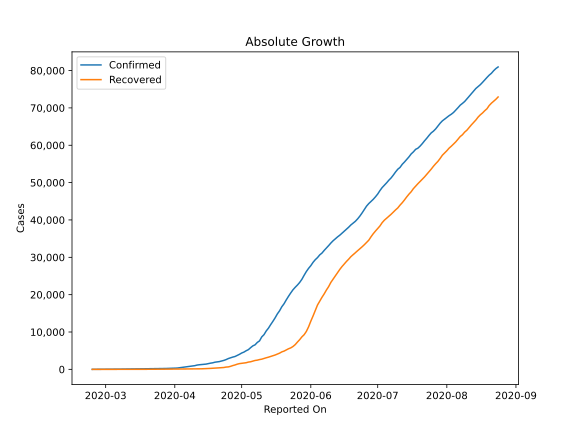
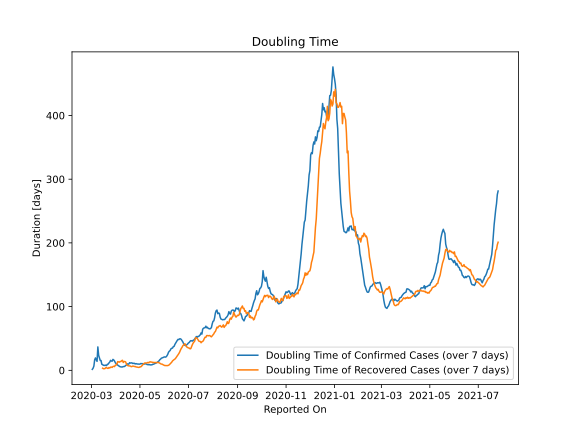

# Country Figures: Doubling Time of Infections for Kuwait 

The doubling time below are calculated based on
* an exponential growth assumption
* for time difference of past seven (7) days.
The doubling time's unit is "days".

The first doubling time indicates the increase of confirmed (infected)
cases. There, the *higher* the number is, the better is to take control
of the disease.

The second doubling time indicates the increase of recovered (healed)
cases. There, the *lower* the number is, the better it is to take
control of the disease.

| Reported On | Confirmed | Doubling Time (Confirmed) | Recovered | Doubling Time (Recovered) |
|-------------|-----------|---------------------------|-----------|---------------------------|
| 2020-04-06 | 665 |  5.6 days  | 103 |  13.9 days  | 
| 2020-04-05 | 556 |  6.6 days  | 99 |  12.8 days  | 
| 2020-04-04 | 479 |  7.2 days  | 93 |  13.3 days  | 
| 2020-04-03 | 417 |  8.2 days  | 82 |  13.7 days  | 
| 2020-04-02 | 342 |  10.1 days  | 81 |  10.0 days  | 
| 2020-04-01 | 317 |  10.3 days  | 80 |  8.2 days  | 
| 2020-03-31 | 289 |  12.1 days  | 73 |  8.1 days  | 
| 2020-03-30 | 266 |  14.5 days  | 72 |  5.9 days  | 
| 2020-03-29 | 255 |  16.3 days  | 67 |  6.4 days  | 
| 2020-03-28 | 235 |  17.1 days  | 64 |  6.0 days  | 
| 2020-03-27 | 225 |  14.3 days  | 57 |  4.5 days  | 
| 2020-03-26 | 208 |  14.6 days  | 49 |  5.2 days  | 
| 2020-03-25 | 195 |  15.6 days  | 43 |  4.9 days  | 
| 2020-03-24 | 191 |  13.0 days  | 39 |  3.6 days  | 
| 2020-03-23 | 189 |  11.6 days  | 30 |  4.4 days  | 
| 2020-03-22 | 188 |  9.7 days  | 30 |  3.0 days  | 
| 2020-03-21 | 176 |  9.6 days  | 27 |  3.2 days  | 
| 2020-03-20 | 159 |  7.4 days  | 18 |  4.1 days  | 
| 2020-03-19 | 148 |  8.2 days  | 18 |  4.1 days  | 
| 2020-03-18 | 142 |  7.5 days  | 15 |  2.7 days  | 
| 2020-03-17 | 130 |  8.0 days  | 9 |  2.5 days  | 
| 2020-03-16 | 123 |  7.8 days  | 9 |  2.5 days  | 
| 2020-03-15 | 112 |  9.0 days  | 5 |  3.3 days  | 
| 2020-03-14 | 104 |  9.4 days  | 5 |  None  | 
| 2020-03-13 | 80 |  15.4 days  | 5 |  None  | 
| 2020-03-12 | 80 |  15.4 days  | 5 |  None  | 
| 2020-03-11 | 72 |  19.7 days  | 2 |  None  | 
| 2020-03-10 | 69 |  23.6 days  | 1 |  None  | 
| 2020-03-09 | 64 |  36.7 days  | 1 |  None  | 
| 2020-03-08 | 64 |  14.1 days  | 1 |  None  | 
| 2020-03-07 | 61 |  16.3 days  | 0 |  None  | 
| 2020-03-06 | 58 |  19.5 days  | 0 |  None  | 
| 2020-03-05 | 58 |  16.6 days  | 0 |  None  | 
| 2020-03-04 | 56 |  6.7 days  | 0 |  None  | 
| 2020-03-03 | 56 |  3.3 days  | 0 |  None  | 
| 2020-03-02 | 56 |  1.5 days  | 0 |  None  | 
| 2020-03-01 | 45 |  None  | 0 |  None  | 
| 2020-02-29 | 45 |  None  | 0 |  None  | 
| 2020-02-28 | 45 |  None  | 0 |  None  | 
| 2020-02-27 | 43 |  None  | 0 |  None  | 
| 2020-02-26 | 26 |  None  | 0 |  None  | 
| 2020-02-25 | 11 |  None  | 0 |  None  | 
| 2020-02-24 | 1 |  None  | 0 |  None  | 

