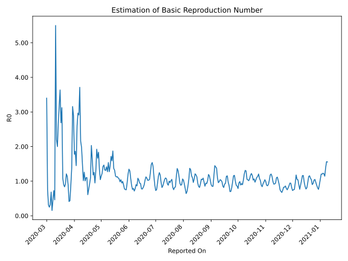

# Country Figures: Time Series for Basic Reproduction Number of Kuwait 

| Reported On | &Delta; Confirmed | Total &Delta; Confirmed First Interval | Total &Delta; Confirmed Second Interval | Estimated Basic Reproduction Number R0 | 
|-------------|-------------------|----------------------------------------|-----------------------------------------|---------------------------------------------------|
| 2020-05-04 | 295 |  1243  |  848  |  1.47  | 
| 2020-05-03 | 364 |  1179  |  826  |  1.43  | 
| 2020-05-02 | 242 |  1089  |  889  |  1.22  | 
| 2020-05-01 | 353 |  949  |  827  |  1.15  | 
| 2020-04-30 | 284 |  848  |  812  |  1.04  | 
| 2020-04-29 | 300 |  826  |  619  |  1.33  | 
| 2020-04-28 | 152 |  889  |  484  |  1.84  | 
| 2020-04-27 | 213 |  827  |  497  |  1.66  | 
| 2020-04-26 | 183 |  812  |  422  |  1.92  | 
| 2020-04-25 | 278 |  619  |  471  |  1.31  | 
| 2020-04-24 | 215 |  484  |  510  |  0.95  | 
| 2020-04-23 | 151 |  497  |  396  |  1.26  | 
| 2020-04-22 | 168 |  422  |  358  |  1.18  | 
| 2020-04-21 | 85 |  471  |  290  |  1.62  | 
| 2020-04-20 | 80 |  510  |  251  |  2.03  | 
| 2020-04-19 | 164 |  396  |  362  |  1.09  | 
| 2020-04-18 | 93 |  358  |  390  |  0.92  | 
| 2020-04-17 | 134 |  290  |  379  |  0.77  | 
| 2020-04-16 | 119 |  251  |  411  |  0.61  | 
| 2020-04-15 | 50 |  362  |  328  |  1.10  | 
| 2020-04-14 | 55 |  390  |  354  |  1.10  | 
| 2020-04-13 | 66 |  379  |  376  |  1.01  | 
| 2020-04-12 | 80 |  411  |  326  |  1.26  | 
| 2020-04-11 | 161 |  328  |  323  |  1.02  | 
| 2020-04-10 | 83 |  354  |  239  |  1.48  | 
| 2020-04-09 | 55 |  376  |  190  |  1.98  | 
| 2020-04-08 | 112 |  326  |  151  |  2.16  | 
| 2020-04-07 | 78 |  323  |  87  |  3.71  | 
| 2020-04-06 | 109 |  239  |  82  |  2.91  | 
| 2020-04-05 | 77 |  190  |  64  |  2.97  | 
| 2020-04-04 | 62 |  151  |  58  |  2.60  | 
| 2020-04-03 | 75 |  87  |  60  |  1.45  | 
| 2020-04-02 | 25 |  82  |  44  |  1.86  | 
| 2020-04-01 | 28 |  64  |  36  |  1.78  | 
| 2020-03-31 | 23 |  58  |  20  |  2.90  | 
| 2020-03-30 | 11 |  60  |  19  |  3.16  | 
| 2020-03-29 | 20 |  44  |  32  |  1.38  | 
| 2020-03-28 | 10 |  36  |  41  |  0.88  | 
| 2020-03-27 | 17 |  20  |  46  |  0.43  | 
| 2020-03-26 | 13 |  19  |  46  |  0.41  | 
| 2020-03-25 | 4 |  32  |  36  |  0.89  | 
| 2020-03-24 | 2 |  41  |  36  |  1.14  | 
| 2020-03-23 | 1 |  46  |  38  |  1.21  | 
| 2020-03-22 | 12 |  46  |  50  |  0.92  | 
| 2020-03-21 | 17 |  36  |  43  |  0.84  | 
| 2020-03-20 | 11 |  36  |  40  |  0.90  | 
| 2020-03-19 | 6 |  38  |  35  |  1.09  | 
| 2020-03-18 | 12 |  50  |  16  |  3.12  | 
| 2020-03-17 | 7 |  43  |  16  |  2.69  | 
| 2020-03-16 | 11 |  40  |  11  |  3.64  | 
| 2020-03-15 | 8 |  35  |  11  |  3.18  | 
| 2020-03-14 | 24 |  16  |  6  |  2.67  | 
| 2020-03-13 | 0 |  16  |  8  |  2.00  | 
| 2020-03-12 | 8 |  11  |  5  |  2.20  | 
| 2020-03-11 | 3 |  11  |  2  |  5.50  | 
| 2020-03-10 | 5 |  6  |  13  |  0.46  | 
| 2020-03-09 | 0 |  8  |  11  |  0.73  | 
| 2020-03-08 | 3 |  5  |  11  |  0.45  | 
| 2020-03-07 | 3 |  2  |  13  |  0.15  | 
| 2020-03-06 | 0 |  13  |  19  |  0.68  | 
| 2020-03-05 | 2 |  11  |  34  |  0.32  | 
| 2020-03-04 | 0 |  11  |  44  |  0.25  | 
| 2020-03-03 | 0 |  13  |  42  |  0.31  | 
| 2020-03-02 | 11 |  19  |  25  |  0.76  | 
| 2020-03-01 | 0 |  34  |  10  |  3.40  | 
| 2020-02-29 | 0 |  44  |  None  |  None  | 
| 2020-02-28 | 2 |  42  |  None  |  None  | 
| 2020-02-27 | 17 |  25  |  None  |  None  | 
| 2020-02-26 | 15 |  10  |  None  |  None  | 
| 2020-02-25 | 10 |  None  |  None  |  None  | 
| 2020-02-24 | None |  None  |  None  |  None  | 

