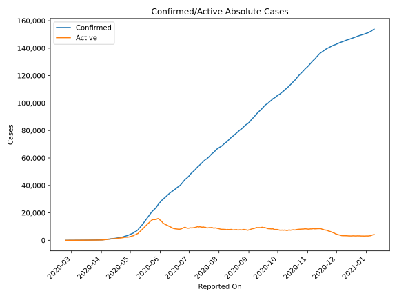
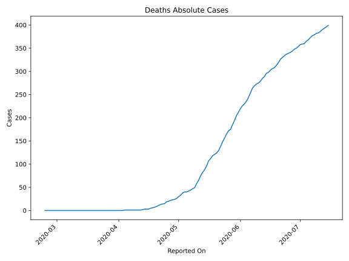
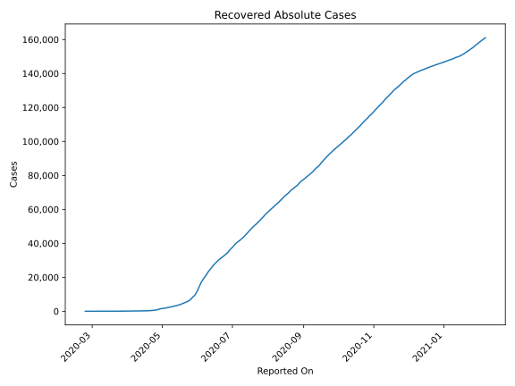
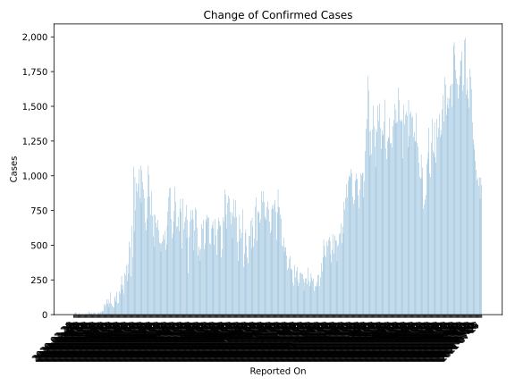
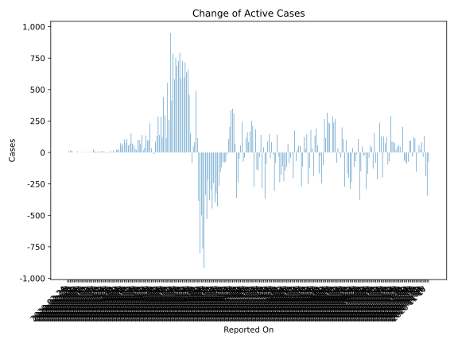
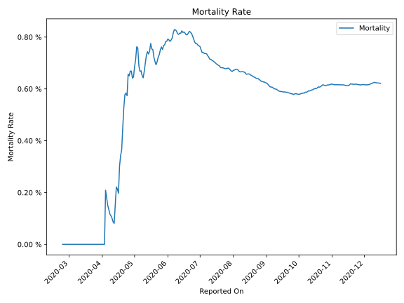

# Country Figures: Time Series for Kuwait 

| Reported On | Confirmed | Deaths | Recovered | Active | Mortality | &Delta; Confirmed | &Delta; Deaths | &Delta; Active | % Active of Population |
|-------------|-----------|--------|-----------|--------|-----------|-------------------|----------------|----------------|------------------------|
| 2020-04-07 | 743 | 1 | 105 | 637 |  0.13 %  | 78 | 0 | 76 |  0.015 %  | 
| 2020-04-06 | 665 | 1 | 103 | 561 |  0.15 %  | 109 | 0 | 105 |  0.014 %  | 
| 2020-04-05 | 556 | 1 | 99 | 456 |  0.18 %  | 77 | 0 | 71 |  0.011 %  | 
| 2020-04-04 | 479 | 1 | 93 | 385 |  0.21 %  | 62 | 1 | 50 |  0.009 %  | 
| 2020-04-03 | 417 | 0 | 82 | 335 |  None  | 75 | 0 | 74 |  0.008 %  | 
| 2020-04-02 | 342 | 0 | 81 | 261 |  None  | 25 | 0 | 24 |  0.006 %  | 
| 2020-04-01 | 317 | 0 | 80 | 237 |  None  | 28 | 0 | 21 |  0.006 %  | 
| 2020-03-31 | 289 | 0 | 73 | 216 |  None  | 23 | 0 | 22 |  0.005 %  | 
| 2020-03-30 | 266 | 0 | 72 | 194 |  None  | 11 | 0 | 6 |  0.005 %  | 
| 2020-03-29 | 255 | 0 | 67 | 188 |  None  | 20 | 0 | 17 |  0.005 %  | 
| 2020-03-28 | 235 | 0 | 64 | 171 |  None  | 10 | 0 | 3 |  0.004 %  | 
| 2020-03-27 | 225 | 0 | 57 | 168 |  None  | 17 | 0 | 9 |  0.004 %  | 
| 2020-03-26 | 208 | 0 | 49 | 159 |  None  | 13 | 0 | 7 |  0.004 %  | 
| 2020-03-25 | 195 | 0 | 43 | 152 |  None  | 4 | 0 | 0 |  0.004 %  | 
| 2020-03-24 | 191 | 0 | 39 | 152 |  None  | 2 | 0 | -7 |  0.004 %  | 
| 2020-03-23 | 189 | 0 | 30 | 159 |  None  | 1 | 0 | 1 |  0.004 %  | 
| 2020-03-22 | 188 | 0 | 30 | 158 |  None  | 12 | 0 | 9 |  0.004 %  | 
| 2020-03-21 | 176 | 0 | 27 | 149 |  None  | 17 | 0 | 8 |  0.004 %  | 
| 2020-03-20 | 159 | 0 | 18 | 141 |  None  | 11 | 0 | 11 |  0.003 %  | 
| 2020-03-19 | 148 | 0 | 18 | 130 |  None  | 6 | 0 | 3 |  0.003 %  | 
| 2020-03-18 | 142 | 0 | 15 | 127 |  None  | 12 | 0 | 6 |  0.003 %  | 
| 2020-03-17 | 130 | 0 | 9 | 121 |  None  | 7 | 0 | 7 |  0.003 %  | 
| 2020-03-16 | 123 | 0 | 9 | 114 |  None  | 11 | 0 | 7 |  0.003 %  | 
| 2020-03-15 | 112 | 0 | 5 | 107 |  None  | 8 | 0 | 8 |  0.003 %  | 
| 2020-03-14 | 104 | 0 | 5 | 99 |  None  | 24 | 0 | 24 |  0.002 %  | 
| 2020-03-13 | 80 | 0 | 5 | 75 |  None  | 0 | 0 | 0 |  0.002 %  | 
| 2020-03-12 | 80 | 0 | 5 | 75 |  None  | 8 | 0 | 5 |  0.002 %  | 
| 2020-03-11 | 72 | 0 | 2 | 70 |  None  | 3 | 0 | 2 |  0.002 %  | 
| 2020-03-10 | 69 | 0 | 1 | 68 |  None  | 5 | 0 | 5 |  0.002 %  | 
| 2020-03-09 | 64 | 0 | 1 | 63 |  None  | 0 | 0 | 0 |  0.002 %  | 
| 2020-03-08 | 64 | 0 | 1 | 63 |  None  | 3 | 0 | 2 |  0.002 %  | 
| 2020-03-07 | 61 | 0 | 0 | 61 |  None  | 3 | 0 | 3 |  0.001 %  | 
| 2020-03-06 | 58 | 0 | 0 | 58 |  None  | 0 | 0 | 0 |  0.001 %  | 
| 2020-03-05 | 58 | 0 | 0 | 58 |  None  | 2 | 0 | 2 |  0.001 %  | 
| 2020-03-04 | 56 | 0 | 0 | 56 |  None  | 0 | 0 | 0 |  0.001 %  | 
| 2020-03-03 | 56 | 0 | 0 | 56 |  None  | 0 | 0 | 0 |  0.001 %  | 
| 2020-03-02 | 56 | 0 | 0 | 56 |  None  | 11 | 0 | 11 |  0.001 %  | 
| 2020-03-01 | 45 | 0 | 0 | 45 |  None  | 0 | 0 | 0 |  0.001 %  | 
| 2020-02-29 | 45 | 0 | 0 | 45 |  None  | 0 | 0 | 0 |  0.001 %  | 
| 2020-02-28 | 45 | 0 | 0 | 45 |  None  | 2 | 0 | 2 |  0.001 %  | 
| 2020-02-27 | 43 | 0 | 0 | 43 |  None  | 17 | 0 | 17 |  0.001 %  | 
| 2020-02-26 | 26 | 0 | 0 | 26 |  None  | 15 | 0 | 15 |  0.001 %  | 
| 2020-02-25 | 11 | 0 | 0 | 11 |  None  | 10 | 0 | 10 |  0.000 %  | 
| 2020-02-24 | 1 | 0 | 0 | 1 |  None  | None | None | None |  0.000 %  | 

