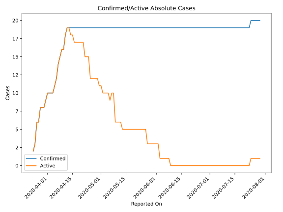
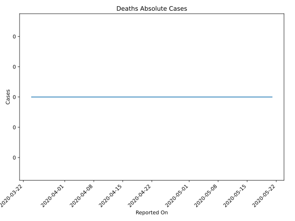
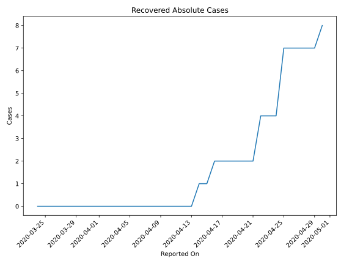
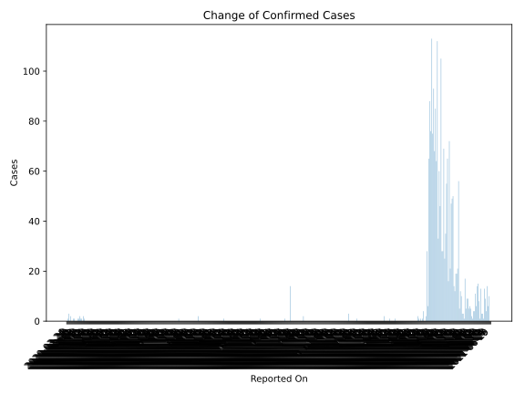
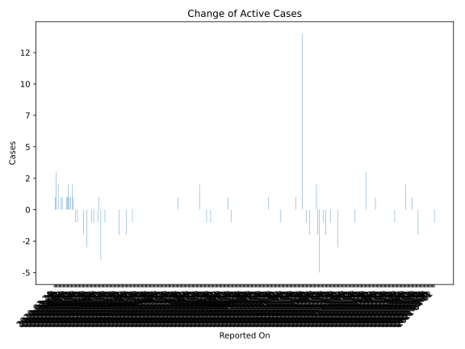
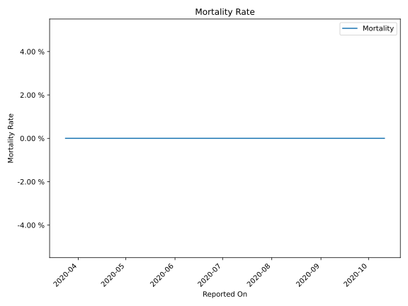

# Country Figures: Time Series for Laos 

| Reported On | Confirmed | Deaths | Recovered | Active | Mortality | &Delta; Confirmed | &Delta; Deaths | &Delta; Recovered | &Delta; Active | % Active of Population |
|-------------|-----------|--------|-----------|--------|-----------|-------------------|----------------|-------------------|----------------|------------------------|
| 2020-05-08 | 19 | 0 | 9 | 10 |  None  | 0 | 0 | 0 | 0 |  0.000 %  | 
| 2020-05-07 | 19 | 0 | 9 | 10 |  None  | 0 | 0 | -1 | 1 |  0.000 %  | 
| 2020-05-06 | 19 | 0 | 10 | 9 |  None  | 0 | 0 | 1 | -1 |  0.000 %  | 
| 2020-05-05 | 19 | 0 | 9 | 10 |  None  | 0 | 0 | 0 | 0 |  0.000 %  | 
| 2020-05-04 | 19 | 0 | 9 | 10 |  None  | 0 | 0 | 0 | 0 |  0.000 %  | 
| 2020-05-03 | 19 | 0 | 9 | 10 |  None  | 0 | 0 | 0 | 0 |  0.000 %  | 
| 2020-05-02 | 19 | 0 | 9 | 10 |  None  | 0 | 0 | 1 | -1 |  0.000 %  | 
| 2020-05-01 | 19 | 0 | 8 | 11 |  None  | 0 | 0 | 0 | 0 |  0.000 %  | 
| 2020-04-30 | 19 | 0 | 8 | 11 |  None  | 0 | 0 | 1 | -1 |  0.000 %  | 
| 2020-04-29 | 19 | 0 | 7 | 12 |  None  | 0 | 0 | 0 | 0 |  0.000 %  | 
| 2020-04-28 | 19 | 0 | 7 | 12 |  None  | 0 | 0 | 0 | 0 |  0.000 %  | 
| 2020-04-27 | 19 | 0 | 7 | 12 |  None  | 0 | 0 | 0 | 0 |  0.000 %  | 
| 2020-04-26 | 19 | 0 | 7 | 12 |  None  | 0 | 0 | 0 | 0 |  0.000 %  | 
| 2020-04-25 | 19 | 0 | 7 | 12 |  None  | 0 | 0 | 3 | -3 |  0.000 %  | 
| 2020-04-24 | 19 | 0 | 4 | 15 |  None  | 0 | 0 | 0 | 0 |  0.000 %  | 
| 2020-04-23 | 19 | 0 | 4 | 15 |  None  | 0 | 0 | 0 | 0 |  0.000 %  | 
| 2020-04-22 | 19 | 0 | 4 | 15 |  None  | 0 | 0 | 2 | -2 |  0.000 %  | 
| 2020-04-21 | 19 | 0 | 2 | 17 |  None  | 0 | 0 | 0 | 0 |  0.000 %  | 
| 2020-04-20 | 19 | 0 | 2 | 17 |  None  | 0 | 0 | 0 | 0 |  0.000 %  | 
| 2020-04-19 | 19 | 0 | 2 | 17 |  None  | 0 | 0 | 0 | 0 |  0.000 %  | 
| 2020-04-18 | 19 | 0 | 2 | 17 |  None  | 0 | 0 | 0 | 0 |  0.000 %  | 
| 2020-04-17 | 19 | 0 | 2 | 17 |  None  | 0 | 0 | 0 | 0 |  0.000 %  | 
| 2020-04-16 | 19 | 0 | 2 | 17 |  None  | 0 | 0 | 1 | -1 |  0.000 %  | 
| 2020-04-15 | 19 | 0 | 1 | 18 |  None  | 0 | 0 | 0 | 0 |  0.000 %  | 
| 2020-04-14 | 19 | 0 | 1 | 18 |  None  | 0 | 0 | 1 | -1 |  0.000 %  | 
| 2020-04-13 | 19 | 0 | 0 | 19 |  None  | 0 | 0 | 0 | 0 |  0.000 %  | 
| 2020-04-12 | 19 | 0 | 0 | 19 |  None  | 1 | 0 | 0 | 1 |  0.000 %  | 
| 2020-04-11 | 18 | 0 | 0 | 18 |  None  | 2 | 0 | 0 | 2 |  0.000 %  | 
| 2020-04-10 | 16 | 0 | 0 | 16 |  None  | 0 | 0 | 0 | 0 |  0.000 %  | 
| 2020-04-09 | 16 | 0 | 0 | 16 |  None  | 1 | 0 | 0 | 1 |  0.000 %  | 
| 2020-04-08 | 15 | 0 | 0 | 15 |  None  | 1 | 0 | 0 | 1 |  0.000 %  | 
| 2020-04-07 | 14 | 0 | 0 | 14 |  None  | 2 | 0 | 0 | 2 |  0.000 %  | 
| 2020-04-06 | 12 | 0 | 0 | 12 |  None  | 1 | 0 | 0 | 1 |  0.000 %  | 
| 2020-04-05 | 11 | 0 | 0 | 11 |  None  | 1 | 0 | 0 | 1 |  0.000 %  | 
| 2020-04-04 | 10 | 0 | 0 | 10 |  None  | 0 | 0 | 0 | 0 |  0.000 %  | 
| 2020-04-03 | 10 | 0 | 0 | 10 |  None  | 0 | 0 | 0 | 0 |  0.000 %  | 
| 2020-04-02 | 10 | 0 | 0 | 10 |  None  | 0 | 0 | 0 | 0 |  0.000 %  | 
| 2020-04-01 | 10 | 0 | 0 | 10 |  None  | 1 | 0 | 0 | 1 |  0.000 %  | 
| 2020-03-31 | 9 | 0 | 0 | 9 |  None  | 1 | 0 | 0 | 1 |  0.000 %  | 
| 2020-03-30 | 8 | 0 | 0 | 8 |  None  | 0 | 0 | 0 | 0 |  0.000 %  | 
| 2020-03-29 | 8 | 0 | 0 | 8 |  None  | 0 | 0 | 0 | 0 |  0.000 %  | 
| 2020-03-28 | 8 | 0 | 0 | 8 |  None  | 2 | 0 | 0 | 2 |  0.000 %  | 
| 2020-03-27 | 6 | 0 | 0 | 6 |  None  | 0 | 0 | 0 | 0 |  0.000 %  | 
| 2020-03-26 | 6 | 0 | 0 | 6 |  None  | 3 | 0 | 0 | 3 |  0.000 %  | 
| 2020-03-25 | 3 | 0 | 0 | 3 |  None  | 1 | 0 | 0 | 1 |  0.000 %  | 
| 2020-03-24 | 2 | 0 | 0 | 2 |  None  | None | None | None | None |  0.000 %  | 

