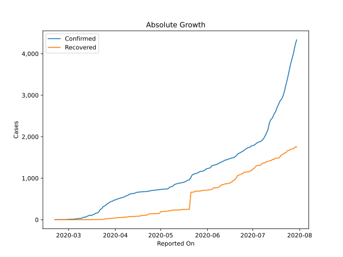
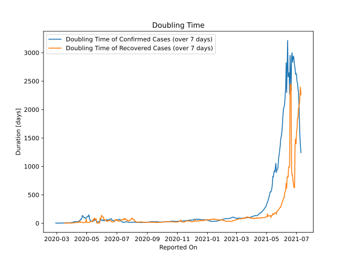

# Country Figures: Doubling Time of Infections for Lebanon 

The doubling time below are calculated based on
* an exponential growth assumption
* for time difference of past seven (7) days.
The doubling time's unit is "days".

The first doubling time indicates the increase of confirmed (infected)
cases. There, the *higher* the number is, the better is to take control
of the disease.

The second doubling time indicates the increase of recovered (healed)
cases. There, the *lower* the number is, the better it is to take
control of the disease.

| Reported On | Confirmed | Doubling Time (Confirmed) | Recovered | Doubling Time (Recovered) |
|-------------|-----------|---------------------------|-----------|---------------------------|
| 2020-04-09 | 582 |  29.9 days  | 67 |  13.2 days  | 
| 2020-04-08 | 576 |  26.7 days  | 62 |  13.6 days  | 
| 2020-04-07 | 548 |  31.9 days  | 62 |  9.7 days  | 
| 2020-04-06 | 541 |  25.5 days  | 60 |  9.3 days  | 
| 2020-04-05 | 527 |  26.6 days  | 54 |  8.6 days  | 
| 2020-04-04 | 520 |  21.2 days  | 54 |  8.6 days  | 
| 2020-04-03 | 508 |  18.9 days  | 50 |  8.2 days  | 
| 2020-04-02 | 494 |  16.8 days  | 46 |  7.3 days  | 
| 2020-04-01 | 479 |  13.7 days  | 43 |  6.7 days  | 
| 2020-03-31 | 470 |  12.8 days  | 37 |  3.5 days  | 
| 2020-03-30 | 446 |  9.8 days  | 35 |  3.6 days  | 
| 2020-03-29 | 438 |  8.9 days  | 30 |  4.0 days  | 
| 2020-03-28 | 412 |  6.5 days  | 30 |  2.7 days  | 
| 2020-03-27 | 391 |  5.9 days  | 27 |  2.9 days  | 
| 2020-03-26 | 368 |  6.0 days  | 23 |  3.1 days  | 
| 2020-03-25 | 333 |  5.6 days  | 20 |  2.9 days  | 
| 2020-03-24 | 318 |  5.3 days  | 8 |  5.3 days  | 
| 2020-03-23 | 267 |  5.2 days  | 8 |  2.7 days  | 
| 2020-03-22 | 248 |  6.3 days  | 8 |  2.7 days  | 
| 2020-03-21 | 187 |  7.3 days  | 4 |  3.8 days  | 
| 2020-03-20 | 163 |  6.8 days  | 4 |  3.8 days  | 
| 2020-03-19 | 157 |  5.5 days  | 4 |  3.8 days  | 
| 2020-03-18 | 133 |  6.6 days  | 3 |  4.8 days  | 
| 2020-03-17 | 120 |  4.9 days  | 3 |  4.8 days  | 
| 2020-03-16 | 99 |  4.6 days  | 1 |  None  | 
| 2020-03-15 | 110 |  4.3 days  | 1 |  None  | 
| 2020-03-14 | 93 |  3.7 days  | 1 |  None  | 
| 2020-03-13 | 77 |  4.2 days  | 1 |  None  | 
| 2020-03-12 | 61 |  4.0 days  | 1 |  None  | 
| 2020-03-11 | 61 |  3.5 days  | 1 |  None  | 
| 2020-03-10 | 41 |  4.6 days  | 1 |  None  | 
| 2020-03-09 | 32 |  5.7 days  | 1 |  None  | 
| 2020-03-08 | 32 |  4.5 days  | 1 |  None  | 
| 2020-03-07 | 22 |  3.2 days  | 1 |  None  | 
| 2020-03-06 | 22 |  2.4 days  | 1 |  None  | 
| 2020-03-05 | 16 |  2.7 days  | 1 |  None  | 
| 2020-03-04 | 13 |  2.9 days  | 1 |  None  | 
| 2020-03-03 | 13 |  2.2 days  | 0 |  None  | 
| 2020-03-02 | 13 |  2.2 days  | 0 |  None  | 
| 2020-03-01 | 10 |  2.4 days  | 0 |  None  | 
| 2020-02-29 | 4 |  3.8 days  | 0 |  None  | 
| 2020-02-28 | 2 |  7.3 days  | 0 |  None  | 
| 2020-02-27 | 2 |  None  | 0 |  None  | 
| 2020-02-26 | 2 |  None  | 0 |  None  | 
| 2020-02-25 | 1 |  None  | 0 |  None  | 
| 2020-02-24 | 1 |  None  | 0 |  None  | 
| 2020-02-23 | 1 |  None  | 0 |  None  | 
| 2020-02-22 | 1 |  None  | 0 |  None  | 
| 2020-02-21 | 1 |  None  | 0 |  None  | 

