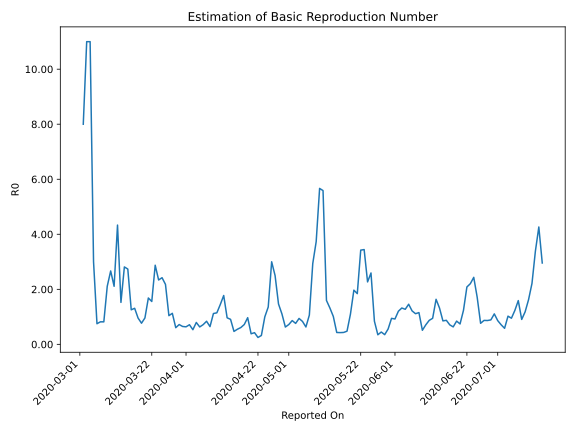

# Country Figures: Time Series for Basic Reproduction Number of Lebanon 

| Reported On | &Delta; Confirmed | Total &Delta; Confirmed First Interval | Total &Delta; Confirmed Second Interval | Estimated Basic Reproduction Number R0 | 
|-------------|-------------------|----------------------------------------|-----------------------------------------|---------------------------------------------------|
| 2020-05-04 | 3 |  16  |  17  |  0.94  | 
| 2020-05-03 | 4 |  16  |  21  |  0.76  | 
| 2020-05-02 | 4 |  19  |  22  |  0.86  | 
| 2020-05-01 | 4 |  18  |  25  |  0.72  | 
| 2020-04-30 | 4 |  17  |  27  |  0.63  | 
| 2020-04-29 | 4 |  21  |  19  |  1.11  | 
| 2020-04-28 | 7 |  22  |  15  |  1.47  | 
| 2020-04-27 | 3 |  25  |  10  |  2.50  | 
| 2020-04-26 | 3 |  27  |  9  |  3.00  | 
| 2020-04-25 | 8 |  19  |  14  |  1.36  | 
| 2020-04-24 | 8 |  15  |  15  |  1.00  | 
| 2020-04-23 | 6 |  10  |  31  |  0.32  | 
| 2020-04-22 | 5 |  9  |  36  |  0.25  | 
| 2020-04-21 | 0 |  14  |  33  |  0.42  | 
| 2020-04-20 | 4 |  15  |  39  |  0.38  | 
| 2020-04-19 | 1 |  31  |  32  |  0.97  | 
| 2020-04-18 | 4 |  36  |  50  |  0.72  | 
| 2020-04-17 | 5 |  33  |  54  |  0.61  | 
| 2020-04-16 | 5 |  39  |  71  |  0.55  | 
| 2020-04-15 | 17 |  32  |  68  |  0.47  | 
| 2020-04-14 | 9 |  50  |  55  |  0.91  | 
| 2020-04-13 | 2 |  54  |  56  |  0.96  | 
| 2020-04-12 | 11 |  71  |  40  |  1.77  | 
| 2020-04-11 | 10 |  68  |  47  |  1.45  | 
| 2020-04-10 | 27 |  55  |  48  |  1.15  | 
| 2020-04-09 | 6 |  56  |  50  |  1.12  | 
| 2020-04-08 | 28 |  40  |  62  |  0.65  | 
| 2020-04-07 | 7 |  47  |  56  |  0.84  | 
| 2020-04-06 | 14 |  48  |  67  |  0.72  | 
| 2020-04-05 | 7 |  50  |  79  |  0.63  | 
| 2020-04-04 | 12 |  62  |  78  |  0.79  | 
| 2020-04-03 | 14 |  56  |  105  |  0.53  | 
| 2020-04-02 | 15 |  67  |  94  |  0.71  | 
| 2020-04-01 | 9 |  79  |  124  |  0.64  | 
| 2020-03-31 | 24 |  78  |  120  |  0.65  | 
| 2020-03-30 | 8 |  105  |  146  |  0.72  | 
| 2020-03-29 | 26 |  94  |  155  |  0.61  | 
| 2020-03-28 | 21 |  124  |  110  |  1.13  | 
| 2020-03-27 | 23 |  120  |  115  |  1.04  | 
| 2020-03-26 | 35 |  146  |  67  |  2.18  | 
| 2020-03-25 | 15 |  155  |  64  |  2.42  | 
| 2020-03-24 | 51 |  110  |  47  |  2.34  | 
| 2020-03-23 | 19 |  115  |  40  |  2.88  | 
| 2020-03-22 | 61 |  67  |  43  |  1.56  | 
| 2020-03-21 | 24 |  64  |  38  |  1.68  | 
| 2020-03-20 | 6 |  47  |  49  |  0.96  | 
| 2020-03-19 | 24 |  40  |  52  |  0.77  | 
| 2020-03-18 | 13 |  43  |  45  |  0.96  | 
| 2020-03-17 | 21 |  38  |  29  |  1.31  | 
| 2020-03-16 | -11 |  49  |  39  |  1.26  | 
| 2020-03-15 | 17 |  52  |  19  |  2.74  | 
| 2020-03-14 | 16 |  45  |  16  |  2.81  | 
| 2020-03-13 | 16 |  29  |  19  |  1.53  | 
| 2020-03-12 | 0 |  39  |  9  |  4.33  | 
| 2020-03-11 | 20 |  19  |  9  |  2.11  | 
| 2020-03-10 | 9 |  16  |  6  |  2.67  | 
| 2020-03-09 | 0 |  19  |  9  |  2.11  | 
| 2020-03-08 | 10 |  9  |  11  |  0.82  | 
| 2020-03-07 | 0 |  9  |  11  |  0.82  | 
| 2020-03-06 | 6 |  6  |  8  |  0.75  | 
| 2020-03-05 | 3 |  9  |  3  |  3.00  | 
| 2020-03-04 | 0 |  11  |  1  |  11.00  | 
| 2020-03-03 | 0 |  11  |  1  |  11.00  | 
| 2020-03-02 | 3 |  8  |  1  |  8.00  | 
| 2020-03-01 | 6 |  3  |  None  |  None  | 
| 2020-02-29 | 2 |  1  |  None  |  None  | 
| 2020-02-28 | 0 |  1  |  None  |  None  | 
| 2020-02-27 | 0 |  1  |  None  |  None  | 
| 2020-02-26 | 1 |  None  |  None  |  None  | 
| 2020-02-25 | 0 |  None  |  None  |  None  | 
| 2020-02-24 | 0 |  None  |  None  |  None  | 
| 2020-02-23 | 0 |  None  |  None  |  None  | 
| 2020-02-22 | 0 |  None  |  None  |  None  | 
| 2020-02-21 | None |  None  |  None  |  None  | 

