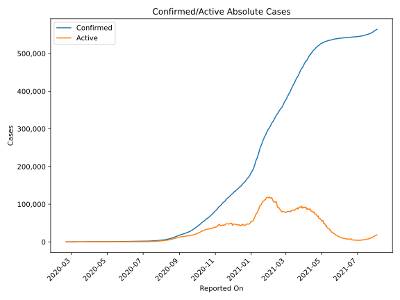
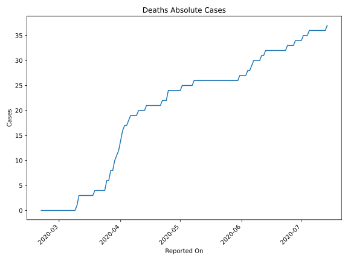
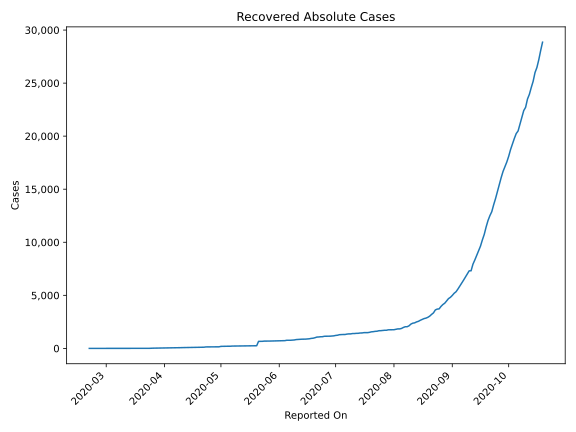
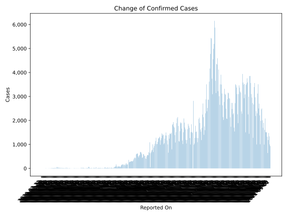
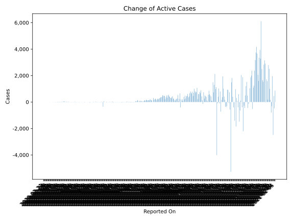
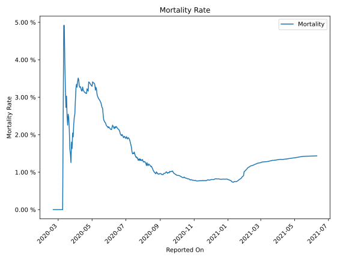

# Country Figures: Time Series for Lebanon 

| Reported On | Confirmed | Deaths | Recovered | Active | Mortality | &Delta; Confirmed | &Delta; Deaths | &Delta; Recovered | &Delta; Active | % Active of Population |
|-------------|-----------|--------|-----------|--------|-----------|-------------------|----------------|-------------------|----------------|------------------------|
| 2020-05-02 | 733 | 25 | 197 | 511 |  3.41 %  | 4 | 1 | 5 | -2 |  0.007 %  | 
| 2020-05-01 | 729 | 24 | 192 | 513 |  3.29 %  | 4 | 0 | 42 | -38 |  0.007 %  | 
| 2020-04-30 | 725 | 24 | 150 | 551 |  3.31 %  | 4 | 0 | 0 | 4 |  0.008 %  | 
| 2020-04-29 | 721 | 24 | 150 | 547 |  3.33 %  | 4 | 0 | 5 | -1 |  0.008 %  | 
| 2020-04-28 | 717 | 24 | 145 | 548 |  3.35 %  | 7 | 0 | 0 | 7 |  0.008 %  | 
| 2020-04-27 | 710 | 24 | 145 | 541 |  3.38 %  | 3 | 0 | 0 | 3 |  0.008 %  | 
| 2020-04-26 | 707 | 24 | 145 | 538 |  3.39 %  | 3 | 0 | 2 | 1 |  0.008 %  | 
| 2020-04-25 | 704 | 24 | 143 | 537 |  3.41 %  | 8 | 2 | 3 | 3 |  0.008 %  | 
| 2020-04-24 | 696 | 22 | 140 | 534 |  3.16 %  | 8 | 0 | 0 | 8 |  0.008 %  | 
| 2020-04-23 | 688 | 22 | 140 | 526 |  3.20 %  | 6 | 0 | 27 | -21 |  0.008 %  | 
| 2020-04-22 | 682 | 22 | 113 | 547 |  3.23 %  | 5 | 1 | 5 | -1 |  0.008 %  | 
| 2020-04-21 | 677 | 21 | 108 | 548 |  3.10 %  | 0 | 0 | 5 | -5 |  0.008 %  | 
| 2020-04-20 | 677 | 21 | 103 | 553 |  3.10 %  | 4 | 0 | 1 | 3 |  0.008 %  | 
| 2020-04-19 | 673 | 21 | 102 | 550 |  3.12 %  | 1 | 0 | 3 | -2 |  0.008 %  | 
| 2020-04-18 | 672 | 21 | 99 | 552 |  3.12 %  | 4 | 0 | 13 | -9 |  0.008 %  | 
| 2020-04-17 | 668 | 21 | 86 | 561 |  3.14 %  | 5 | 0 | 0 | 5 |  0.008 %  | 
| 2020-04-16 | 663 | 21 | 86 | 556 |  3.17 %  | 5 | 0 | 1 | 4 |  0.008 %  | 
| 2020-04-15 | 658 | 21 | 85 | 552 |  3.19 %  | 17 | 0 | 5 | 12 |  0.008 %  | 
| 2020-04-14 | 641 | 21 | 80 | 540 |  3.28 %  | 9 | 1 | 0 | 8 |  0.008 %  | 
| 2020-04-13 | 632 | 20 | 80 | 532 |  3.16 %  | 2 | 0 | 0 | 2 |  0.008 %  | 
| 2020-04-12 | 630 | 20 | 80 | 530 |  3.17 %  | 11 | 0 | 3 | 8 |  0.008 %  | 
| 2020-04-11 | 619 | 20 | 77 | 522 |  3.23 %  | 10 | 0 | 1 | 9 |  0.008 %  | 
| 2020-04-10 | 609 | 20 | 76 | 513 |  3.28 %  | 27 | 1 | 9 | 17 |  0.007 %  | 
| 2020-04-09 | 582 | 19 | 67 | 496 |  3.26 %  | 6 | 0 | 5 | 1 |  0.007 %  | 
| 2020-04-08 | 576 | 19 | 62 | 495 |  3.30 %  | 28 | 0 | 0 | 28 |  0.007 %  | 
| 2020-04-07 | 548 | 19 | 62 | 467 |  3.47 %  | 7 | 0 | 2 | 5 |  0.007 %  | 
| 2020-04-06 | 541 | 19 | 60 | 462 |  3.51 %  | 14 | 1 | 6 | 7 |  0.007 %  | 
| 2020-04-05 | 527 | 18 | 54 | 455 |  3.42 %  | 7 | 1 | 0 | 6 |  0.007 %  | 
| 2020-04-04 | 520 | 17 | 54 | 449 |  3.27 %  | 12 | 0 | 4 | 8 |  0.007 %  | 
| 2020-04-03 | 508 | 17 | 50 | 441 |  3.35 %  | 14 | 1 | 4 | 9 |  0.006 %  | 
| 2020-04-02 | 494 | 16 | 46 | 432 |  3.24 %  | 15 | 2 | 3 | 10 |  0.006 %  | 
| 2020-04-01 | 479 | 14 | 43 | 422 |  2.92 %  | 9 | 2 | 6 | 1 |  0.006 %  | 
| 2020-03-31 | 470 | 12 | 37 | 421 |  2.55 %  | 24 | 1 | 2 | 21 |  0.006 %  | 
| 2020-03-30 | 446 | 11 | 35 | 400 |  2.47 %  | 8 | 1 | 5 | 2 |  0.006 %  | 
| 2020-03-29 | 438 | 10 | 30 | 398 |  2.28 %  | 26 | 2 | 0 | 24 |  0.006 %  | 
| 2020-03-28 | 412 | 8 | 30 | 374 |  1.94 %  | 21 | 0 | 3 | 18 |  0.005 %  | 
| 2020-03-27 | 391 | 8 | 27 | 356 |  2.05 %  | 23 | 2 | 4 | 17 |  0.005 %  | 
| 2020-03-26 | 368 | 6 | 23 | 339 |  1.63 %  | 35 | 0 | 3 | 32 |  0.005 %  | 
| 2020-03-25 | 333 | 6 | 20 | 307 |  1.80 %  | 15 | 2 | 12 | 1 |  0.004 %  | 
| 2020-03-24 | 318 | 4 | 8 | 306 |  1.26 %  | 51 | 0 | 0 | 51 |  0.004 %  | 
| 2020-03-23 | 267 | 4 | 8 | 255 |  1.50 %  | 19 | 0 | 0 | 19 |  0.004 %  | 
| 2020-03-22 | 248 | 4 | 8 | 236 |  1.61 %  | 61 | 0 | 4 | 57 |  0.003 %  | 
| 2020-03-21 | 187 | 4 | 4 | 179 |  2.14 %  | 24 | 0 | 0 | 24 |  0.003 %  | 
| 2020-03-20 | 163 | 4 | 4 | 155 |  2.45 %  | 6 | 0 | 0 | 6 |  0.002 %  | 
| 2020-03-19 | 157 | 4 | 4 | 149 |  2.55 %  | 24 | 1 | 1 | 22 |  0.002 %  | 
| 2020-03-18 | 133 | 3 | 3 | 127 |  2.26 %  | 13 | 0 | 0 | 13 |  0.002 %  | 
| 2020-03-17 | 120 | 3 | 3 | 114 |  2.50 %  | 21 | 0 | 2 | 19 |  0.002 %  | 
| 2020-03-16 | 99 | 3 | 1 | 95 |  3.03 %  | -11 | 0 | 0 | -11 |  0.001 %  | 
| 2020-03-15 | 110 | 3 | 1 | 106 |  2.73 %  | 17 | 0 | 0 | 17 |  0.002 %  | 
| 2020-03-14 | 93 | 3 | 1 | 89 |  3.23 %  | 16 | 0 | 0 | 16 |  0.001 %  | 
| 2020-03-13 | 77 | 3 | 1 | 73 |  3.90 %  | 16 | 0 | 0 | 16 |  0.001 %  | 
| 2020-03-12 | 61 | 3 | 1 | 57 |  4.92 %  | 0 | 0 | 0 | 0 |  0.001 %  | 
| 2020-03-11 | 61 | 3 | 1 | 57 |  4.92 %  | 20 | 2 | 0 | 18 |  0.001 %  | 
| 2020-03-10 | 41 | 1 | 1 | 39 |  2.44 %  | 9 | 1 | 0 | 8 |  0.001 %  | 
| 2020-03-09 | 32 | 0 | 1 | 31 |  None  | 0 | 0 | 0 | 0 |  0.000 %  | 
| 2020-03-08 | 32 | 0 | 1 | 31 |  None  | 10 | 0 | 0 | 10 |  0.000 %  | 
| 2020-03-07 | 22 | 0 | 1 | 21 |  None  | 0 | 0 | 0 | 0 |  0.000 %  | 
| 2020-03-06 | 22 | 0 | 1 | 21 |  None  | 6 | 0 | 0 | 6 |  0.000 %  | 
| 2020-03-05 | 16 | 0 | 1 | 15 |  None  | 3 | 0 | 0 | 3 |  0.000 %  | 
| 2020-03-04 | 13 | 0 | 1 | 12 |  None  | 0 | 0 | 1 | -1 |  0.000 %  | 
| 2020-03-03 | 13 | 0 | 0 | 13 |  None  | 0 | 0 | 0 | 0 |  0.000 %  | 
| 2020-03-02 | 13 | 0 | 0 | 13 |  None  | 3 | 0 | 0 | 3 |  0.000 %  | 
| 2020-03-01 | 10 | 0 | 0 | 10 |  None  | 6 | 0 | 0 | 6 |  0.000 %  | 
| 2020-02-29 | 4 | 0 | 0 | 4 |  None  | 2 | 0 | 0 | 2 |  0.000 %  | 
| 2020-02-28 | 2 | 0 | 0 | 2 |  None  | 0 | 0 | 0 | 0 |  0.000 %  | 
| 2020-02-27 | 2 | 0 | 0 | 2 |  None  | 0 | 0 | 0 | 0 |  0.000 %  | 
| 2020-02-26 | 2 | 0 | 0 | 2 |  None  | 1 | 0 | 0 | 1 |  0.000 %  | 
| 2020-02-25 | 1 | 0 | 0 | 1 |  None  | 0 | 0 | 0 | 0 |  0.000 %  | 
| 2020-02-24 | 1 | 0 | 0 | 1 |  None  | 0 | 0 | 0 | 0 |  0.000 %  | 
| 2020-02-23 | 1 | 0 | 0 | 1 |  None  | 0 | 0 | 0 | 0 |  0.000 %  | 
| 2020-02-22 | 1 | 0 | 0 | 1 |  None  | 0 | 0 | 0 | 0 |  0.000 %  | 
| 2020-02-21 | 1 | 0 | 0 | 1 |  None  | None | None | None | None |  0.000 %  | 

