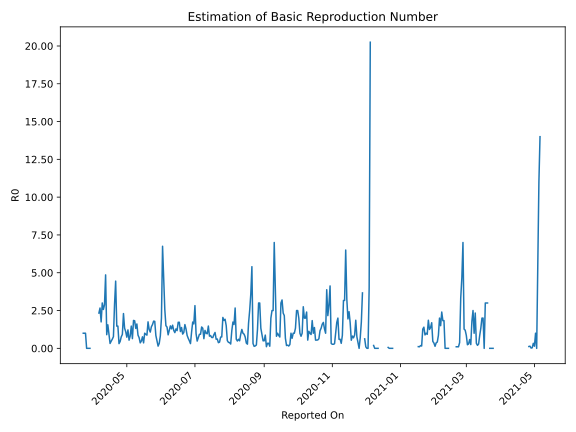

# Country Figures: Time Series for Basic Reproduction Number of Liberia 

| Reported On | &Delta; Confirmed | Total &Delta; Confirmed First Interval | Total &Delta; Confirmed Second Interval | Estimated Basic Reproduction Number R0 | 
|-------------|-------------------|----------------------------------------|-----------------------------------------|---------------------------------------------------|
| 2020-05-04 | 8 |  17  |  21  |  0.81  | 
| 2020-05-03 | 4 |  13  |  24  |  0.54  | 
| 2020-05-02 | 2 |  28  |  23  |  1.22  | 
| 2020-05-01 | 11 |  17  |  23  |  0.74  | 
| 2020-04-30 | 0 |  21  |  19  |  1.11  | 
| 2020-04-29 | 0 |  24  |  18  |  1.33  | 
| 2020-04-28 | 17 |  23  |  10  |  2.30  | 
| 2020-04-27 | 0 |  23  |  25  |  0.92  | 
| 2020-04-26 | 4 |  19  |  25  |  0.76  | 
| 2020-04-25 | 3 |  18  |  40  |  0.45  | 
| 2020-04-24 | 16 |  10  |  32  |  0.31  | 
| 2020-04-23 | 0 |  25  |  17  |  1.47  | 
| 2020-04-22 | 0 |  25  |  17  |  1.47  | 
| 2020-04-21 | 2 |  40  |  9  |  4.44  | 
| 2020-04-20 | 8 |  32  |  11  |  2.91  | 
| 2020-04-19 | 15 |  17  |  22  |  0.77  | 
| 2020-04-18 | 0 |  17  |  28  |  0.61  | 
| 2020-04-17 | 17 |  9  |  19  |  0.47  | 
| 2020-04-16 | 0 |  11  |  34  |  0.32  | 
| 2020-04-15 | 0 |  22  |  23  |  0.96  | 
| 2020-04-14 | 0 |  28  |  18  |  1.56  | 
| 2020-04-13 | 9 |  19  |  21  |  0.90  | 
| 2020-04-12 | 2 |  34  |  7  |  4.86  | 
| 2020-04-11 | 11 |  23  |  8  |  2.88  | 
| 2020-04-10 | 6 |  18  |  7  |  2.57  | 
| 2020-04-09 | 0 |  21  |  7  |  3.00  | 
| 2020-04-08 | 17 |  7  |  4  |  1.75  | 
| 2020-04-07 | 0 |  8  |  3  |  2.67  | 
| 2020-04-06 | 1 |  7  |  3  |  2.33  | 
| 2020-04-05 | 3 |  7  |  None  |  None  | 
| 2020-04-04 | 3 |  4  |  None  |  None  | 
| 2020-04-03 | 1 |  3  |  None  |  None  | 
| 2020-04-02 | 0 |  3  |  None  |  None  | 
| 2020-04-01 | 3 |  None  |  None  |  None  | 
| 2020-03-31 | 0 |  None  |  None  |  None  | 
| 2020-03-30 | 0 |  None  |  None  |  None  | 
| 2020-03-29 | 0 |  None  |  1  |  None  | 
| 2020-03-28 | 0 |  None  |  1  |  None  | 
| 2020-03-27 | 0 |  None  |  1  |  None  | 
| 2020-03-26 | 0 |  None  |  2  |  None  | 
| 2020-03-25 | 0 |  1  |  1  |  1.00  | 
| 2020-03-24 | 0 |  1  |  1  |  1.00  | 
| 2020-03-23 | 0 |  1  |  1  |  1.00  | 
| 2020-03-22 | 0 |  2  |  None  |  None  | 
| 2020-03-21 | 1 |  1  |  None  |  None  | 
| 2020-03-20 | 0 |  1  |  None  |  None  | 
| 2020-03-19 | 0 |  1  |  None  |  None  | 
| 2020-03-18 | 1 |  None  |  None  |  None  | 
| 2020-03-17 | 0 |  None  |  None  |  None  | 
| 2020-03-16 | None |  None  |  None  |  None  | 

