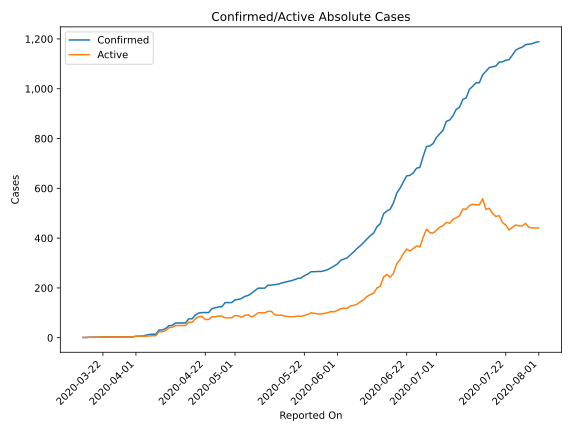
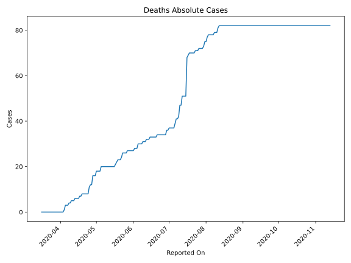
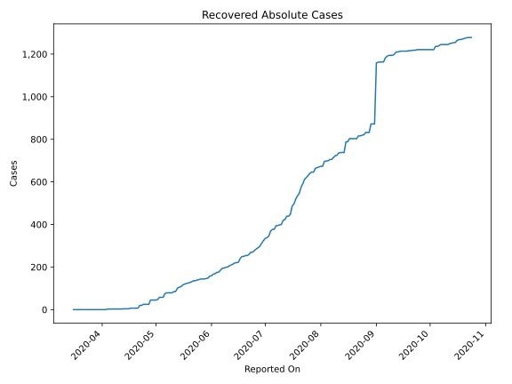
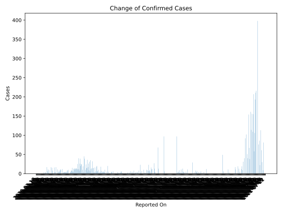
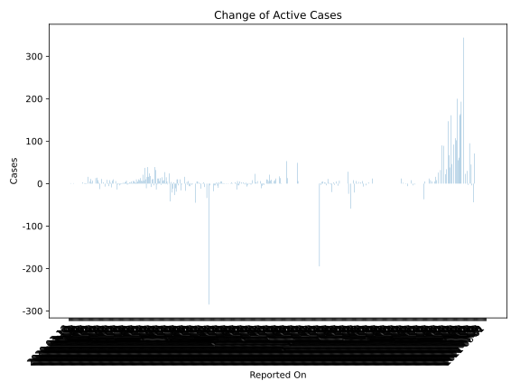
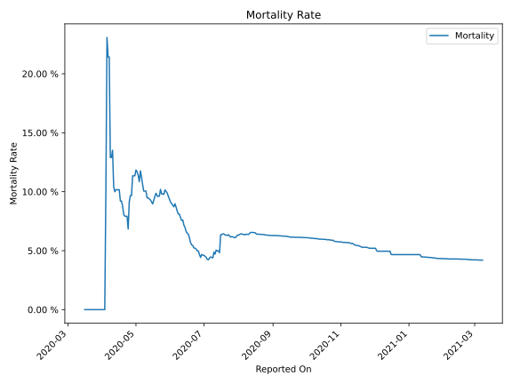

# Country Figures: Time Series for Liberia 

| Reported On | Confirmed | Deaths | Recovered | Active | Mortality | &Delta; Confirmed | &Delta; Deaths | &Delta; Recovered | &Delta; Active | % Active of Population |
|-------------|-----------|--------|-----------|--------|-----------|-------------------|----------------|-------------------|----------------|------------------------|
| 2020-05-06 | 178 | 20 | 75 | 83 |  11.24 %  | 8 | 0 | 17 | -9 |  0.002 %  | 
| 2020-05-05 | 170 | 20 | 58 | 92 |  11.76 %  | 4 | 2 | 0 | 2 |  0.002 %  | 
| 2020-05-04 | 166 | 18 | 58 | 90 |  10.84 %  | 8 | 0 | 0 | 8 |  0.002 %  | 
| 2020-05-03 | 158 | 18 | 58 | 82 |  11.39 %  | 4 | 0 | 10 | -6 |  0.002 %  | 
| 2020-05-02 | 154 | 18 | 48 | 88 |  11.69 %  | 2 | 0 | 3 | -1 |  0.002 %  | 
| 2020-05-01 | 152 | 18 | 45 | 89 |  11.84 %  | 11 | 2 | 0 | 9 |  0.002 %  | 
| 2020-04-30 | 141 | 16 | 45 | 80 |  11.35 %  | 0 | 0 | 0 | 0 |  0.002 %  | 
| 2020-04-29 | 141 | 16 | 45 | 80 |  11.35 %  | 0 | 0 | 0 | 0 |  0.002 %  | 
| 2020-04-28 | 141 | 16 | 45 | 80 |  11.35 %  | 17 | 4 | 20 | -7 |  0.002 %  | 
| 2020-04-27 | 124 | 12 | 25 | 87 |  9.68 %  | 0 | 0 | 0 | 0 |  0.002 %  | 
| 2020-04-26 | 124 | 12 | 25 | 87 |  9.68 %  | 4 | 1 | 0 | 3 |  0.002 %  | 
| 2020-04-25 | 120 | 11 | 25 | 84 |  9.17 %  | 3 | 3 | 0 | 0 |  0.002 %  | 
| 2020-04-24 | 117 | 8 | 25 | 84 |  6.84 %  | 16 | 0 | 5 | 11 |  0.002 %  | 
| 2020-04-23 | 101 | 8 | 20 | 73 |  7.92 %  | 0 | 0 | 0 | 0 |  0.002 %  | 
| 2020-04-22 | 101 | 8 | 20 | 73 |  7.92 %  | 0 | 0 | 13 | -13 |  0.002 %  | 
| 2020-04-21 | 101 | 8 | 7 | 86 |  7.92 %  | 2 | 0 | 0 | 2 |  0.002 %  | 
| 2020-04-20 | 99 | 8 | 7 | 84 |  8.08 %  | 8 | 0 | 0 | 8 |  0.002 %  | 
| 2020-04-19 | 91 | 8 | 7 | 76 |  8.79 %  | 15 | 1 | 0 | 14 |  0.002 %  | 
| 2020-04-18 | 76 | 7 | 7 | 62 |  9.21 %  | 0 | 0 | 0 | 0 |  0.001 %  | 
| 2020-04-17 | 76 | 7 | 7 | 62 |  9.21 %  | 17 | 1 | 3 | 13 |  0.001 %  | 
| 2020-04-16 | 59 | 6 | 4 | 49 |  10.17 %  | 0 | 0 | 0 | 0 |  0.001 %  | 
| 2020-04-15 | 59 | 6 | 4 | 49 |  10.17 %  | 0 | 0 | 0 | 0 |  0.001 %  | 
| 2020-04-14 | 59 | 6 | 4 | 49 |  10.17 %  | 0 | 0 | 0 | 0 |  0.001 %  | 
| 2020-04-13 | 59 | 6 | 4 | 49 |  10.17 %  | 9 | 1 | 1 | 7 |  0.001 %  | 
| 2020-04-12 | 50 | 5 | 3 | 42 |  10.00 %  | 2 | 0 | 0 | 2 |  0.001 %  | 
| 2020-04-11 | 48 | 5 | 3 | 40 |  10.42 %  | 11 | 0 | 0 | 11 |  0.001 %  | 
| 2020-04-10 | 37 | 5 | 3 | 29 |  13.51 %  | 6 | 1 | 0 | 5 |  0.001 %  | 
| 2020-04-09 | 31 | 4 | 3 | 24 |  12.90 %  | 0 | 0 | 0 | 0 |  0.000 %  | 
| 2020-04-08 | 31 | 4 | 3 | 24 |  12.90 %  | 17 | 1 | 0 | 16 |  0.000 %  | 
| 2020-04-07 | 14 | 3 | 3 | 8 |  21.43 %  | 0 | 0 | 0 | 0 |  0.000 %  | 
| 2020-04-06 | 14 | 3 | 3 | 8 |  21.43 %  | 1 | 0 | 0 | 1 |  0.000 %  | 
| 2020-04-05 | 13 | 3 | 3 | 7 |  23.08 %  | 3 | 2 | 0 | 1 |  0.000 %  | 
| 2020-04-04 | 10 | 1 | 3 | 6 |  10.00 %  | 3 | 1 | 3 | -1 |  0.000 %  | 
| 2020-04-03 | 7 | 0 | 0 | 7 |  None  | 1 | 0 | 0 | 1 |  0.000 %  | 
| 2020-04-02 | 6 | 0 | 0 | 6 |  None  | 0 | 0 | 0 | 0 |  0.000 %  | 
| 2020-04-01 | 6 | 0 | 0 | 6 |  None  | 3 | 0 | 0 | 3 |  0.000 %  | 
| 2020-03-31 | 3 | 0 | 0 | 3 |  None  | 0 | 0 | 0 | 0 |  0.000 %  | 
| 2020-03-30 | 3 | 0 | 0 | 3 |  None  | 0 | 0 | 0 | 0 |  0.000 %  | 
| 2020-03-29 | 3 | 0 | 0 | 3 |  None  | 0 | 0 | 0 | 0 |  0.000 %  | 
| 2020-03-28 | 3 | 0 | 0 | 3 |  None  | 0 | 0 | 0 | 0 |  0.000 %  | 
| 2020-03-27 | 3 | 0 | 0 | 3 |  None  | 0 | 0 | 0 | 0 |  0.000 %  | 
| 2020-03-26 | 3 | 0 | 0 | 3 |  None  | 0 | 0 | 0 | 0 |  0.000 %  | 
| 2020-03-25 | 3 | 0 | 0 | 3 |  None  | 0 | 0 | 0 | 0 |  0.000 %  | 
| 2020-03-24 | 3 | 0 | 0 | 3 |  None  | 0 | 0 | 0 | 0 |  0.000 %  | 
| 2020-03-23 | 3 | 0 | 0 | 3 |  None  | 0 | 0 | 0 | 0 |  0.000 %  | 
| 2020-03-22 | 3 | 0 | 0 | 3 |  None  | 0 | 0 | 0 | 0 |  0.000 %  | 
| 2020-03-21 | 3 | 0 | 0 | 3 |  None  | 1 | 0 | 0 | 1 |  0.000 %  | 
| 2020-03-20 | 2 | 0 | 0 | 2 |  None  | 0 | 0 | 0 | 0 |  0.000 %  | 
| 2020-03-19 | 2 | 0 | 0 | 2 |  None  | 0 | 0 | 0 | 0 |  0.000 %  | 
| 2020-03-18 | 2 | 0 | 0 | 2 |  None  | 1 | 0 | 0 | 1 |  0.000 %  | 
| 2020-03-17 | 1 | 0 | 0 | 1 |  None  | 0 | 0 | 0 | 0 |  0.000 %  | 
| 2020-03-16 | 1 | 0 | 0 | 1 |  None  | None | None | None | None |  0.000 %  | 

