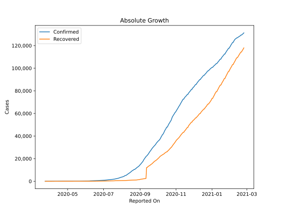
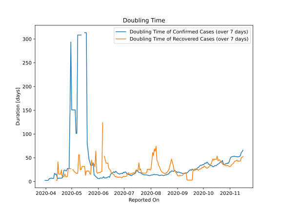

# Country Figures: Doubling Time of Infections for Libya 

The doubling time below are calculated based on
* an exponential growth assumption
* for time difference of past seven (7) days.
The doubling time's unit is "days".

The first doubling time indicates the increase of confirmed (infected)
cases. There, the *higher* the number is, the better is to take control
of the disease.

The second doubling time indicates the increase of recovered (healed)
cases. There, the *lower* the number is, the better it is to take
control of the disease.

| Reported On | Confirmed | Doubling Time (Confirmed) | Recovered | Doubling Time (Recovered) |
|-------------|-----------|---------------------------|-----------|---------------------------|
| 2020-04-28 | 61 |  27.4 days  | 18 |  27.0 days  | 
| 2020-04-27 | 61 |  27.4 days  | 18 |  27.0 days  | 
| 2020-04-26 | 61 |  27.4 days  | 18 |  10.2 days  | 
| 2020-04-25 | 61 |  22.5 days  | 18 |  10.2 days  | 
| 2020-04-24 | 61 |  22.5 days  | 18 |  10.2 days  | 
| 2020-04-23 | 60 |  24.3 days  | 15 |  16.0 days  | 
| 2020-04-22 | 59 |  23.9 days  | 15 |  9.8 days  | 
| 2020-04-21 | 51 |  13.2 days  | 15 |  9.8 days  | 
| 2020-04-20 | 51 |  7.5 days  | 15 |  9.8 days  | 
| 2020-04-19 | 51 |  7.1 days  | 11 |  24.5 days  | 
| 2020-04-18 | 49 |  7.1 days  | 11 |  15.6 days  | 
| 2020-04-17 | 49 |  7.1 days  | 11 |  15.6 days  | 
| 2020-04-16 | 49 |  7.1 days  | 11 |  15.6 days  | 
| 2020-04-15 | 48 |  6.2 days  | 9 |  41.5 days  | 
| 2020-04-14 | 35 |  9.0 days  | 9 |  2.5 days  | 
| 2020-04-13 | 26 |  15.8 days  | 9 |  2.5 days  | 
| 2020-04-12 | 25 |  15.1 days  | 9 |  None  | 
| 2020-04-11 | 24 |  17.2 days  | 8 |  None  | 
| 2020-04-10 | 24 |  6.6 days  | 8 |  None  | 
| 2020-04-09 | 24 |  6.6 days  | 8 |  None  | 
| 2020-04-08 | 21 |  6.9 days  | 8 |  None  | 
| 2020-04-07 | 20 |  7.3 days  | 1 |  None  | 
| 2020-04-06 | 19 |  5.9 days  | 1 |  None  | 
| 2020-04-05 | 18 |  6.3 days  | 0 |  None  | 
| 2020-04-04 | 18 |  3.0 days  | 0 |  None  | 
| 2020-04-03 | 11 |  2.4 days  | 0 |  None  | 
| 2020-04-02 | 11 |  2.4 days  | 0 |  None  | 
| 2020-04-01 | 10 |  2.4 days  | 0 |  None  | 
| 2020-03-31 | 10 |  2.4 days  | 1 |  None  | 
| 2020-03-30 | 8 |  None  | 0 |  None  | 
| 2020-03-29 | 8 |  None  | 0 |  None  | 
| 2020-03-28 | 3 |  None  | 0 |  None  | 
| 2020-03-27 | 1 |  None  | 0 |  None  | 
| 2020-03-26 | 1 |  None  | 0 |  None  | 
| 2020-03-25 | 1 |  None  | 0 |  None  | 
| 2020-03-24 | 1 |  None  | 0 |  None  | 

