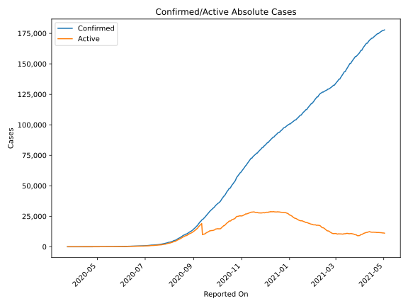
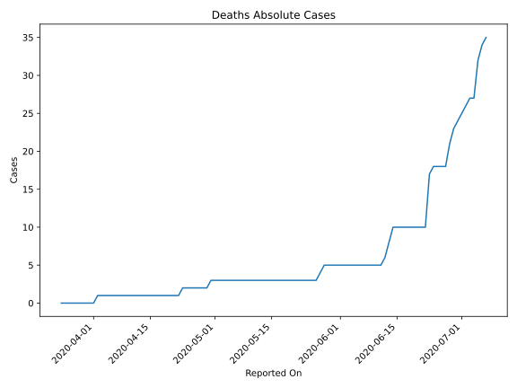
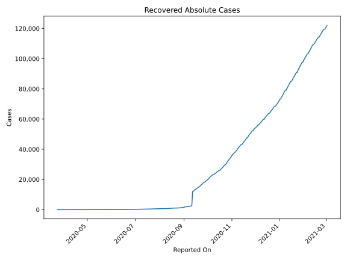
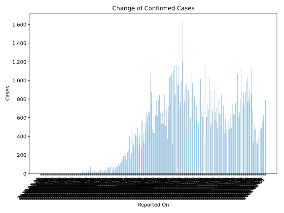
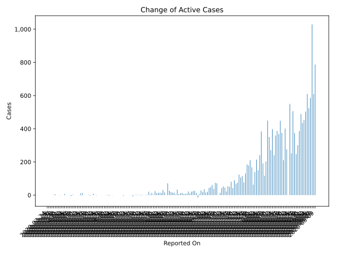
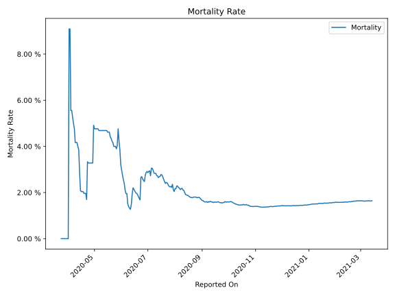

# Country Figures: Time Series for Libya 

| Reported On | Confirmed | Deaths | Recovered | Active | Mortality | &Delta; Confirmed | &Delta; Deaths | &Delta; Recovered | &Delta; Active | % Active of Population |
|-------------|-----------|--------|-----------|--------|-----------|-------------------|----------------|-------------------|----------------|------------------------|
| 2020-05-04 | 63 | 3 | 23 | 37 |  4.76 %  | 0 | 0 | 1 | -1 |  0.001 %  | 
| 2020-05-03 | 63 | 3 | 22 | 38 |  4.76 %  | 0 | 0 | 0 | 0 |  0.001 %  | 
| 2020-05-02 | 63 | 3 | 22 | 38 |  4.76 %  | 0 | 0 | 4 | -4 |  0.001 %  | 
| 2020-05-01 | 63 | 3 | 18 | 42 |  4.76 %  | 2 | 0 | 0 | 2 |  0.001 %  | 
| 2020-04-30 | 61 | 3 | 18 | 40 |  4.92 %  | 0 | 1 | 0 | -1 |  0.001 %  | 
| 2020-04-29 | 61 | 2 | 18 | 41 |  3.28 %  | 0 | 0 | 0 | 0 |  0.001 %  | 
| 2020-04-28 | 61 | 2 | 18 | 41 |  3.28 %  | 0 | 0 | 0 | 0 |  0.001 %  | 
| 2020-04-27 | 61 | 2 | 18 | 41 |  3.28 %  | 0 | 0 | 0 | 0 |  0.001 %  | 
| 2020-04-26 | 61 | 2 | 18 | 41 |  3.28 %  | 0 | 0 | 0 | 0 |  0.001 %  | 
| 2020-04-25 | 61 | 2 | 18 | 41 |  3.28 %  | 0 | 0 | 0 | 0 |  0.001 %  | 
| 2020-04-24 | 61 | 2 | 18 | 41 |  3.28 %  | 1 | 0 | 3 | -2 |  0.001 %  | 
| 2020-04-23 | 60 | 2 | 15 | 43 |  3.33 %  | 1 | 1 | 0 | 0 |  0.001 %  | 
| 2020-04-22 | 59 | 1 | 15 | 43 |  1.69 %  | 8 | 0 | 0 | 8 |  0.001 %  | 
| 2020-04-21 | 51 | 1 | 15 | 35 |  1.96 %  | 0 | 0 | 0 | 0 |  0.001 %  | 
| 2020-04-20 | 51 | 1 | 15 | 35 |  1.96 %  | 0 | 0 | 4 | -4 |  0.001 %  | 
| 2020-04-19 | 51 | 1 | 11 | 39 |  1.96 %  | 2 | 0 | 0 | 2 |  0.001 %  | 
| 2020-04-18 | 49 | 1 | 11 | 37 |  2.04 %  | 0 | 0 | 0 | 0 |  0.001 %  | 
| 2020-04-17 | 49 | 1 | 11 | 37 |  2.04 %  | 0 | 0 | 0 | 0 |  0.001 %  | 
| 2020-04-16 | 49 | 1 | 11 | 37 |  2.04 %  | 1 | 0 | 2 | -1 |  0.001 %  | 
| 2020-04-15 | 48 | 1 | 9 | 38 |  2.08 %  | 13 | 0 | 0 | 13 |  0.001 %  | 
| 2020-04-14 | 35 | 1 | 9 | 25 |  2.86 %  | 9 | 0 | 0 | 9 |  0.000 %  | 
| 2020-04-13 | 26 | 1 | 9 | 16 |  3.85 %  | 1 | 0 | 0 | 1 |  0.000 %  | 
| 2020-04-12 | 25 | 1 | 9 | 15 |  4.00 %  | 1 | 0 | 1 | 0 |  0.000 %  | 
| 2020-04-11 | 24 | 1 | 8 | 15 |  4.17 %  | 0 | 0 | 0 | 0 |  0.000 %  | 
| 2020-04-10 | 24 | 1 | 8 | 15 |  4.17 %  | 0 | 0 | 0 | 0 |  0.000 %  | 
| 2020-04-09 | 24 | 1 | 8 | 15 |  4.17 %  | 3 | 0 | 0 | 3 |  0.000 %  | 
| 2020-04-08 | 21 | 1 | 8 | 12 |  4.76 %  | 1 | 0 | 7 | -6 |  0.000 %  | 
| 2020-04-07 | 20 | 1 | 1 | 18 |  5.00 %  | 1 | 0 | 0 | 1 |  0.000 %  | 
| 2020-04-06 | 19 | 1 | 1 | 17 |  5.26 %  | 1 | 0 | 1 | 0 |  0.000 %  | 
| 2020-04-05 | 18 | 1 | 0 | 17 |  5.56 %  | 0 | 0 | 0 | 0 |  0.000 %  | 
| 2020-04-04 | 18 | 1 | 0 | 17 |  5.56 %  | 7 | 0 | 0 | 7 |  0.000 %  | 
| 2020-04-03 | 11 | 1 | 0 | 10 |  9.09 %  | 0 | 0 | 0 | 0 |  0.000 %  | 
| 2020-04-02 | 11 | 1 | 0 | 10 |  9.09 %  | 1 | 1 | 0 | 0 |  0.000 %  | 
| 2020-04-01 | 10 | 0 | 0 | 10 |  None  | 0 | 0 | -1 | 1 |  0.000 %  | 
| 2020-03-31 | 10 | 0 | 1 | 9 |  None  | 2 | 0 | 1 | 1 |  0.000 %  | 
| 2020-03-30 | 8 | 0 | 0 | 8 |  None  | 0 | 0 | 0 | 0 |  0.000 %  | 
| 2020-03-29 | 8 | 0 | 0 | 8 |  None  | 5 | 0 | 0 | 5 |  0.000 %  | 
| 2020-03-28 | 3 | 0 | 0 | 3 |  None  | 2 | 0 | 0 | 2 |  0.000 %  | 
| 2020-03-27 | 1 | 0 | 0 | 1 |  None  | 0 | 0 | 0 | 0 |  0.000 %  | 
| 2020-03-26 | 1 | 0 | 0 | 1 |  None  | 0 | 0 | 0 | 0 |  0.000 %  | 
| 2020-03-25 | 1 | 0 | 0 | 1 |  None  | 0 | 0 | 0 | 0 |  0.000 %  | 
| 2020-03-24 | 1 | 0 | 0 | 1 |  None  | None | None | None | None |  0.000 %  | 

