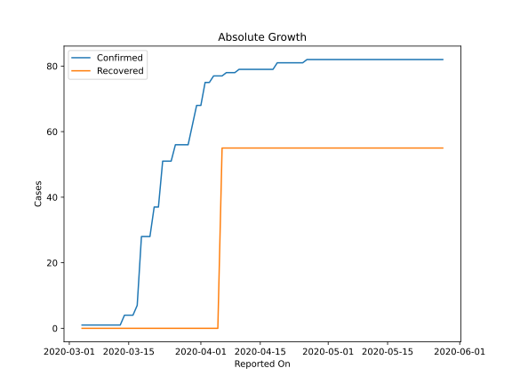
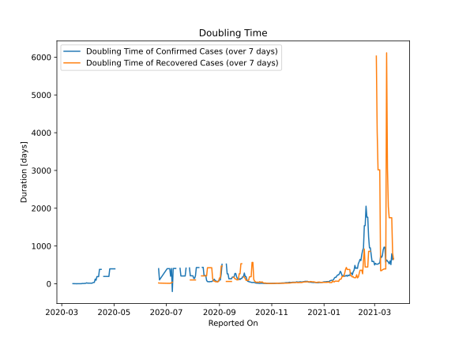

# Country Figures: Doubling Time of Infections for Liechtenstein 

The doubling time below are calculated based on
* an exponential growth assumption
* for time difference of past seven (7) days.
The doubling time's unit is "days".

The first doubling time indicates the increase of confirmed (infected)
cases. There, the *higher* the number is, the better is to take control
of the disease.

The second doubling time indicates the increase of recovered (healed)
cases. There, the *lower* the number is, the better it is to take
control of the disease.

| Reported On | Confirmed | Doubling Time (Confirmed) | Recovered | Doubling Time (Recovered) |
|-------------|-----------|---------------------------|-----------|---------------------------|
| 2020-05-04 | 82 |  None  | 55 |  None  | 
| 2020-05-03 | 82 |  None  | 55 |  None  | 
| 2020-05-02 | 82 |  395.8 days  | 55 |  None  | 
| 2020-05-01 | 82 |  395.8 days  | 55 |  None  | 
| 2020-04-30 | 82 |  395.8 days  | 55 |  None  | 
| 2020-04-29 | 82 |  395.8 days  | 55 |  None  | 
| 2020-04-28 | 82 |  395.8 days  | 55 |  None  | 
| 2020-04-27 | 82 |  395.8 days  | 55 |  None  | 
| 2020-04-26 | 82 |  395.8 days  | 55 |  None  | 
| 2020-04-25 | 81 |  194.4 days  | 55 |  None  | 
| 2020-04-24 | 81 |  194.4 days  | 55 |  None  | 
| 2020-04-23 | 81 |  194.4 days  | 55 |  None  | 
| 2020-04-22 | 81 |  194.4 days  | 55 |  None  | 
| 2020-04-21 | 81 |  194.4 days  | 55 |  None  | 
| 2020-04-20 | 81 |  194.4 days  | 55 |  None  | 
| 2020-04-19 | 81 |  194.4 days  | 55 |  None  | 
| 2020-04-18 | 79 |  None  | 55 |  None  | 
| 2020-04-17 | 79 |  None  | 55 |  None  | 
| 2020-04-16 | 79 |  381.2 days  | 55 |  None  | 
| 2020-04-15 | 79 |  381.2 days  | 55 |  None  | 
| 2020-04-14 | 79 |  381.2 days  | 55 |  None  | 
| 2020-04-13 | 79 |  189.6 days  | 55 |  None  | 
| 2020-04-12 | 79 |  189.6 days  | 55 |  None  | 
| 2020-04-11 | 79 |  189.6 days  | 55 |  None  | 
| 2020-04-10 | 79 |  93.7 days  | 55 |  None  | 
| 2020-04-09 | 78 |  124.1 days  | 55 |  None  | 
| 2020-04-08 | 78 |  35.7 days  | 55 |  None  | 
| 2020-04-07 | 78 |  35.7 days  | 55 |  None  | 
| 2020-04-06 | 77 |  22.7 days  | 55 |  None  | 
| 2020-04-05 | 77 |  15.6 days  | 0 |  None  | 
| 2020-04-04 | 77 |  15.6 days  | 0 |  None  | 
| 2020-04-03 | 75 |  17.0 days  | 0 |  None  | 
| 2020-04-02 | 75 |  17.0 days  | 0 |  None  | 
| 2020-04-01 | 68 |  17.2 days  | 0 |  None  | 
| 2020-03-31 | 68 |  17.2 days  | 0 |  None  | 
| 2020-03-30 | 62 |  25.2 days  | 0 |  None  | 
| 2020-03-29 | 56 |  12.1 days  | 0 |  None  | 
| 2020-03-28 | 56 |  12.1 days  | 0 |  None  | 
| 2020-03-27 | 56 |  7.3 days  | 0 |  None  | 
| 2020-03-26 | 56 |  7.3 days  | 0 |  None  | 
| 2020-03-25 | 51 |  8.4 days  | 0 |  None  | 
| 2020-03-24 | 51 |  2.8 days  | 0 |  None  | 
| 2020-03-23 | 51 |  2.2 days  | 0 |  None  | 
| 2020-03-22 | 37 |  2.5 days  | 0 |  None  | 
| 2020-03-21 | 37 |  2.5 days  | 0 |  None  | 
| 2020-03-20 | 28 |  1.8 days  | 0 |  None  | 
| 2020-03-19 | 28 |  1.8 days  | 0 |  None  | 
| 2020-03-18 | 28 |  1.8 days  | 0 |  None  | 
| 2020-03-17 | 7 |  2.8 days  | 0 |  None  | 
| 2020-03-16 | 4 |  3.8 days  | 0 |  None  | 
| 2020-03-15 | 4 |  3.8 days  | 0 |  None  | 
| 2020-03-14 | 4 |  3.8 days  | 0 |  None  | 
| 2020-03-13 | 1 |  None  | 0 |  None  | 
| 2020-03-12 | 1 |  None  | 0 |  None  | 
| 2020-03-11 | 1 |  None  | 0 |  None  | 
| 2020-03-10 | 1 |  None  | 0 |  None  | 
| 2020-03-09 | 1 |  None  | 0 |  None  | 
| 2020-03-08 | 1 |  None  | 0 |  None  | 
| 2020-03-07 | 1 |  None  | 0 |  None  | 
| 2020-03-06 | 1 |  None  | 0 |  None  | 
| 2020-03-05 | 1 |  None  | 0 |  None  | 
| 2020-03-04 | 1 |  None  | 0 |  None  | 

