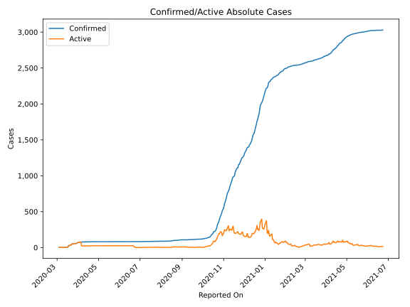
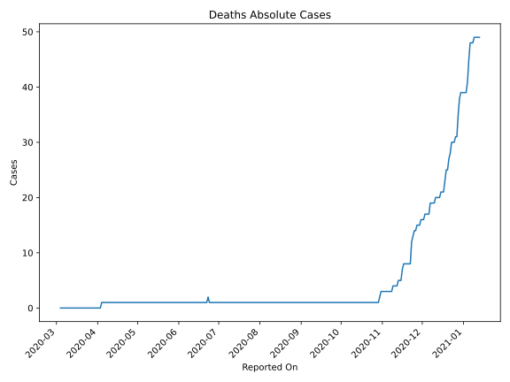
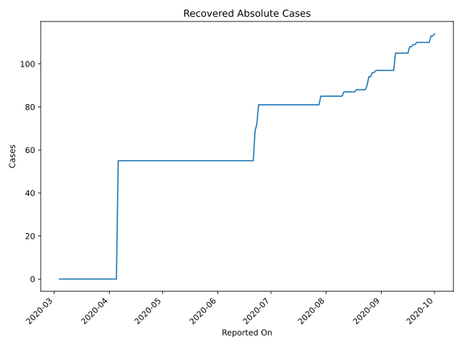
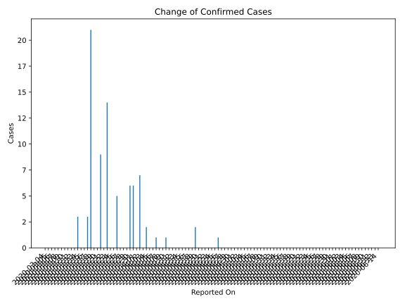
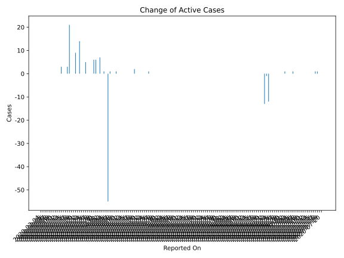
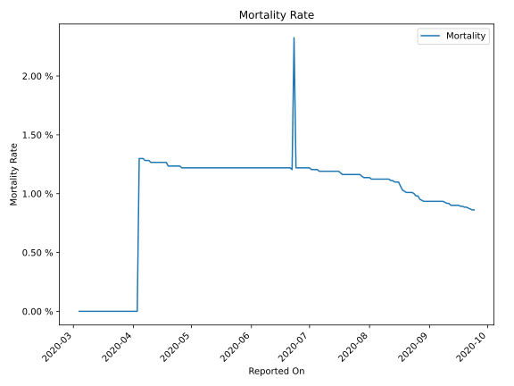

# Country Figures: Time Series for Liechtenstein 

| Reported On | Confirmed | Deaths | Recovered | Active | Mortality | &Delta; Confirmed | &Delta; Deaths | &Delta; Recovered | &Delta; Active | % Active of Population |
|-------------|-----------|--------|-----------|--------|-----------|-------------------|----------------|-------------------|----------------|------------------------|
| 2020-04-19 | 81 | 1 | 55 | 25 |  1.23 %  | 2 | 0 | 0 | 2 |  0.066 %  | 
| 2020-04-18 | 79 | 1 | 55 | 23 |  1.27 %  | 0 | 0 | 0 | 0 |  0.061 %  | 
| 2020-04-17 | 79 | 1 | 55 | 23 |  1.27 %  | 0 | 0 | 0 | 0 |  0.061 %  | 
| 2020-04-16 | 79 | 1 | 55 | 23 |  1.27 %  | 0 | 0 | 0 | 0 |  0.061 %  | 
| 2020-04-15 | 79 | 1 | 55 | 23 |  1.27 %  | 0 | 0 | 0 | 0 |  0.061 %  | 
| 2020-04-14 | 79 | 1 | 55 | 23 |  1.27 %  | 0 | 0 | 0 | 0 |  0.061 %  | 
| 2020-04-13 | 79 | 1 | 55 | 23 |  1.27 %  | 0 | 0 | 0 | 0 |  0.061 %  | 
| 2020-04-12 | 79 | 1 | 55 | 23 |  1.27 %  | 0 | 0 | 0 | 0 |  0.061 %  | 
| 2020-04-11 | 79 | 1 | 55 | 23 |  1.27 %  | 0 | 0 | 0 | 0 |  0.061 %  | 
| 2020-04-10 | 79 | 1 | 55 | 23 |  1.27 %  | 1 | 0 | 0 | 1 |  0.061 %  | 
| 2020-04-09 | 78 | 1 | 55 | 22 |  1.28 %  | 0 | 0 | 0 | 0 |  0.058 %  | 
| 2020-04-08 | 78 | 1 | 55 | 22 |  1.28 %  | 0 | 0 | 0 | 0 |  0.058 %  | 
| 2020-04-07 | 78 | 1 | 55 | 22 |  1.28 %  | 1 | 0 | 0 | 1 |  0.058 %  | 
| 2020-04-06 | 77 | 1 | 55 | 21 |  1.30 %  | 0 | 0 | 55 | -55 |  0.055 %  | 
| 2020-04-05 | 77 | 1 | 0 | 76 |  1.30 %  | 0 | 0 | 0 | 0 |  0.200 %  | 
| 2020-04-04 | 77 | 1 | 0 | 76 |  1.30 %  | 2 | 1 | 0 | 1 |  0.200 %  | 
| 2020-04-03 | 75 | 0 | 0 | 75 |  None  | 0 | 0 | 0 | 0 |  0.198 %  | 
| 2020-04-02 | 75 | 0 | 0 | 75 |  None  | 7 | 0 | 0 | 7 |  0.198 %  | 
| 2020-04-01 | 68 | 0 | 0 | 68 |  None  | 0 | 0 | 0 | 0 |  0.179 %  | 
| 2020-03-31 | 68 | 0 | 0 | 68 |  None  | 6 | 0 | 0 | 6 |  0.179 %  | 
| 2020-03-30 | 62 | 0 | 0 | 62 |  None  | 6 | 0 | 0 | 6 |  0.164 %  | 
| 2020-03-29 | 56 | 0 | 0 | 56 |  None  | 0 | 0 | 0 | 0 |  0.148 %  | 
| 2020-03-28 | 56 | 0 | 0 | 56 |  None  | 0 | 0 | 0 | 0 |  0.148 %  | 
| 2020-03-27 | 56 | 0 | 0 | 56 |  None  | 0 | 0 | 0 | 0 |  0.148 %  | 
| 2020-03-26 | 56 | 0 | 0 | 56 |  None  | 5 | 0 | 0 | 5 |  0.148 %  | 
| 2020-03-25 | 51 | 0 | 0 | 51 |  None  | 0 | 0 | 0 | 0 |  0.135 %  | 
| 2020-03-24 | 51 | 0 | 0 | 51 |  None  | 0 | 0 | 0 | 0 |  0.135 %  | 
| 2020-03-23 | 51 | 0 | 0 | 51 |  None  | 14 | 0 | 0 | 14 |  0.135 %  | 
| 2020-03-22 | 37 | 0 | 0 | 37 |  None  | 0 | 0 | 0 | 0 |  0.098 %  | 
| 2020-03-21 | 37 | 0 | 0 | 37 |  None  | 9 | 0 | 0 | 9 |  0.098 %  | 
| 2020-03-20 | 28 | 0 | 0 | 28 |  None  | 0 | 0 | 0 | 0 |  0.074 %  | 
| 2020-03-19 | 28 | 0 | 0 | 28 |  None  | 0 | 0 | 0 | 0 |  0.074 %  | 
| 2020-03-18 | 28 | 0 | 0 | 28 |  None  | 21 | 0 | 0 | 21 |  0.074 %  | 
| 2020-03-17 | 7 | 0 | 0 | 7 |  None  | 3 | 0 | 0 | 3 |  0.018 %  | 
| 2020-03-16 | 4 | 0 | 0 | 4 |  None  | 0 | 0 | 0 | 0 |  0.011 %  | 
| 2020-03-15 | 4 | 0 | 0 | 4 |  None  | 0 | 0 | 0 | 0 |  0.011 %  | 
| 2020-03-14 | 4 | 0 | 0 | 4 |  None  | 3 | 0 | 0 | 3 |  0.011 %  | 
| 2020-03-13 | 1 | 0 | 0 | 1 |  None  | 0 | 0 | 0 | 0 |  0.003 %  | 
| 2020-03-12 | 1 | 0 | 0 | 1 |  None  | 0 | 0 | 0 | 0 |  0.003 %  | 
| 2020-03-11 | 1 | 0 | 0 | 1 |  None  | 0 | 0 | 0 | 0 |  0.003 %  | 
| 2020-03-10 | 1 | 0 | 0 | 1 |  None  | 0 | 0 | 0 | 0 |  0.003 %  | 
| 2020-03-09 | 1 | 0 | 0 | 1 |  None  | 0 | 0 | 0 | 0 |  0.003 %  | 
| 2020-03-08 | 1 | 0 | 0 | 1 |  None  | 0 | 0 | 0 | 0 |  0.003 %  | 
| 2020-03-07 | 1 | 0 | 0 | 1 |  None  | 0 | 0 | 0 | 0 |  0.003 %  | 
| 2020-03-06 | 1 | 0 | 0 | 1 |  None  | 0 | 0 | 0 | 0 |  0.003 %  | 
| 2020-03-05 | 1 | 0 | 0 | 1 |  None  | 0 | 0 | 0 | 0 |  0.003 %  | 
| 2020-03-04 | 1 | 0 | 0 | 1 |  None  | None | None | None | None |  0.003 %  | 

