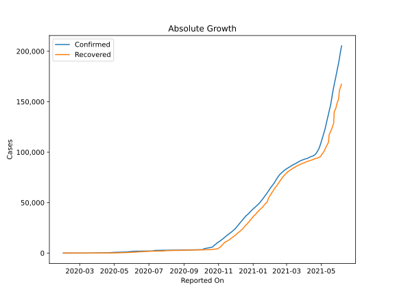
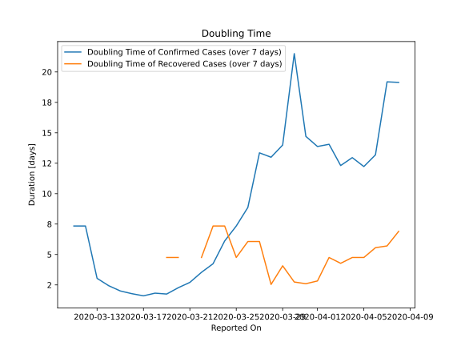

# Country Figures: Doubling Time of Infections for SriLanka 

The doubling time below are calculated based on
* an exponential growth assumption
* for time difference of past seven (7) days.
The doubling time's unit is "days".

The first doubling time indicates the increase of confirmed (infected)
cases. There, the *higher* the number is, the better is to take control
of the disease.

The second doubling time indicates the increase of recovered (healed)
cases. There, the *lower* the number is, the better it is to take
control of the disease.

| Reported On | Confirmed | Doubling Time (Confirmed) | Recovered | Doubling Time (Recovered) |
|-------------|-----------|---------------------------|-----------|---------------------------|
| 2020-04-20 | 304 |  14.7 days  | 98 |  9.0 days  | 
| 2020-04-19 | 271 |  19.4 days  | 96 |  9.3 days  | 
| 2020-04-18 | 254 |  19.8 days  | 86 |  10.8 days  | 
| 2020-04-17 | 244 |  19.7 days  | 77 |  14.0 days  | 
| 2020-04-16 | 238 |  21.9 days  | 68 |  15.2 days  | 
| 2020-04-15 | 238 |  21.4 days  | 63 |  13.9 days  | 
| 2020-04-14 | 233 |  21.4 days  | 61 |  13.3 days  | 
| 2020-04-13 | 217 |  24.8 days  | 56 |  12.9 days  | 
| 2020-04-12 | 210 |  27.8 days  | 56 |  9.5 days  | 
| 2020-04-11 | 198 |  27.9 days  | 54 |  7.3 days  | 
| 2020-04-10 | 190 |  27.6 days  | 54 |  6.3 days  | 
| 2020-04-09 | 190 |  21.5 days  | 49 |  6.1 days  | 
| 2020-04-08 | 189 |  19.1 days  | 44 |  6.9 days  | 
| 2020-04-07 | 185 |  19.2 days  | 42 |  5.7 days  | 
| 2020-04-06 | 178 |  13.2 days  | 38 |  5.6 days  | 
| 2020-04-05 | 176 |  12.2 days  | 33 |  4.8 days  | 
| 2020-04-04 | 166 |  13.0 days  | 27 |  4.8 days  | 
| 2020-04-03 | 159 |  12.3 days  | 24 |  4.3 days  | 
| 2020-04-02 | 151 |  14.1 days  | 21 |  4.8 days  | 
| 2020-04-01 | 146 |  13.9 days  | 21 |  2.8 days  | 
| 2020-03-31 | 143 |  14.7 days  | 17 |  2.6 days  | 
| 2020-03-30 | 122 |  21.5 days  | 15 |  2.7 days  | 
| 2020-03-29 | 117 |  14.0 days  | 11 |  4.1 days  | 
| 2020-03-28 | 113 |  13.0 days  | 9 |  2.5 days  | 
| 2020-03-27 | 106 |  13.4 days  | 7 |  6.1 days  | 
| 2020-03-26 | 106 |  8.9 days  | 7 |  6.1 days  | 
| 2020-03-25 | 102 |  7.3 days  | 3 |  4.8 days  | 
| 2020-03-24 | 102 |  6.1 days  | 2 |  7.3 days  | 
| 2020-03-23 | 97 |  4.2 days  | 2 |  7.3 days  | 
| 2020-03-22 | 82 |  3.5 days  | 3 |  4.8 days  | 
| 2020-03-21 | 77 |  2.7 days  | 1 |  None  | 
| 2020-03-20 | 73 |  2.3 days  | 3 |  4.8 days  | 
| 2020-03-19 | 60 |  1.8 days  | 3 |  4.8 days  | 
| 2020-03-18 | 51 |  1.8 days  | 1 |  None  | 
| 2020-03-17 | 44 |  1.6 days  | 1 |  None  | 
| 2020-03-16 | 28 |  1.8 days  | 1 |  None  | 
| 2020-03-15 | 18 |  2.0 days  | 1 |  None  | 
| 2020-03-14 | 10 |  2.4 days  | 1 |  None  | 
| 2020-03-13 | 6 |  3.0 days  | 1 |  None  | 
| 2020-03-12 | 2 |  7.3 days  | 1 |  None  | 
| 2020-03-11 | 2 |  7.3 days  | 1 |  None  | 
| 2020-02-07 | 1 |  None  | 0 |  None  | 
| 2020-02-06 | 1 |  None  | 0 |  None  | 
| 2020-02-05 | 1 |  None  | 0 |  None  | 
| 2020-02-04 | 1 |  None  | 0 |  None  | 
| 2020-02-03 | 1 |  None  | 0 |  None  | 
| 2020-02-02 | 1 |  None  | 0 |  None  | 
| 2020-02-01 | 1 |  None  | 0 |  None  | 

