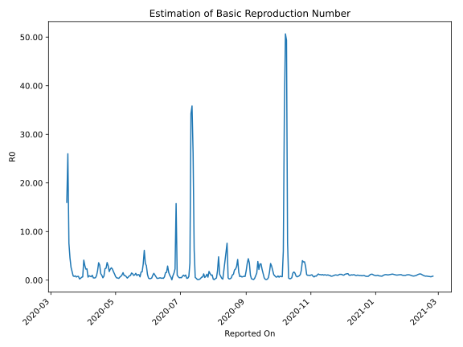

# Country Figures: Time Series for Basic Reproduction Number of SriLanka 

| Reported On | &Delta; Confirmed | Total &Delta; Confirmed First Interval | Total &Delta; Confirmed Second Interval | Estimated Basic Reproduction Number R0 | 
|-------------|-------------------|----------------------------------------|-----------------------------------------|---------------------------------------------------|
| 2020-05-02 | 15 |  102  |  220  |  0.46  | 
| 2020-05-01 | 27 |  140  |  193  |  0.73  | 
| 2020-04-30 | 14 |  189  |  150  |  1.26  | 
| 2020-04-29 | 30 |  199  |  116  |  1.72  | 
| 2020-04-28 | 31 |  220  |  97  |  2.27  | 
| 2020-04-27 | 65 |  193  |  76  |  2.54  | 
| 2020-04-26 | 63 |  150  |  66  |  2.27  | 
| 2020-04-25 | 40 |  116  |  66  |  1.76  | 
| 2020-04-24 | 52 |  97  |  33  |  2.94  | 
| 2020-04-23 | 38 |  76  |  21  |  3.62  | 
| 2020-04-22 | 20 |  66  |  27  |  2.44  | 
| 2020-04-21 | 6 |  66  |  28  |  2.36  | 
| 2020-04-20 | 33 |  33  |  40  |  0.82  | 
| 2020-04-19 | 17 |  21  |  43  |  0.49  | 
| 2020-04-18 | 10 |  27  |  27  |  1.00  | 
| 2020-04-17 | 6 |  28  |  21  |  1.33  | 
| 2020-04-16 | 0 |  40  |  13  |  3.08  | 
| 2020-04-15 | 5 |  43  |  12  |  3.58  | 
| 2020-04-14 | 16 |  27  |  14  |  1.93  | 
| 2020-04-13 | 7 |  21  |  23  |  0.91  | 
| 2020-04-12 | 12 |  13  |  26  |  0.50  | 
| 2020-04-11 | 8 |  12  |  27  |  0.44  | 
| 2020-04-10 | 0 |  14  |  30  |  0.47  | 
| 2020-04-09 | 1 |  23  |  23  |  1.00  | 
| 2020-04-08 | 4 |  26  |  37  |  0.70  | 
| 2020-04-07 | 7 |  27  |  34  |  0.79  | 
| 2020-04-06 | 2 |  30  |  33  |  0.91  | 
| 2020-04-05 | 10 |  23  |  37  |  0.62  | 
| 2020-04-04 | 7 |  37  |  16  |  2.31  | 
| 2020-04-03 | 8 |  34  |  15  |  2.27  | 
| 2020-04-02 | 5 |  33  |  11  |  3.00  | 
| 2020-04-01 | 3 |  37  |  9  |  4.11  | 
| 2020-03-31 | 21 |  16  |  24  |  0.67  | 
| 2020-03-30 | 5 |  15  |  25  |  0.60  | 
| 2020-03-29 | 4 |  11  |  29  |  0.38  | 
| 2020-03-28 | 7 |  9  |  37  |  0.24  | 
| 2020-03-27 | 0 |  24  |  31  |  0.77  | 
| 2020-03-26 | 4 |  25  |  33  |  0.76  | 
| 2020-03-25 | 0 |  29  |  45  |  0.64  | 
| 2020-03-24 | 5 |  37  |  42  |  0.88  | 
| 2020-03-23 | 15 |  31  |  41  |  0.76  | 
| 2020-03-22 | 5 |  33  |  38  |  0.87  | 
| 2020-03-21 | 4 |  45  |  26  |  1.73  | 
| 2020-03-20 | 13 |  42  |  16  |  2.62  | 
| 2020-03-19 | 9 |  41  |  9  |  4.56  | 
| 2020-03-18 | 7 |  38  |  5  |  7.60  | 
| 2020-03-17 | 16 |  26  |  1  |  26.00  | 
| 2020-03-16 | 10 |  16  |  1  |  16.00  | 
| 2020-03-15 | 8 |  9  |  None  |  None  | 
| 2020-03-14 | 4 |  5  |  None  |  None  | 
| 2020-03-13 | 4 |  1  |  None  |  None  | 
| 2020-03-12 | 0 |  1  |  None  |  None  | 
| 2020-03-11 | 1 |  None  |  None  |  None  | 
| 2020-03-10 | 0 |  None  |  None  |  None  | 
| 2020-03-09 | 0 |  None  |  None  |  None  | 
| 2020-03-08 | 0 |  None  |  None  |  None  | 
| 2020-03-07 | 0 |  None  |  None  |  None  | 
| 2020-03-06 | 0 |  None  |  None  |  None  | 
| 2020-03-05 | 0 |  None  |  None  |  None  | 
| 2020-03-04 | 0 |  None  |  None  |  None  | 
| 2020-03-03 | 0 |  None  |  None  |  None  | 
| 2020-03-02 | 0 |  None  |  None  |  None  | 
| 2020-03-01 | 0 |  None  |  None  |  None  | 
| 2020-02-29 | 0 |  None  |  None  |  None  | 
| 2020-02-28 | 0 |  None  |  None  |  None  | 
| 2020-02-27 | 0 |  None  |  None  |  None  | 
| 2020-02-26 | 0 |  None  |  None  |  None  | 
| 2020-02-25 | 0 |  None  |  None  |  None  | 
| 2020-02-24 | 0 |  None  |  None  |  None  | 
| 2020-02-23 | 0 |  None  |  None  |  None  | 
| 2020-02-22 | 0 |  None  |  None  |  None  | 
| 2020-02-21 | 0 |  None  |  None  |  None  | 
| 2020-02-20 | 0 |  None  |  None  |  None  | 
| 2020-02-19 | 0 |  None  |  None  |  None  | 
| 2020-02-18 | 0 |  None  |  None  |  None  | 
| 2020-02-17 | 0 |  None  |  None  |  None  | 
| 2020-02-16 | 0 |  None  |  None  |  None  | 
| 2020-02-15 | 0 |  None  |  None  |  None  | 
| 2020-02-14 | 0 |  None  |  None  |  None  | 
| 2020-02-13 | 0 |  None  |  None  |  None  | 
| 2020-02-12 | 0 |  None  |  None  |  None  | 
| 2020-02-11 | 0 |  None  |  None  |  None  | 
| 2020-02-10 | 0 |  None  |  None  |  None  | 
| 2020-02-09 | 0 |  None  |  None  |  None  | 
| 2020-02-08 | 0 |  None  |  None  |  None  | 
| 2020-02-07 | 0 |  None  |  None  |  None  | 
| 2020-02-06 | 0 |  None  |  None  |  None  | 
| 2020-02-05 | 0 |  None  |  None  |  None  | 
| 2020-02-04 | 0 |  None  |  None  |  None  | 
| 2020-02-03 | 0 |  None  |  None  |  None  | 
| 2020-02-02 | 0 |  None  |  None  |  None  | 
| 2020-02-01 | 0 |  None  |  None  |  None  | 
| 2020-01-31 | 0 |  None  |  None  |  None  | 
| 2020-01-30 | 0 |  None  |  None  |  None  | 
| 2020-01-29 | 0 |  None  |  None  |  None  | 
| 2020-01-28 | 0 |  None  |  None  |  None  | 
| 2020-01-27 | None |  None  |  None  |  None  | 

