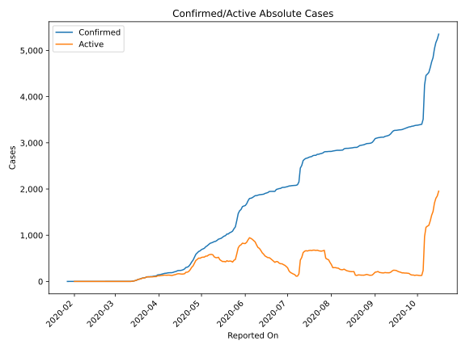
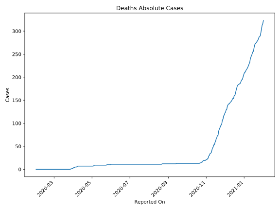
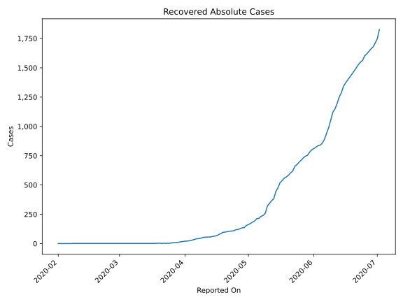
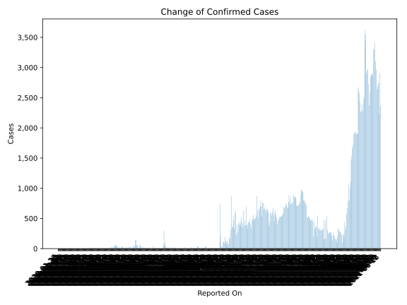
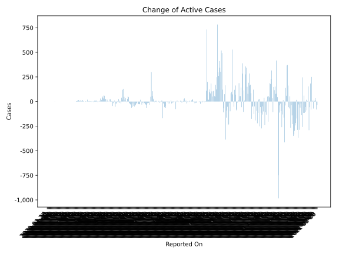
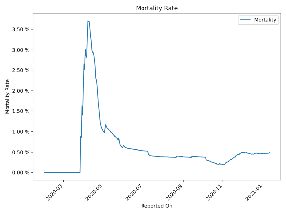

# Country Figures: Time Series for SriLanka 

| Reported On | Confirmed | Deaths | Recovered | Active | Mortality | &Delta; Confirmed | &Delta; Deaths | &Delta; Recovered | &Delta; Active | % Active of Population |
|-------------|-----------|--------|-----------|--------|-----------|-------------------|----------------|-------------------|----------------|------------------------|
| 2020-04-10 | 190 | 7 | 54 | 129 |  3.68 %  | 0 | 0 | 5 | -5 |  0.001 %  | 
| 2020-04-09 | 190 | 7 | 49 | 134 |  3.68 %  | 1 | 0 | 5 | -4 |  0.001 %  | 
| 2020-04-08 | 189 | 7 | 44 | 138 |  3.70 %  | 4 | 1 | 2 | 1 |  0.001 %  | 
| 2020-04-07 | 185 | 6 | 42 | 137 |  3.24 %  | 7 | 1 | 4 | 2 |  0.001 %  | 
| 2020-04-06 | 178 | 5 | 38 | 135 |  2.81 %  | 2 | 0 | 5 | -3 |  0.001 %  | 
| 2020-04-05 | 176 | 5 | 33 | 138 |  2.84 %  | 10 | 0 | 6 | 4 |  0.001 %  | 
| 2020-04-04 | 166 | 5 | 27 | 134 |  3.01 %  | 7 | 1 | 3 | 3 |  0.001 %  | 
| 2020-04-03 | 159 | 4 | 24 | 131 |  2.52 %  | 8 | 0 | 3 | 5 |  0.001 %  | 
| 2020-04-02 | 151 | 4 | 21 | 126 |  2.65 %  | 5 | 1 | 0 | 4 |  0.001 %  | 
| 2020-04-01 | 146 | 3 | 21 | 122 |  2.05 %  | 3 | 1 | 4 | -2 |  0.001 %  | 
| 2020-03-31 | 143 | 2 | 17 | 124 |  1.40 %  | 21 | 0 | 2 | 19 |  0.001 %  | 
| 2020-03-30 | 122 | 2 | 15 | 105 |  1.64 %  | 5 | 1 | 4 | 0 |  0.000 %  | 
| 2020-03-29 | 117 | 1 | 11 | 105 |  0.85 %  | 4 | 0 | 2 | 2 |  0.000 %  | 
| 2020-03-28 | 113 | 1 | 9 | 103 |  0.88 %  | 7 | 1 | 2 | 4 |  0.000 %  | 
| 2020-03-27 | 106 | 0 | 7 | 99 |  None  | 0 | 0 | 0 | 0 |  0.000 %  | 
| 2020-03-26 | 106 | 0 | 7 | 99 |  None  | 4 | 0 | 4 | 0 |  0.000 %  | 
| 2020-03-25 | 102 | 0 | 3 | 99 |  None  | 0 | 0 | 1 | -1 |  0.000 %  | 
| 2020-03-24 | 102 | 0 | 2 | 100 |  None  | 5 | 0 | 0 | 5 |  0.000 %  | 
| 2020-03-23 | 97 | 0 | 2 | 95 |  None  | 15 | 0 | -1 | 16 |  0.000 %  | 
| 2020-03-22 | 82 | 0 | 3 | 79 |  None  | 5 | 0 | 2 | 3 |  0.000 %  | 
| 2020-03-21 | 77 | 0 | 1 | 76 |  None  | 4 | 0 | -2 | 6 |  0.000 %  | 
| 2020-03-20 | 73 | 0 | 3 | 70 |  None  | 13 | 0 | 0 | 13 |  0.000 %  | 
| 2020-03-19 | 60 | 0 | 3 | 57 |  None  | 9 | 0 | 2 | 7 |  0.000 %  | 
| 2020-03-18 | 51 | 0 | 1 | 50 |  None  | 7 | 0 | 0 | 7 |  0.000 %  | 
| 2020-03-17 | 44 | 0 | 1 | 43 |  None  | 16 | 0 | 0 | 16 |  0.000 %  | 
| 2020-03-16 | 28 | 0 | 1 | 27 |  None  | 10 | 0 | 0 | 10 |  0.000 %  | 
| 2020-03-15 | 18 | 0 | 1 | 17 |  None  | 8 | 0 | 0 | 8 |  0.000 %  | 
| 2020-03-14 | 10 | 0 | 1 | 9 |  None  | 4 | 0 | 0 | 4 |  0.000 %  | 
| 2020-03-13 | 6 | 0 | 1 | 5 |  None  | 4 | 0 | 0 | 4 |  0.000 %  | 
| 2020-03-12 | 2 | 0 | 1 | 1 |  None  | 0 | 0 | 0 | 0 |  0.000 %  | 
| 2020-03-11 | 2 | 0 | 1 | 1 |  None  | 1 | 0 | 0 | 1 |  0.000 %  | 
| 2020-03-10 | 1 | 0 | 1 | 0 |  None  | 0 | 0 | 0 | 0 |  n/a  | 
| 2020-03-09 | 1 | 0 | 1 | 0 |  None  | 0 | 0 | 0 | 0 |  n/a  | 
| 2020-03-08 | 1 | 0 | 1 | 0 |  None  | 0 | 0 | 0 | 0 |  n/a  | 
| 2020-03-07 | 1 | 0 | 1 | 0 |  None  | 0 | 0 | 0 | 0 |  n/a  | 
| 2020-03-06 | 1 | 0 | 1 | 0 |  None  | 0 | 0 | 0 | 0 |  n/a  | 
| 2020-03-05 | 1 | 0 | 1 | 0 |  None  | 0 | 0 | 0 | 0 |  n/a  | 
| 2020-03-04 | 1 | 0 | 1 | 0 |  None  | 0 | 0 | 0 | 0 |  n/a  | 
| 2020-03-03 | 1 | 0 | 1 | 0 |  None  | 0 | 0 | 0 | 0 |  n/a  | 
| 2020-03-02 | 1 | 0 | 1 | 0 |  None  | 0 | 0 | 0 | 0 |  n/a  | 
| 2020-03-01 | 1 | 0 | 1 | 0 |  None  | 0 | 0 | 0 | 0 |  n/a  | 
| 2020-02-29 | 1 | 0 | 1 | 0 |  None  | 0 | 0 | 0 | 0 |  n/a  | 
| 2020-02-28 | 1 | 0 | 1 | 0 |  None  | 0 | 0 | 0 | 0 |  n/a  | 
| 2020-02-27 | 1 | 0 | 1 | 0 |  None  | 0 | 0 | 0 | 0 |  n/a  | 
| 2020-02-26 | 1 | 0 | 1 | 0 |  None  | 0 | 0 | 0 | 0 |  n/a  | 
| 2020-02-25 | 1 | 0 | 1 | 0 |  None  | 0 | 0 | 0 | 0 |  n/a  | 
| 2020-02-24 | 1 | 0 | 1 | 0 |  None  | 0 | 0 | 0 | 0 |  n/a  | 
| 2020-02-23 | 1 | 0 | 1 | 0 |  None  | 0 | 0 | 0 | 0 |  n/a  | 
| 2020-02-22 | 1 | 0 | 1 | 0 |  None  | 0 | 0 | 0 | 0 |  n/a  | 
| 2020-02-21 | 1 | 0 | 1 | 0 |  None  | 0 | 0 | 0 | 0 |  n/a  | 
| 2020-02-20 | 1 | 0 | 1 | 0 |  None  | 0 | 0 | 0 | 0 |  n/a  | 
| 2020-02-19 | 1 | 0 | 1 | 0 |  None  | 0 | 0 | 0 | 0 |  n/a  | 
| 2020-02-18 | 1 | 0 | 1 | 0 |  None  | 0 | 0 | 0 | 0 |  n/a  | 
| 2020-02-17 | 1 | 0 | 1 | 0 |  None  | 0 | 0 | 0 | 0 |  n/a  | 
| 2020-02-16 | 1 | 0 | 1 | 0 |  None  | 0 | 0 | 0 | 0 |  n/a  | 
| 2020-02-15 | 1 | 0 | 1 | 0 |  None  | 0 | 0 | 0 | 0 |  n/a  | 
| 2020-02-14 | 1 | 0 | 1 | 0 |  None  | 0 | 0 | 0 | 0 |  n/a  | 
| 2020-02-13 | 1 | 0 | 1 | 0 |  None  | 0 | 0 | 0 | 0 |  n/a  | 
| 2020-02-12 | 1 | 0 | 1 | 0 |  None  | 0 | 0 | 0 | 0 |  n/a  | 
| 2020-02-11 | 1 | 0 | 1 | 0 |  None  | 0 | 0 | 0 | 0 |  n/a  | 
| 2020-02-10 | 1 | 0 | 1 | 0 |  None  | 0 | 0 | 0 | 0 |  n/a  | 
| 2020-02-09 | 1 | 0 | 1 | 0 |  None  | 0 | 0 | 0 | 0 |  n/a  | 
| 2020-02-08 | 1 | 0 | 1 | 0 |  None  | 0 | 0 | 1 | -1 |  n/a  | 
| 2020-02-07 | 1 | 0 | 0 | 1 |  None  | 0 | 0 | 0 | 0 |  0.000 %  | 
| 2020-02-06 | 1 | 0 | 0 | 1 |  None  | 0 | 0 | 0 | 0 |  0.000 %  | 
| 2020-02-05 | 1 | 0 | 0 | 1 |  None  | 0 | 0 | 0 | 0 |  0.000 %  | 
| 2020-02-04 | 1 | 0 | 0 | 1 |  None  | 0 | 0 | 0 | 0 |  0.000 %  | 
| 2020-02-03 | 1 | 0 | 0 | 1 |  None  | 0 | 0 | 0 | 0 |  0.000 %  | 
| 2020-02-02 | 1 | 0 | 0 | 1 |  None  | 0 | 0 | 0 | 0 |  0.000 %  | 
| 2020-02-01 | 1 | 0 | 0 | 1 |  None  | 0 | None | None | None |  0.000 %  | 
| 2020-01-31 | 1 | None | None | None |  None  | 0 | None | None | None |  n/a  | 
| 2020-01-30 | 1 | None | None | None |  None  | 0 | None | None | None |  n/a  | 
| 2020-01-29 | 1 | None | None | None |  None  | 0 | None | None | None |  n/a  | 
| 2020-01-28 | 1 | None | None | None |  None  | 0 | None | None | None |  n/a  | 
| 2020-01-27 | 1 | None | None | None |  None  | None | None | None | None |  n/a  | 

