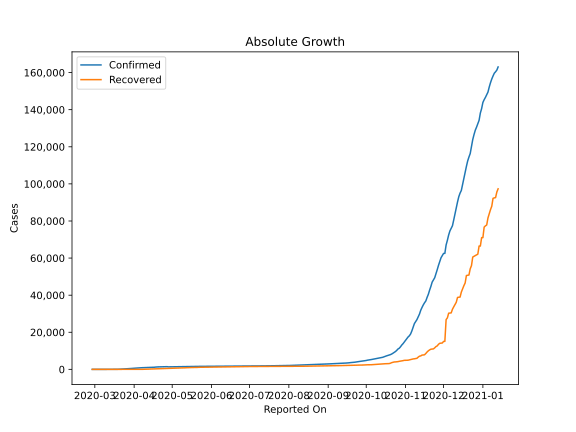
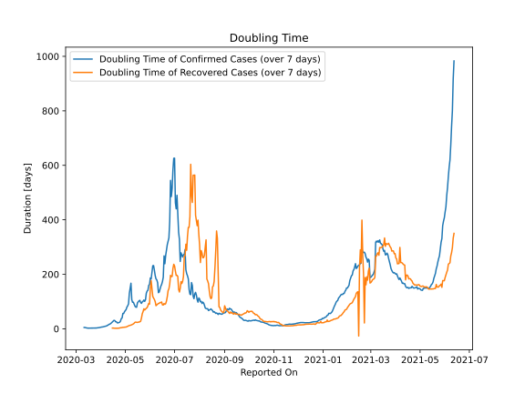

# Country Figures: Doubling Time of Infections for Lithuania 

The doubling time below are calculated based on
* an exponential growth assumption
* for time difference of past seven (7) days.
The doubling time's unit is "days".

The first doubling time indicates the increase of confirmed (infected)
cases. There, the *higher* the number is, the better is to take control
of the disease.

The second doubling time indicates the increase of recovered (healed)
cases. There, the *lower* the number is, the better it is to take
control of the disease.

| Reported On | Confirmed | Doubling Time (Confirmed) | Recovered | Doubling Time (Recovered) |
|-------------|-----------|---------------------------|-----------|---------------------------|
| 2020-05-07 | 1433 |  142.8 days  | 739 |  21.7 days  | 
| 2020-05-06 | 1428 |  128.6 days  | 718 |  20.3 days  | 
| 2020-05-05 | 1423 |  85.3 days  | 678 |  21.0 days  | 
| 2020-05-04 | 1419 |  -231.6 days  | 638 |  16.7 days  | 
| 2020-05-03 | 1410 |  -246.4 days  | 635 |  16.1 days  | 
| 2020-05-02 | 1406 |  -343.2 days  | 632 |  15.6 days  | 
| 2020-05-01 | 1399 |  -619.2 days  | 594 |  15.4 days  | 
| 2020-04-30 | 1385 |  -519.0 days  | 589 |  12.8 days  | 
| 2020-04-29 | 1375 |  1332.2 days  | 563 |  11.0 days  | 
| 2020-04-28 | 1344 |  -1088.9 days  | 536 |  8.6 days  | 
| 2020-04-27 | 1449 |  55.0 days  | 474 |  7.6 days  | 
| 2020-04-26 | 1438 |  47.7 days  | 467 |  7.7 days  | 
| 2020-04-25 | 1426 |  34.9 days  | 460 |  7.3 days  | 
| 2020-04-24 | 1410 |  24.0 days  | 430 |  7.1 days  | 
| 2020-04-23 | 1398 |  23.0 days  | 399 |  6.4 days  | 
| 2020-04-22 | 1370 |  21.7 days  | 357 |  5.4 days  | 
| 2020-04-21 | 1350 |  21.2 days  | 298 |  4.8 days  | 
| 2020-04-20 | 1326 |  22.2 days  | 242 |  5.9 days  | 
| 2020-04-19 | 1298 |  23.5 days  | 242 |  5.6 days  | 
| 2020-04-18 | 1239 |  26.1 days  | 228 |  3.7 days  | 
| 2020-04-17 | 1149 |  35.0 days  | 210 |  3.9 days  | 
| 2020-04-16 | 1128 |  29.5 days  | 178 |  1.9 days  | 
| 2020-04-15 | 1091 |  27.4 days  | 138 |  2.0 days  | 
| 2020-04-14 | 1070 |  25.2 days  | 101 |  2.2 days  | 
| 2020-04-13 | 1062 |  21.4 days  | 101 |  2.2 days  | 
| 2020-04-12 | 1053 |  18.9 days  | 97 |  2.2 days  | 
| 2020-04-11 | 1026 |  17.3 days  | 54 |  2.7 days  | 
| 2020-04-10 | 999 |  13.8 days  | 54 |  2.7 days  | 
| 2020-04-09 | 955 |  12.9 days  | 8 |  36.7 days  | 
| 2020-04-08 | 912 |  11.1 days  | 8 |  36.7 days  | 
| 2020-04-07 | 880 |  10.2 days  | 8 |  36.7 days  | 
| 2020-04-06 | 843 |  9.3 days  | 8 |  36.7 days  | 
| 2020-04-05 | 811 |  8.9 days  | 7 |  2.8 days  | 
| 2020-04-04 | 771 |  7.6 days  | 7 |  2.8 days  | 
| 2020-04-03 | 696 |  7.6 days  | 7 |  2.8 days  | 
| 2020-04-02 | 649 |  6.6 days  | 7 |  2.8 days  | 
| 2020-04-01 | 581 |  6.8 days  | 7 |  2.8 days  | 
| 2020-03-31 | 537 |  5.5 days  | 7 |  2.8 days  | 
| 2020-03-30 | 491 |  5.1 days  | 7 |  2.8 days  | 
| 2020-03-29 | 460 |  4.2 days  | 1 |  None  | 
| 2020-03-28 | 394 |  3.5 days  | 1 |  None  | 
| 2020-03-27 | 358 |  2.8 days  | 1 |  None  | 
| 2020-03-26 | 299 |  2.6 days  | 1 |  None  | 
| 2020-03-25 | 274 |  2.4 days  | 1 |  None  | 
| 2020-03-24 | 209 |  2.6 days  | 1 |  None  | 
| 2020-03-23 | 179 |  2.4 days  | 1 |  None  | 
| 2020-03-22 | 129 |  2.4 days  | 1 |  None  | 
| 2020-03-21 | 83 |  2.4 days  | 1 |  None  | 
| 2020-03-20 | 49 |  2.6 days  | 1 |  None  | 
| 2020-03-19 | 36 |  2.3 days  | 1 |  None  | 
| 2020-03-18 | 27 |  2.5 days  | 1 |  None  | 
| 2020-03-17 | 25 |  1.8 days  | 1 |  None  | 
| 2020-03-16 | 17 |  2.0 days  | 1 |  None  | 
| 2020-03-15 | 12 |  2.3 days  | 1 |  None  | 
| 2020-03-14 | 8 |  2.7 days  | 0 |  None  | 
| 2020-03-13 | 6 |  3.0 days  | 0 |  None  | 
| 2020-03-12 | 3 |  4.8 days  | 0 |  None  | 
| 2020-03-11 | 3 |  4.8 days  | 0 |  None  | 
| 2020-03-10 | 1 |  None  | 0 |  None  | 
| 2020-03-09 | 1 |  None  | 0 |  None  | 
| 2020-03-08 | 1 |  None  | 0 |  None  | 
| 2020-03-07 | 1 |  None  | 0 |  None  | 
| 2020-03-06 | 1 |  None  | 0 |  None  | 
| 2020-03-05 | 1 |  None  | 0 |  None  | 
| 2020-03-04 | 1 |  None  | 0 |  None  | 
| 2020-03-03 | 1 |  None  | 0 |  None  | 
| 2020-03-02 | 1 |  None  | 0 |  None  | 
| 2020-03-01 | 1 |  None  | 0 |  None  | 
| 2020-02-29 | 1 |  None  | 0 |  None  | 
| 2020-02-28 | 1 |  None  | 0 |  None  | 

