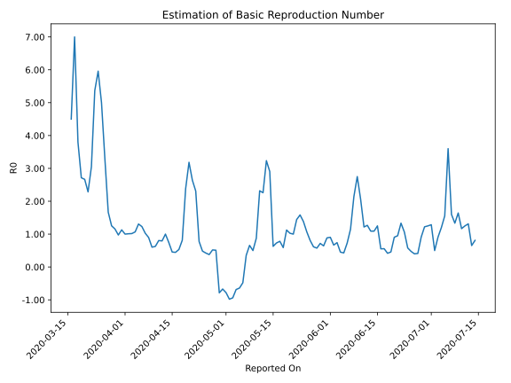

# Country Figures: Time Series for Basic Reproduction Number of Lithuania 

| Reported On | &Delta; Confirmed | Total &Delta; Confirmed First Interval | Total &Delta; Confirmed Second Interval | Estimated Basic Reproduction Number R0 | 
|-------------|-------------------|----------------------------------------|-----------------------------------------|---------------------------------------------------|
| 2020-05-08 | 3 |  23  |  35  |  0.66  | 
| 2020-05-07 | 5 |  22  |  62  |  0.35  | 
| 2020-05-06 | 5 |  24  |  -50  |  -0.48  | 
| 2020-05-05 | 4 |  34  |  -53  |  -0.64  | 
| 2020-05-04 | 9 |  35  |  -51  |  -0.69  | 
| 2020-05-03 | 4 |  62  |  -66  |  -0.94  | 
| 2020-05-02 | 7 |  -50  |  51  |  -0.98  | 
| 2020-05-01 | 14 |  -53  |  68  |  -0.78  | 
| 2020-04-30 | 10 |  -51  |  76  |  -0.67  | 
| 2020-04-29 | 31 |  -66  |  84  |  -0.79  | 
| 2020-04-28 | -105 |  51  |  100  |  0.51  | 
| 2020-04-27 | 11 |  68  |  131  |  0.52  | 
| 2020-04-26 | 12 |  76  |  201  |  0.38  | 
| 2020-04-25 | 16 |  84  |  198  |  0.42  | 
| 2020-04-24 | 12 |  100  |  207  |  0.48  | 
| 2020-04-23 | 28 |  131  |  169  |  0.78  | 
| 2020-04-22 | 20 |  201  |  87  |  2.31  | 
| 2020-04-21 | 24 |  198  |  75  |  2.64  | 
| 2020-04-20 | 28 |  207  |  65  |  3.18  | 
| 2020-04-19 | 59 |  169  |  71  |  2.38  | 
| 2020-04-18 | 90 |  87  |  107  |  0.81  | 
| 2020-04-17 | 21 |  75  |  141  |  0.53  | 
| 2020-04-16 | 37 |  65  |  146  |  0.45  | 
| 2020-04-15 | 21 |  71  |  156  |  0.46  | 
| 2020-04-14 | 8 |  107  |  144  |  0.74  | 
| 2020-04-13 | 9 |  141  |  141  |  1.00  | 
| 2020-04-12 | 27 |  146  |  184  |  0.79  | 
| 2020-04-11 | 27 |  156  |  194  |  0.80  | 
| 2020-04-10 | 44 |  144  |  230  |  0.63  | 
| 2020-04-09 | 43 |  141  |  234  |  0.60  | 
| 2020-04-08 | 32 |  184  |  205  |  0.90  | 
| 2020-04-07 | 37 |  194  |  189  |  1.03  | 
| 2020-04-06 | 32 |  230  |  187  |  1.23  | 
| 2020-04-05 | 40 |  234  |  179  |  1.31  | 
| 2020-04-04 | 75 |  205  |  192  |  1.07  | 
| 2020-04-03 | 47 |  189  |  186  |  1.02  | 
| 2020-04-02 | 68 |  187  |  185  |  1.01  | 
| 2020-04-01 | 44 |  179  |  179  |  1.00  | 
| 2020-03-31 | 46 |  192  |  170  |  1.13  | 
| 2020-03-30 | 31 |  186  |  191  |  0.97  | 
| 2020-03-29 | 66 |  185  |  160  |  1.16  | 
| 2020-03-28 | 36 |  179  |  143  |  1.25  | 
| 2020-03-27 | 59 |  170  |  102  |  1.67  | 
| 2020-03-26 | 25 |  191  |  58  |  3.29  | 
| 2020-03-25 | 65 |  160  |  32  |  5.00  | 
| 2020-03-24 | 30 |  143  |  24  |  5.96  | 
| 2020-03-23 | 50 |  102  |  19  |  5.37  | 
| 2020-03-22 | 46 |  58  |  19  |  3.05  | 
| 2020-03-21 | 34 |  32  |  14  |  2.29  | 
| 2020-03-20 | 13 |  24  |  9  |  2.67  | 
| 2020-03-19 | 9 |  19  |  7  |  2.71  | 
| 2020-03-18 | 2 |  19  |  5  |  3.80  | 
| 2020-03-17 | 8 |  14  |  2  |  7.00  | 
| 2020-03-16 | 5 |  9  |  2  |  4.50  | 
| 2020-03-15 | 4 |  7  |  None  |  None  | 
| 2020-03-14 | 2 |  5  |  None  |  None  | 
| 2020-03-13 | 3 |  2  |  None  |  None  | 
| 2020-03-12 | 0 |  2  |  None  |  None  | 
| 2020-03-11 | 2 |  None  |  None  |  None  | 
| 2020-03-10 | 0 |  None  |  None  |  None  | 
| 2020-03-09 | 0 |  None  |  None  |  None  | 
| 2020-03-08 | 0 |  None  |  None  |  None  | 
| 2020-03-07 | 0 |  None  |  None  |  None  | 
| 2020-03-06 | 0 |  None  |  None  |  None  | 
| 2020-03-05 | 0 |  None  |  None  |  None  | 
| 2020-03-04 | 0 |  None  |  None  |  None  | 
| 2020-03-03 | 0 |  None  |  None  |  None  | 
| 2020-03-02 | 0 |  None  |  None  |  None  | 
| 2020-03-01 | 0 |  None  |  None  |  None  | 
| 2020-02-29 | 0 |  None  |  None  |  None  | 
| 2020-02-28 | None |  None  |  None  |  None  | 

