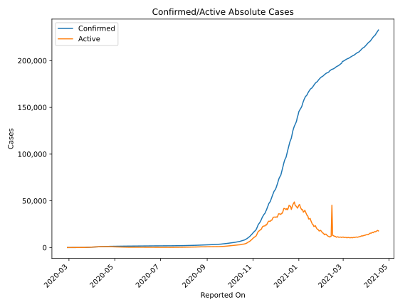
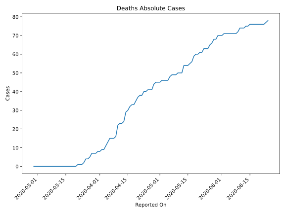
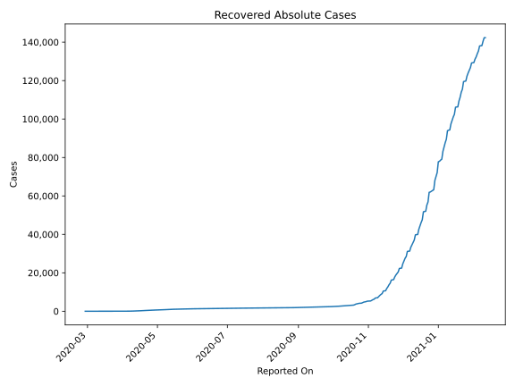
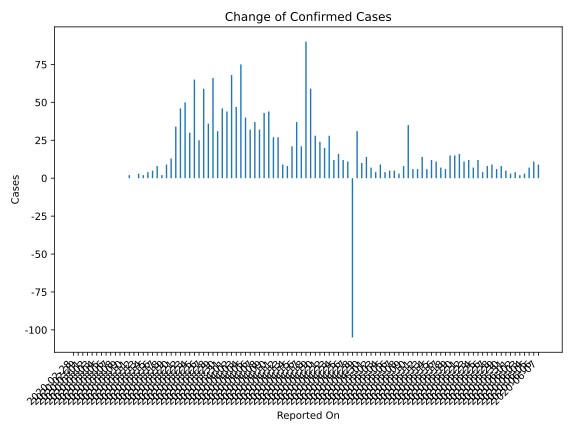
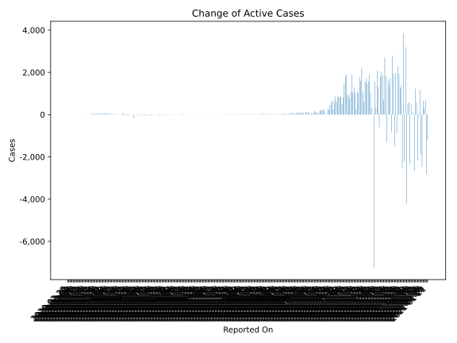
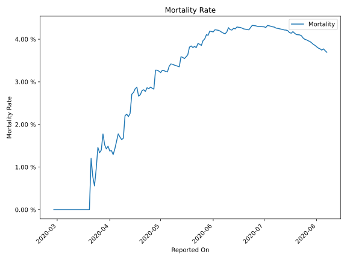

# Country Figures: Time Series for Lithuania 

| Reported On | Confirmed | Deaths | Recovered | Active | Mortality | &Delta; Confirmed | &Delta; Deaths | &Delta; Recovered | &Delta; Active | % Active of Population |
|-------------|-----------|--------|-----------|--------|-----------|-------------------|----------------|-------------------|----------------|------------------------|
| 2020-05-06 | 1428 | 48 | 718 | 662 |  3.36 %  | 5 | 2 | 40 | -37 |  0.024 %  | 
| 2020-05-05 | 1423 | 46 | 678 | 699 |  3.23 %  | 4 | 0 | 40 | -36 |  0.025 %  | 
| 2020-05-04 | 1419 | 46 | 638 | 735 |  3.24 %  | 9 | 0 | 3 | 6 |  0.026 %  | 
| 2020-05-03 | 1410 | 46 | 635 | 729 |  3.26 %  | 4 | 0 | 3 | 1 |  0.026 %  | 
| 2020-05-02 | 1406 | 46 | 632 | 728 |  3.27 %  | 7 | 1 | 38 | -32 |  0.026 %  | 
| 2020-05-01 | 1399 | 45 | 594 | 760 |  3.22 %  | 14 | 0 | 5 | 9 |  0.027 %  | 
| 2020-04-30 | 1385 | 45 | 589 | 751 |  3.25 %  | 10 | 0 | 26 | -16 |  0.027 %  | 
| 2020-04-29 | 1375 | 45 | 563 | 767 |  3.27 %  | 31 | 1 | 27 | 3 |  0.027 %  | 
| 2020-04-28 | 1344 | 44 | 536 | 764 |  3.27 %  | -105 | 3 | 62 | -170 |  0.027 %  | 
| 2020-04-27 | 1449 | 41 | 474 | 934 |  2.83 %  | 11 | 0 | 7 | 4 |  0.033 %  | 
| 2020-04-26 | 1438 | 41 | 467 | 930 |  2.85 %  | 12 | 0 | 7 | 5 |  0.033 %  | 
| 2020-04-25 | 1426 | 41 | 460 | 925 |  2.88 %  | 16 | 1 | 30 | -15 |  0.033 %  | 
| 2020-04-24 | 1410 | 40 | 430 | 940 |  2.84 %  | 12 | 0 | 31 | -19 |  0.034 %  | 
| 2020-04-23 | 1398 | 40 | 399 | 959 |  2.86 %  | 28 | 2 | 42 | -16 |  0.034 %  | 
| 2020-04-22 | 1370 | 38 | 357 | 975 |  2.77 %  | 20 | 0 | 59 | -39 |  0.035 %  | 
| 2020-04-21 | 1350 | 38 | 298 | 1014 |  2.81 %  | 24 | 1 | 56 | -33 |  0.036 %  | 
| 2020-04-20 | 1326 | 37 | 242 | 1047 |  2.79 %  | 28 | 2 | 0 | 26 |  0.038 %  | 
| 2020-04-19 | 1298 | 35 | 242 | 1021 |  2.70 %  | 59 | 2 | 14 | 43 |  0.037 %  | 
| 2020-04-18 | 1239 | 33 | 228 | 978 |  2.66 %  | 90 | 0 | 18 | 72 |  0.035 %  | 
| 2020-04-17 | 1149 | 33 | 210 | 906 |  2.87 %  | 21 | 1 | 32 | -12 |  0.032 %  | 
| 2020-04-16 | 1128 | 32 | 178 | 918 |  2.84 %  | 37 | 2 | 40 | -5 |  0.033 %  | 
| 2020-04-15 | 1091 | 30 | 138 | 923 |  2.75 %  | 21 | 1 | 37 | -17 |  0.033 %  | 
| 2020-04-14 | 1070 | 29 | 101 | 940 |  2.71 %  | 8 | 5 | 0 | 3 |  0.034 %  | 
| 2020-04-13 | 1062 | 24 | 101 | 937 |  2.26 %  | 9 | 1 | 4 | 4 |  0.034 %  | 
| 2020-04-12 | 1053 | 23 | 97 | 933 |  2.18 %  | 27 | 0 | 43 | -16 |  0.033 %  | 
| 2020-04-11 | 1026 | 23 | 54 | 949 |  2.24 %  | 27 | 1 | 0 | 26 |  0.034 %  | 
| 2020-04-10 | 999 | 22 | 54 | 923 |  2.20 %  | 44 | 6 | 46 | -8 |  0.033 %  | 
| 2020-04-09 | 955 | 16 | 8 | 931 |  1.68 %  | 43 | 1 | 0 | 42 |  0.033 %  | 
| 2020-04-08 | 912 | 15 | 8 | 889 |  1.64 %  | 32 | 0 | 0 | 32 |  0.032 %  | 
| 2020-04-07 | 880 | 15 | 8 | 857 |  1.70 %  | 37 | 0 | 0 | 37 |  0.031 %  | 
| 2020-04-06 | 843 | 15 | 8 | 820 |  1.78 %  | 32 | 2 | 1 | 29 |  0.029 %  | 
| 2020-04-05 | 811 | 13 | 7 | 791 |  1.60 %  | 40 | 2 | 0 | 38 |  0.028 %  | 
| 2020-04-04 | 771 | 11 | 7 | 753 |  1.43 %  | 75 | 2 | 0 | 73 |  0.027 %  | 
| 2020-04-03 | 696 | 9 | 7 | 680 |  1.29 %  | 47 | 0 | 0 | 47 |  0.024 %  | 
| 2020-04-02 | 649 | 9 | 7 | 633 |  1.39 %  | 68 | 1 | 0 | 67 |  0.023 %  | 
| 2020-04-01 | 581 | 8 | 7 | 566 |  1.38 %  | 44 | 0 | 0 | 44 |  0.020 %  | 
| 2020-03-31 | 537 | 8 | 7 | 522 |  1.49 %  | 46 | 1 | 0 | 45 |  0.019 %  | 
| 2020-03-30 | 491 | 7 | 7 | 477 |  1.43 %  | 31 | 0 | 6 | 25 |  0.017 %  | 
| 2020-03-29 | 460 | 7 | 1 | 452 |  1.52 %  | 66 | 0 | 0 | 66 |  0.016 %  | 
| 2020-03-28 | 394 | 7 | 1 | 386 |  1.78 %  | 36 | 2 | 0 | 34 |  0.014 %  | 
| 2020-03-27 | 358 | 5 | 1 | 352 |  1.40 %  | 59 | 1 | 0 | 58 |  0.013 %  | 
| 2020-03-26 | 299 | 4 | 1 | 294 |  1.34 %  | 25 | 0 | 0 | 25 |  0.011 %  | 
| 2020-03-25 | 274 | 4 | 1 | 269 |  1.46 %  | 65 | 2 | 0 | 63 |  0.010 %  | 
| 2020-03-24 | 209 | 2 | 1 | 206 |  0.96 %  | 30 | 1 | 0 | 29 |  0.007 %  | 
| 2020-03-23 | 179 | 1 | 1 | 177 |  0.56 %  | 50 | 0 | 0 | 50 |  0.006 %  | 
| 2020-03-22 | 129 | 1 | 1 | 127 |  0.78 %  | 46 | 0 | 0 | 46 |  0.005 %  | 
| 2020-03-21 | 83 | 1 | 1 | 81 |  1.20 %  | 34 | 1 | 0 | 33 |  0.003 %  | 
| 2020-03-20 | 49 | 0 | 1 | 48 |  None  | 13 | 0 | 0 | 13 |  0.002 %  | 
| 2020-03-19 | 36 | 0 | 1 | 35 |  None  | 9 | 0 | 0 | 9 |  0.001 %  | 
| 2020-03-18 | 27 | 0 | 1 | 26 |  None  | 2 | 0 | 0 | 2 |  0.001 %  | 
| 2020-03-17 | 25 | 0 | 1 | 24 |  None  | 8 | 0 | 0 | 8 |  0.001 %  | 
| 2020-03-16 | 17 | 0 | 1 | 16 |  None  | 5 | 0 | 0 | 5 |  0.001 %  | 
| 2020-03-15 | 12 | 0 | 1 | 11 |  None  | 4 | 0 | 1 | 3 |  0.000 %  | 
| 2020-03-14 | 8 | 0 | 0 | 8 |  None  | 2 | 0 | 0 | 2 |  0.000 %  | 
| 2020-03-13 | 6 | 0 | 0 | 6 |  None  | 3 | 0 | 0 | 3 |  0.000 %  | 
| 2020-03-12 | 3 | 0 | 0 | 3 |  None  | 0 | 0 | 0 | 0 |  0.000 %  | 
| 2020-03-11 | 3 | 0 | 0 | 3 |  None  | 2 | 0 | 0 | 2 |  0.000 %  | 
| 2020-03-10 | 1 | 0 | 0 | 1 |  None  | 0 | 0 | 0 | 0 |  0.000 %  | 
| 2020-03-09 | 1 | 0 | 0 | 1 |  None  | 0 | 0 | 0 | 0 |  0.000 %  | 
| 2020-03-08 | 1 | 0 | 0 | 1 |  None  | 0 | 0 | 0 | 0 |  0.000 %  | 
| 2020-03-07 | 1 | 0 | 0 | 1 |  None  | 0 | 0 | 0 | 0 |  0.000 %  | 
| 2020-03-06 | 1 | 0 | 0 | 1 |  None  | 0 | 0 | 0 | 0 |  0.000 %  | 
| 2020-03-05 | 1 | 0 | 0 | 1 |  None  | 0 | 0 | 0 | 0 |  0.000 %  | 
| 2020-03-04 | 1 | 0 | 0 | 1 |  None  | 0 | 0 | 0 | 0 |  0.000 %  | 
| 2020-03-03 | 1 | 0 | 0 | 1 |  None  | 0 | 0 | 0 | 0 |  0.000 %  | 
| 2020-03-02 | 1 | 0 | 0 | 1 |  None  | 0 | 0 | 0 | 0 |  0.000 %  | 
| 2020-03-01 | 1 | 0 | 0 | 1 |  None  | 0 | 0 | 0 | 0 |  0.000 %  | 
| 2020-02-29 | 1 | 0 | 0 | 1 |  None  | 0 | 0 | 0 | 0 |  0.000 %  | 
| 2020-02-28 | 1 | 0 | 0 | 1 |  None  | None | None | None | None |  0.000 %  | 

